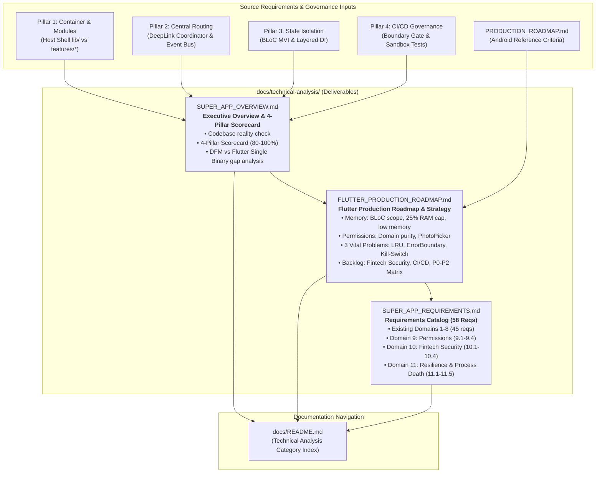
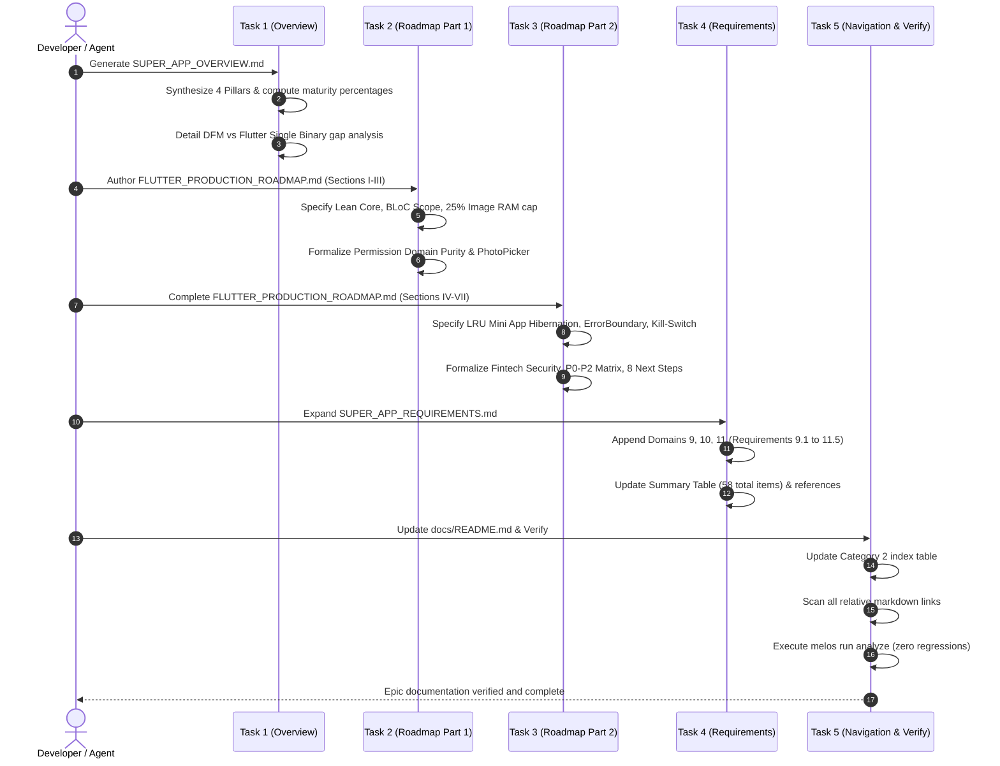

# Epic: Super App Production Roadmap & 4-Pillar Governance Synthesis

## Table of Contents
1. [Meta Data](#meta-data)
2. [Background](#background)
3. [Goals & Non-Goals](#goals--non-goals)
4. [Architecture & Technical Design](#architecture--technical-design)
   - [High-Level Architecture](#high-level-architecture)
   - [Use Cases](#use-cases)
   - [Sequence Diagram](#sequence-diagram)
   - [Check 1: Shift-Left Impact Analysis](#check-1-shift-left-impact-analysis)
   - [BDD Scenarios](#bdd-scenarios)
5. [Rollout Strategy & Mitigation](#rollout-strategy--mitigation)
6. [Kanban Tasks Breakdown](#kanban-tasks-breakdown)

---

## Meta Data
- **Epic Name:** `super_app_roadmap`
- **Epic Slug:** `super-app-roadmap`
- **Status:** Todo
- **Target Release:** Flutter Super App Template v2.2 (Governance & Production Documentation)
- **Platform:** Flutter (monorepo — `bloc_digital_wallet`)
- **Source Spec:** [2026-09-16-super-app-production-roadmap-design.md](2026-09-16-super-app-production-roadmap-design.md)

---

## Background

The `bloc_digital_wallet` repository is a Flutter super-app monorepo designed with Clean Architecture + MVI, BLoC, Melos, FVM, and Mason automation.

While an existing `PRODUCTION_ROADMAP.md` documents production-readiness criteria for Android Native (Compose, DFM, Dagger/Hilt, Coil, Room Paging 3), developers and AI agents operating on this Flutter super-app monorepo need a definitive, idiomatic roadmap that:
1. Evaluates current monorepo maturity against the **4 Core Governance Pillars**:
   - Pillar 1: Container & Modules
   - Pillar 2: Central Communication & Routing (DeepLink Router & Event Bridge)
   - Pillar 3: State Isolation (Local BLoC & Dependency Inversion)
   - Pillar 4: Lifecycle & CI/CD Governance (Module boundaries & Sandbox)
2. Translates every production criterion from `PRODUCTION_ROADMAP.md` into concrete **Flutter/Dart** technical implementations (Memory scope hygiene, image RAM caps, low memory signals, permission domain purity, error boundaries, router kill-switches, biometrics, offline-first).
3. Synthesizes these criteria into an executive overview (`SUPER_APP_OVERVIEW.md`), a dedicated Flutter roadmap (`FLUTTER_PRODUCTION_ROADMAP.md`), and an expanded verifiable requirements catalog in `SUPER_APP_REQUIREMENTS.md`.

---

## Goals & Non-Goals

### Goals
- Create `docs/technical-analysis/SUPER_APP_OVERVIEW.md` as an executive-level assessment and scorecard covering the 4 Core Governance Pillars with actual codebase metrics.
- Create `docs/technical-analysis/FLUTTER_PRODUCTION_ROADMAP.md` as an in-depth Flutter production handbook translating memory, permissions, runtime resilience, and strategic enhancements into Flutter/Dart patterns.
- Expand `docs/technical-analysis/SUPER_APP_REQUIREMENTS.md` with Domains 9 (Permissions), 10 (Fintech Security), and 11 (Resilience & Process Death), increasing the requirement set from 45 to 58 verifiable items.
- Update `docs/README.md` to index the new documents in the Technical Analysis category.
- Ensure all relative links across `docs/` and `.devtool/` resolve with zero broken references.
- Ensure zero Dart analyzer regressions (`melos run analyze`).

### Non-Goals
- Modifying underlying Dart production code or changing package APIs in this epic (this is a documentation and architectural governance release).
- Modifying or deleting the existing reference `PRODUCTION_ROADMAP.md` (preserved as an Android Native reference).
- Rewriting existing epic HLDs (`SUPER_APP_GOVERNANCE`, `DEEPLINK_ENGINE`, etc.).

---

## Architecture & Technical Design

### High-Level Architecture

### Use Cases

```mermaid
flowchart TD
    Dev(["App Developer"])
    Architect(["Software Architect"])
    Agent(["AI Agent"])

    subgraph UC1["UC-1: Evaluate Super App Governance"]
        UC1A["Open docs/technical-analysis/SUPER_APP_OVERVIEW.md"]
        UC1B["Review 4-Pillar Scorecard & Current Monorepo Maturity"]
        UC1C["Identify Architecture Seams & Dual-Mode Configuration"]
        UC1A --> UC1B --> UC1C
    end

    subgraph UC2["UC-2: Consult Flutter Production Strategy"]
        UC2A["Open docs/technical-analysis/FLUTTER_PRODUCTION_ROADMAP.md"]
        UC2B["Study Memory Management & Allocation Churn Rules"]
        UC2C["Implement Permissionless PhotoPicker & Domain Purity"]
        UC2D["Adopt LRU Eviction & ErrorBoundary Patterns"]
        UC2A --> UC2B --> UC2C --> UC2D
    end

    subgraph UC3["UC-3: Audit & Track Governance Requirements"]
        UC3A["Read SUPER_APP_REQUIREMENTS.md"]
        UC3B["Verify Domains 9, 10, 11 (58 Total Requirements)"]
        UC3C["Cross-check Acceptance Criteria during Quality Audit"]
        UC3A --> UC3B --> UC3C
    end

    Architect --> UC1
    Dev --> UC2
    Agent --> UC3
    Dev --> UC3
```

### Sequence Diagram

### Check 1: Shift-Left Impact Analysis
- **Target Files:**
  - `docs/technical-analysis/SUPER_APP_OVERVIEW.md` (New)
  - `docs/technical-analysis/FLUTTER_PRODUCTION_ROADMAP.md` (New)
  - `docs/technical-analysis/SUPER_APP_REQUIREMENTS.md` (Modify)
  - `docs/README.md` (Modify)
- **Blast Radius:** Documentation only under `docs/`. Zero Dart production source code modified.
- **Downstream Callers:** AI Agent quality audits (`quality_check`), onboarding developers, architectural reviewers.
- **Divergence Risk:** None (working on clean `super_app_template` branch).

### BDD Scenarios

See dedicated file: [bdd_scenarios.md](bdd_scenarios.md)

---

## Rollout Strategy & Mitigation

### Phased Rollout Approach
1. **Phase 1: Foundations (Tasks 1–2)**: Establish `SUPER_APP_OVERVIEW.md` and the first half of `FLUTTER_PRODUCTION_ROADMAP.md` (Core philosophy, memory, permissions).
2. **Phase 2: Advanced Resilience & Backlog (Task 3)**: Complete `FLUTTER_PRODUCTION_ROADMAP.md` with runtime resilience, strategic backlog, and P0–P2 matrix.
3. **Phase 3: Requirements & Navigation Integration (Tasks 4–5)**: Expand `SUPER_APP_REQUIREMENTS.md` to 58 items, update `docs/README.md`, and verify link integrity.

### Risks & Mitigations
- **Link Rot / Stale Paths**: Run automated link integrity scanner verifying every cross-document link before committing.
- **Conceptual Divergence**: Maintain 1:1 parity between requirements numbering in `SUPER_APP_REQUIREMENTS.md` and section headings in `FLUTTER_PRODUCTION_ROADMAP.md`.

---

## Kanban Tasks Breakdown

| Task | Title | Status |
|------|-------|--------|
| [Task 1](task_1_create_super_app_overview.md) | Author `docs/technical-analysis/SUPER_APP_OVERVIEW.md` | todo |
| [Task 2](task_2_create_flutter_production_roadmap_foundations.md) | Author `FLUTTER_PRODUCTION_ROADMAP.md` (Sections I, II, III) | todo |
| [Task 3](task_3_create_flutter_production_roadmap_resilience_and_backlog.md) | Complete `FLUTTER_PRODUCTION_ROADMAP.md` (Sections IV, V, VI, VII) | todo |
| [Task 4](task_4_update_super_app_requirements.md) | Update `docs/technical-analysis/SUPER_APP_REQUIREMENTS.md` (Domains 9, 10, 11) | todo |
| [Task 5](task_5_update_readme_and_verify_links.md) | Update `docs/README.md` & verify link integrity across documentation | todo |
