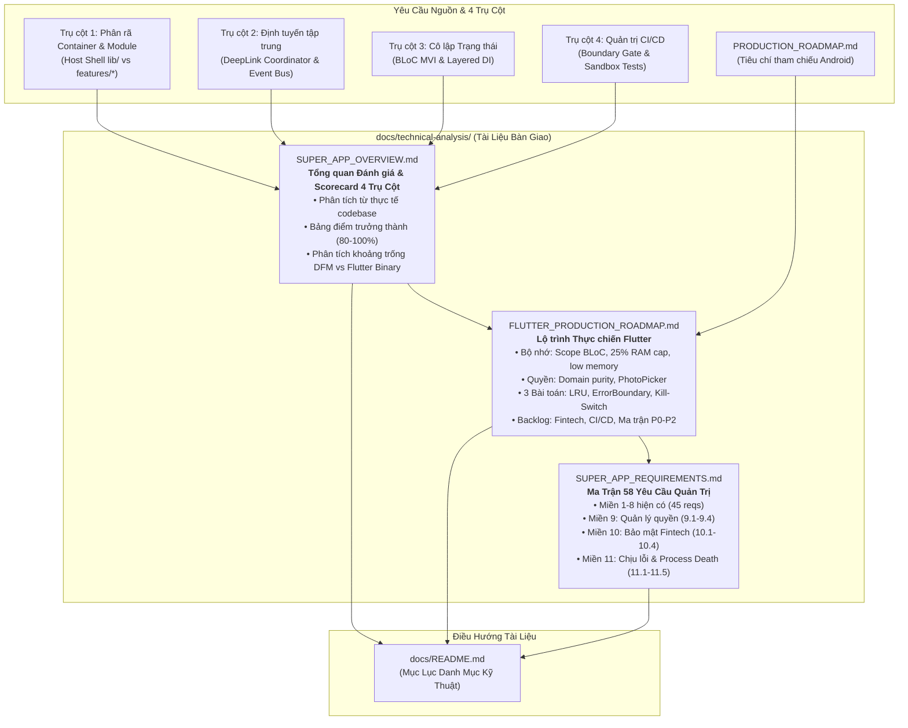
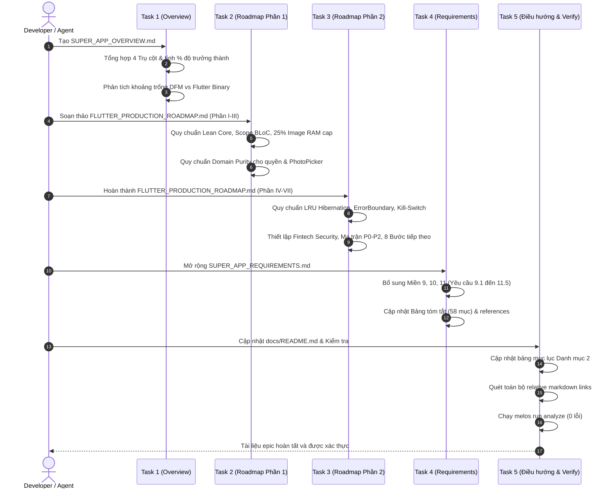

# Epic: Lộ Trình Thực Chiến Super App & Đánh Giá 4 Trụ Cột Quản Trị

## Mục Lục
1. [Meta Data](#meta-data)
2. [Bối Cảnh](#bối-cảnh)
3. [Mục Tiêu & Ngoài Phạm Vi](#mục-tiêu--ngoài-phạm-vi)
4. [Kiến Trúc & Thiết Kế Kỹ Thuật](#kiến-trúc--thiết-kế-kỹ-thuật)
   - [Kiến Trúc Tổng Thể](#kiến-trúc-tổng-thể)
   - [Use Cases](#use-cases)
   - [Sequence Diagram](#sequence-diagram)
   - [Kiểm Tra 1: Shift-Left Impact Analysis](#kiểm-tra-1-shift-left-impact-analysis)
   - [Kịch Bản BDD](#kịch-bản-bdd)
5. [Chiến Lược Triển Khai & Giảm Thiểu Rủi Ro](#chiến-lược-triển-khai--giảm-thiểu-rủi-ro)
6. [Bảng Phân Rã Kanban Tasks](#bảng-phân-rã-kanban-tasks)

---

## Meta Data
- **Tên Epic:** `super_app_roadmap`
- **Epic Slug:** `super-app-roadmap`
- **Trạng Thái:** Todo
- **Target Release:** Flutter Super App Template v2.2 (Governance & Production Documentation)
- **Nền Tảng:** Flutter (monorepo — `bloc_digital_wallet`)
- **Source Spec:** [2026-09-16-super-app-production-roadmap-design.md](2026-09-16-super-app-production-roadmap-design.md)

---

## Bối Cảnh

Repository `bloc_digital_wallet` là một siêu ứng dụng Flutter monorepo được thiết kế theo mô hình Clean Architecture + MVI, BLoC, Melos, FVM và Mason automation.

Mặc dù tài liệu tham khảo `PRODUCTION_ROADMAP.md` đã có trong dự án cho Android Native (Compose, DFM, Dagger/Hilt, Coil, Room Paging 3), đội ngũ phát triển và AI Agent vận hành trên Flutter Super App Template cần một bộ tài liệu quy chuẩn kỹ thuật chuyên sâu bằng ngôn ngữ thực tế của Flutter/Dart:
1. Đánh giá độ trưởng thành của monorepo hiện tại dựa trên **4 Trụ Cột Quản Trị Cốt Lõi**:
   - Trụ cột 1: Kiến trúc phân rã (Container Host vs Module Mini Apps)
   - Trụ cột 2: Giao tiếp & Định tuyến tập trung (DeepLink Router Engine & Event Bridge)
   - Trụ cột 3: Cô lập Trạng thái (Local BLoC MVI & Dependency Inversion)
   - Trụ cột 4: Quản trị Vòng đời & CI/CD (Ranh giới module & Sandbox testing)
2. Chuyển dịch toàn bộ các tiêu chí thực chiến từ `PRODUCTION_ROADMAP.md` sang các giải pháp đặc thù của **Flutter/Dart** (Quản trị scope BLoC, RAM cap cho image cache, xử lý áp lực bộ nhớ OS qua `didHaveMemoryPressure`, domain purity cấm import permission, Error Boundary, Router Kill-Switch, sinh trắc học, offline-first).
3. Tổng hợp thành một bản đánh giá tổng quan (`SUPER_APP_OVERVIEW.md`), một cẩm nang thực chiến chuyên biệt cho Flutter (`FLUTTER_PRODUCTION_ROADMAP.md`), và mở rộng ma trận kiểm thử trong `SUPER_APP_REQUIREMENTS.md`.

---

## Mục Tiêu & Ngoài Phạm Vi

### Mục Tiêu
- Tạo `docs/technical-analysis/SUPER_APP_OVERVIEW.md`: Bản đánh giá tổng quan và chấm điểm (Scorecard) 4 Trụ Cột Quản Trị dựa trên dữ liệu thực tế từ codebase.
- Tạo `docs/technical-analysis/FLUTTER_PRODUCTION_ROADMAP.md`: Cẩm nang thực chiến chuyên sâu cho Flutter về bộ nhớ, quyền, 3 bài toán sống còn tại runtime và danh mục nâng cấp chiến lược P0–P2.
- Mở rộng `docs/technical-analysis/SUPER_APP_REQUIREMENTS.md` với các Miền 9 (Quản lý quyền), 10 (Bảo mật Fintech) và 11 (Khả năng chịu lỗi & Process Death), nâng tổng số yêu cầu từ 45 lên 58 mục có tiêu chí nghiệm thu rõ ràng.
- Cập nhật `docs/README.md` để đưa các tài liệu mới vào mục lục Danh mục Phân tích Kỹ thuật.
- Đảm bảo toàn bộ liên kết nội bộ trong `docs/` và `.devtool/` trỏ chính xác không có liên kết gãy.
- Đảm bảo `melos run analyze` đạt 0 cảnh báo/lỗi (không có regression).

### Ngoài Phạm Vi
- Chỉnh sửa code logic Dart runtime hoặc thay đổi API packages trong epic này (đây là epic tài liệu kiến trúc và governance).
- Chỉnh sửa hoặc xóa file tham chiếu `PRODUCTION_ROADMAP.md` (giữ nguyên làm tài liệu tham khảo cho Android Native).
- Viết lại các HLD đã hoàn thành khác (`SUPER_APP_GOVERNANCE`, `DEEPLINK_ENGINE`...).

---

## Kiến Trúc & Thiết Kế Kỹ Thuật

### Kiến Trúc Tổng Thể

### Use Cases

```mermaid
flowchart TD
    Dev(["Lập Trình Viên"])
    Architect(["Kiến Trúc Sư Hệ Thống"])
    Agent(["AI Agent"])

    subgraph UC1["UC-1: Đánh giá Quản trị Super App"]
        UC1A["Mở docs/technical-analysis/SUPER_APP_OVERVIEW.md"]
        UC1B["Xem Bảng điểm 4 Trụ cột & Độ trưởng thành Codebase"]
        UC1C["Xác định Seams kiến trúc & Cấu hình Dual-Mode"]
        UC1A --> UC1B --> UC1C
    end

    subgraph UC2["UC-2: Tra Cứu Chiến Lược Thực Chiến Flutter"]
        UC2A["Mở docs/technical-analysis/FLUTTER_PRODUCTION_ROADMAP.md"]
        UC2B["Nghiên cứu Quy tắc Quản lý Bộ nhớ & Allocation Churn"]
        UC2C["Triển khai PhotoPicker không cần quyền & Domain Purity"]
        UC2D["Áp dụng LRU Eviction & ErrorBoundary"]
        UC2A --> UC2B --> UC2C --> UC2D
    end

    subgraph UC3["UC-3: Kiểm Tra & Theo Dõi Yêu Cầu Quản Trị"]
        UC3A["Đọc SUPER_APP_REQUIREMENTS.md"]
        UC3B["Xác thực Miền 9, 10, 11 (Tổng 58 Yêu cầu)"]
        UC3C["Đối chiếu Tiêu chí Nghiệm thu trong Quality Audit"]
        UC3A --> UC3B --> UC3C
    end

    Architect --> UC1
    Dev --> UC2
    Agent --> UC3
    Dev --> UC3
```

### Sequence Diagram

### Kiểm Tra 1: Shift-Left Impact Analysis
- **Tập tin tác động:**
  - `docs/technical-analysis/SUPER_APP_OVERVIEW.md` (Mới)
  - `docs/technical-analysis/FLUTTER_PRODUCTION_ROADMAP.md` (Mới)
  - `docs/technical-analysis/SUPER_APP_REQUIREMENTS.md` (Chỉnh sửa)
  - `docs/README.md` (Chỉnh sửa)
- **Bán kính ảnh hưởng (Blast Radius):** Chỉ giới hạn trong tài liệu markdown dưới `docs/`. Không sửa đổi code Dart sản xuất.
- **Rủi ro phân kỳ:** Không (làm việc trên branch sạch `super_app_template`).

### Kịch Bản BDD

Xem file chuyên biệt: [bdd_scenarios.md](bdd_scenarios.md)

---

## Chiến Lược Triển Khai & Giảm Thiểu Rủi Ro

### Tiếp Cận Phân Pha
1. **Pha 1: Nền tảng (Tasks 1–2)**: Thiết lập `SUPER_APP_OVERVIEW.md` và nửa đầu `FLUTTER_PRODUCTION_ROADMAP.md` (Triết lý cốt lõi, bộ nhớ, quyền).
2. **Pha 2: Khả năng chịu lỗi & Backlog (Task 3)**: Hoàn thành `FLUTTER_PRODUCTION_ROADMAP.md` với 3 bài toán sống còn, backlog chiến lược và ma trận P0–P2.
3. **Pha 3: Tích hợp Yêu cầu & Điều hướng (Tasks 4–5)**: Mở rộng `SUPER_APP_REQUIREMENTS.md` lên 58 mục, cập nhật `docs/README.md` và xác thực liên kết.

### Rủi Ro & Giảm Thiểu
- **Liên kết gãy**: Chạy script quét liên kết tự động trước khi commit.
- **Lệch pha thuật ngữ**: Giữ sự đồng nhất 1:1 giữa mã số yêu cầu trong `SUPER_APP_REQUIREMENTS.md` và tiêu đề trong `FLUTTER_PRODUCTION_ROADMAP.md`.

---

## Bảng Phân Rã Kanban Tasks

| Task | Tiêu Đề | Trạng Thái |
|------|---------|------------|
| [Task 1](task_1_create_super_app_overview.md) | Soạn thảo `docs/technical-analysis/SUPER_APP_OVERVIEW.md` | todo |
| [Task 2](task_2_create_flutter_production_roadmap_foundations.md) | Soạn thảo `FLUTTER_PRODUCTION_ROADMAP.md` (Phần I, II, III) | todo |
| [Task 3](task_3_create_flutter_production_roadmap_resilience_and_backlog.md) | Hoàn thành `FLUTTER_PRODUCTION_ROADMAP.md` (Phần IV, V, VI, VII) | todo |
| [Task 4](task_4_update_super_app_requirements.md) | Cập nhật `docs/technical-analysis/SUPER_APP_REQUIREMENTS.md` (Miền 9, 10, 11) | todo |
| [Task 5](task_5_update_readme_and_verify_links.md) | Cập nhật `docs/README.md` & xác thực liên kết toàn bộ tài liệu | todo |
