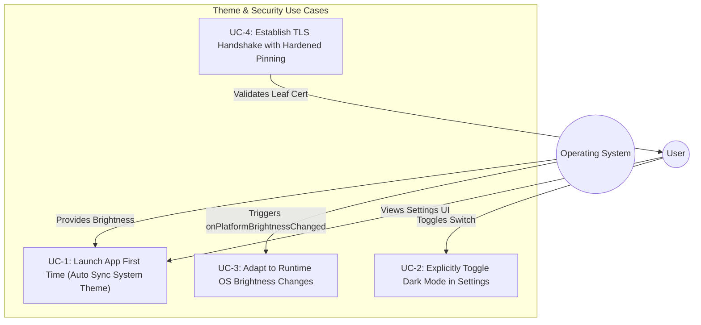
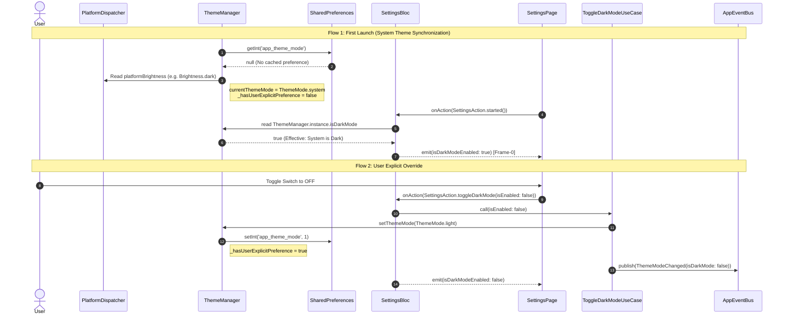

# Epic Overview: System Theme Synchronization & SSL Pinning Resiliency (HLD)

## 1. Meta Data
- **Epic Name**: `system_theme_sync`
- **Status**: Done
- **Target Release**: `v1.1.0`
- **Platform**: `Flutter` (Monorepo with BLoC, Clean Architecture, Melos, FVM)
- **Source Spec**: [2026-09-17-system-theme-sync-and-ssl-pinning-design.md](2026-09-17-system-theme-sync-and-ssl-pinning-design.md)
- **Living BDD Document**: [bdd_scenarios.md](bdd_scenarios.md)

---

## 2. Background
1. **Theme Desynchronization**: On initial application launch without cached user preferences, `ThemeManager` seeds `ThemeMode.system`. However, `ThemeManager.isDarkMode` simply evaluates `currentThemeMode == ThemeMode.dark`, which yields `false` when in `ThemeMode.system` even if the host operating system is operating in Dark Mode. Consequently, `SettingsBloc._onStarted` sets `SettingsUiModel.isDarkModeEnabled = false`, rendering the Dark Mode switch in the Settings UI as OFF despite the app displaying dark styling via `MaterialApp`.
2. **SSL Pinning Handshake Failures**: In non-debug execution modes (`--profile` / `--release` or whenever `ENABLE_SSL_PINNING=true`), `AutoSslConfiguration` activates `HardenedSslPinning`. When backend host `digital-wallet-93c4ba68a41d.herokuapp.com` rotated its wildcard certificate `*.herokuapp.com` (issued by Amazon RSA 2048 M01 on Dec 31, 2025), the active leaf certificate SHA-256 fingerprint changed to `k9HqKHp7CLk410cHWxSuIB6q1sbvRQ3rjgSZ2NwzkvA=`. Because `native_security.cpp` contained outdated fingerprints, TLS verification failed with `CERTIFICATE_VERIFY_FAILED`, crashing bootstrap API requests.

---

## 3. Goals & Non-Goals

### Goals
- **Automatic OS Theme Match on First Init**: On first launch without user preferences, the app detects system brightness via `PlatformDispatcher.instance.platformBrightness` and dynamically synchronizes the Settings UI switch state.
- **Explicit User Preference Persistence**: When the user flips the Dark Mode switch in Settings, persist `ThemeMode.dark` or `ThemeMode.light` to `SharedPreferences` and mark `hasUserExplicitPreference = true`, decoupling the app from future OS theme changes.
- **Runtime OS Theme Adaptation**: While the user has not set an explicit preference, listen to `onPlatformBrightnessChanged` to dynamically adapt the app and Settings UI if the OS theme changes at runtime.
- **SSL Pinning Hardening & Verification**: Update native C++ FFI fingerprint storage with the active rotated certificate, retain redundant backup pins, and enforce test suites verifying handshake validation.

### Non-Goals
- Changing the Settings UI layout to a 3-way radio picker (retains the existing toggle switch UX requested by the user).
- Modifying backend APIs or changing remote localization schemas.

---

## 4. Architecture & Technical Design

### 4.1 High-Level Architecture

```mermaid
graph TD
    subgraph Core_Package ["packages/core"]
        TM["ThemeManager"]
        PD["PlatformDispatcher (Brightness)"]
        SP["SharedPreferences (app_theme_mode)"]
    end

    subgraph Settings_Feature ["features/settings"]
        SB["SettingsBloc"]
        SP_UI["SettingsPage (Switch Widget)"]
        UC["ToggleDarkModeUseCase"]
    end

    subgraph Platform_Package ["packages/platform"]
        EB["AppEventBus"]
        EVT["ThemeModeChanged(isDarkMode)"]
    end

    subgraph Native_Security ["packages/native_security & packages/network"]
        CPP["native_security.cpp (XOR 0xAA)"]
        NS["NativeSecurity (Dart FFI)"]
        HSP["HardenedSslPinning"]
    end

    SP -->|1. Read on init| TM
    PD -->|2. platformBrightness| TM
    TM -->|3. isDarkMode (effective)| SB
    SB -->|4. Frame-0 State| SP_UI
    SP_UI -->|5. User Toggle Action| SB
    SB -->|6. onToggleDarkMode| UC
    UC -->|7. setThemeMode(dark/light)| TM
    UC -->|8. publish| EB
    EB --> EVT

    CPP -->|FFI Lookup| NS
    NS -->|Allowed Fingerprints| HSP
```

### 4.2 Use Cases



### 4.3 Sequence Diagram: First Launch vs User Override



### 4.4 Shift-Left Impact Analysis Summary
- **Target Files**:
  - `packages/core/lib/services/theme_manager.dart`
  - `features/settings/lib/presentation/settings/settings_bloc.dart`
  - `features/settings/lib/presentation/settings/settings_page.dart`
  - `features/settings/lib/domain/usecases/toggle_dark_mode_usecase.dart`
  - `packages/native_security/ios/native_security/Sources/native_security_ffi/native_security.cpp`
  - `packages/network/lib/ssl/hardened_ssl_pinning.dart`
- **Blast Radius**: 25 downstream files inspected. Zero cross-feature leaks.
- **Safety Net**: Creates new dedicated unit test suite for `ThemeManager` (previously 0% covered).

---

## 5. Rollout Strategy & Mitigation

- **Zero-Migration Risk**: If an existing user has already configured Dark/Light mode, `themeIndex` exists in `SharedPreferences`, preserving their saved preference untouched.
- **Fail-Closed Security**: If native FFI fails, `NativeSecurityFingerprintSource` degrades to an empty list, safely rejecting untrusted connections without app crash.
- **Development Fallback**: Developers running locally with proxies can bypass pinning using `--dart-define=ENABLE_SSL_PINNING=false`.

---

## 6. Kanban Tasks Breakdown

- [Task 01: Core ThemeManager Effective Brightness & Lifecycle](task_01_core_theme_manager_effective_brightness.md)
- [Task 02: SettingsBloc Frame-0 & Runtime Synchronization](task_02_settings_bloc_theme_synchronization.md)
- [Task 03: Native Security SSL Pinning Obfuscation & Verification](task_03_native_security_ssl_pinning_verification.md)
- [Task 04: Host App Integration, BDD Acceptance & 3-Tier Quality Gate](task_04_integration_and_quality_gate.md)
