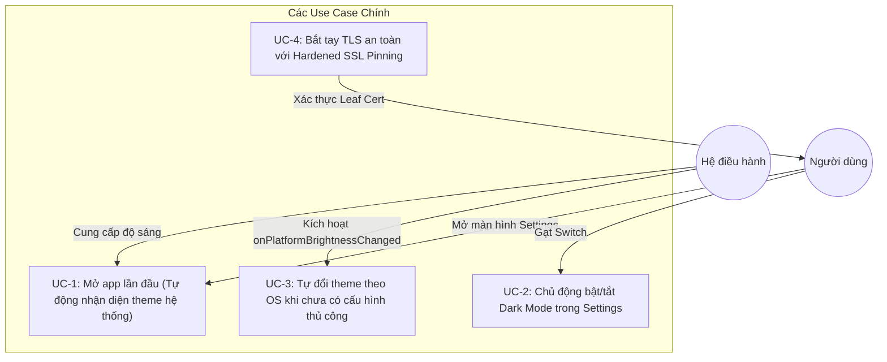
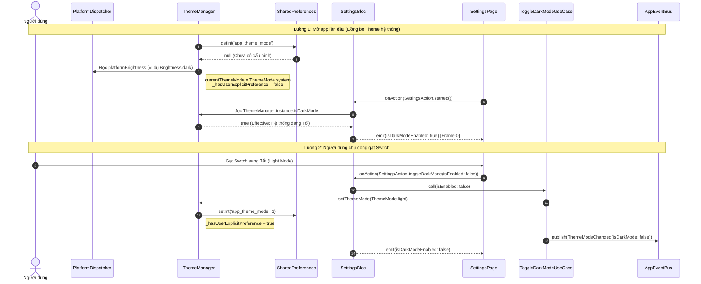

# Tổng quan Epic: Đồng bộ Giao diện Hệ thống & Gia cố SSL Pinning (HLD)

## 1. Thông tin Meta (Meta Data)
- **Tên Epic**: `system_theme_sync`
- **Trạng thái**: Done
- **Phiên bản mục tiêu**: `v1.1.0`
- **Nền tảng**: `Flutter` (Monorepo với BLoC, Clean Architecture, Melos, FVM)
- **Spec nguồn**: [2026-09-17-system-theme-sync-and-ssl-pinning-design.md](2026-09-17-system-theme-sync-and-ssl-pinning-design.md)
- **Tài liệu BDD**: [bdd_scenarios.md](bdd_scenarios.md)

---

## 2. Bối cảnh (Background)
1. **Lệch pha Theme khi mở app:** Lần đầu mở ứng dụng khi chưa có tùy chọn lưu trong `SharedPreferences`, `ThemeManager` nạp mặc định `ThemeMode.system`. Tuy nhiên, getter `ThemeManager.isDarkMode` chỉ kiểm tra cứng `currentThemeMode == ThemeMode.dark`, dẫn tới kết quả `false` dù cho hệ điều hành của thiết bị đang ở Dark Mode. Hệ quả là `SettingsBloc._onStarted` gán `isDarkModeEnabled = false`, khiến Switch Dark Mode trên giao diện Settings hiển thị OFF (sai lệch so với thực tế).
2. **Lỗi SSL Pinning khi chạy Non-Debug:** Khi build ứng dụng ở chế độ `--profile` hoặc `--release` (hoặc cấu hình `ENABLE_SSL_PINNING=true` trong môi trường staging/production), `AutoSslConfiguration` kích hoạt chế độ bảo mật `HardenedSslPinning`. Khi máy chủ Heroku (`digital-wallet-93c4ba68a41d.herokuapp.com`) luân chuyển chứng chỉ wildcard `*.herokuapp.com` mới (cấp bởi Amazon RSA 2048 M01 ngày 31/12/2025), fingerprint SHA-256 thực tế đổi thành `k9HqKHp7CLk410cHWxSuIB6q1sbvRQ3rjgSZ2NwzkvA=`. Fingerprint cũ trong code C++ (`native_security.cpp`) không khớp gây lỗi `CERTIFICATE_VERIFY_FAILED`, làm gián đoạn API bootstrap.

---

## 3. Mục tiêu (Goals & Non-Goals)

### Mục tiêu (Goals)
- **Tự động đồng bộ Theme hệ thống lần đầu:** Lần đầu mở app khi chưa có cấu hình người dùng, app tự động kiểm tra `platformDispatcher.platformBrightness` và đồng bộ chính xác trạng thái Switch Dark Mode trong Settings.
- **Lưu trữ tùy chọn người dùng bền vững:** Khi người dùng chủ động gạt Switch Dark Mode, lưu giá trị `ThemeMode.dark` hoặc `ThemeMode.light` vào `SharedPreferences`, đánh dấu `hasUserExplicitPreference = true` và ngừng tự động nhảy theo OS.
- **Thích ứng động khi OS đổi theme:** Khi người dùng chưa gạt Switch thủ công, lắng nghe sự kiện `onPlatformBrightnessChanged` để tự cập nhật giao diện và Switch trong Settings nếu hệ thống đổi giao diện.
- **Khắc phục & Gia cố SSL Pinning:** Cập nhật fingerprint mới đã mã hóa trong C++ FFI, duy trì các mã pin dự phòng theo chuẩn OWASP MASVS, hoàn thiện bộ test kiểm thử bắt tay TLS.

### Ngoài phạm vi (Non-Goals)
- Không thay đổi thiết kế Switch sang dạng Picker/Radio 3 chế độ (giữ nguyên trải nghiệm Switch On/Off theo yêu cầu người dùng).
- Không sửa đổi backend API hay cấu trúc translation dynamic.

---

## 4. Kiến trúc & Thiết kế Kỹ thuật

### 4.1 Sơ đồ Kiến trúc Tổng thể (High-Level Architecture)

```mermaid
graph TD
    subgraph Core_Package ["packages/core"]
        TM["ThemeManager"]
        PD["PlatformDispatcher (Brightness)"]
        SP["SharedPreferences (app_theme_mode)"]
    end

    subgraph Settings_Feature ["features/settings"]
        SB["SettingsBloc"]
        SP_UI["SettingsPage (Switch Widget)"]
        UC["ToggleDarkModeUseCase"]
    end

    subgraph Platform_Package ["packages/platform"]
        EB["AppEventBus"]
        EVT["ThemeModeChanged(isDarkMode)"]
    end

    subgraph Native_Security ["packages/native_security & packages/network"]
        CPP["native_security.cpp (XOR 0xAA)"]
        NS["NativeSecurity (Dart FFI)"]
        HSP["HardenedSslPinning"]
    end

    SP -->|1. Đọc khi init| TM
    PD -->|2. platformBrightness| TM
    TM -->|3. isDarkMode (effective)| SB
    SB -->|4. Frame-0 State| SP_UI
    SP_UI -->|5. User Gạt Switch| SB
    SB -->|6. onToggleDarkMode| UC
    UC -->|7. setThemeMode(dark/light)| TM
    UC -->|8. publish| EB
    EB --> EVT

    CPP -->|FFI Lookup| NS
    NS -->|Allowed Fingerprints| HSP
```

### 4.2 Trường hợp Sử dụng (Use Cases)



### 4.3 Sơ đồ Tuần tự: Khởi tạo lần đầu & Ghi đè người dùng



---

## 5. Chiến lược Triển khai & Giảm thiểu Rủi ro

- **Không ảnh hưởng dữ liệu cũ:** Người dùng đã từng cài đặt chế độ sáng/tối trước đây sẽ giữ nguyên tùy chọn lưu trong `SharedPreferences`.
- **Nguyên tắc Bảo mật Fail-Closed:** Khi xảy ra lỗi FFI, danh sách fingerprint trả về rỗng, `HardenedSslPinning` từ chối kết nối để ngăn chặn MITM mà không làm crash app.
- **Phát triển cục bộ linh hoạt:** Hỗ trợ cờ `--dart-define=ENABLE_SSL_PINNING=false` cho môi trường debug proxy.

---

## 6. Danh sách Phân rã Kanban Tasks

- [Task 01: Core ThemeManager Effective Brightness & Lifecycle](task_01_core_theme_manager_effective_brightness.md)
- [Task 02: SettingsBloc Frame-0 & Runtime Synchronization](task_02_settings_bloc_theme_synchronization.md)
- [Task 03: Native Security SSL Pinning Obfuscation & Verification](task_03_native_security_ssl_pinning_verification.md)
- [Task 04: Host App Integration, BDD Acceptance & 3-Tier Quality Gate](task_04_integration_and_quality_gate.md)
