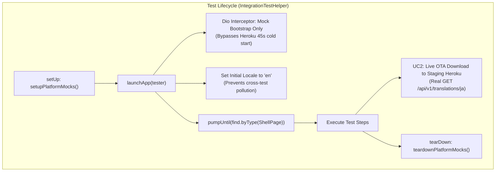
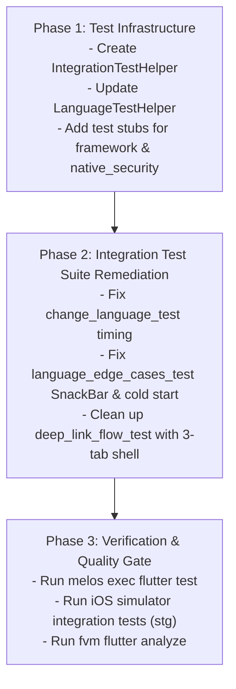

# Design Spec: Test Suite & Integration Test Remediation (Staging-Aware)

**Date**: 2026-09-17  
**Status**: Approved (Gate 1 Passed)  
**Authors**: Antigravity & DanhDue ExOICTIF  
**Target Branch**: `develop`  
**Target Environment**: `stg` / `stgDebug` (`secureFiles/stg/environment-configs.json`)  
**Target Architecture**: Clean Architecture + MVI + Multi-Package Monorepo (Flutter, Melos, BLoC)

---

## 1. Context & Problem Statement

During demo execution and local CI/testing workflows on branch `develop`, multiple test issues were observed:

1. **Integration Test Timing & Race Conditions**:
   - **45-second Heroku Staging Cold-Start**: On the staging environment (`secureFiles/stg/environment-configs.json`), cold-starts or background OTA translation downloads triggered by `POST /api/v1/settings/sync/bootstrap` frequently cause `pumpUntil` or `pumpAndSettle` in integration tests to time out.
   - **SnackBar Dismissal Race (Edge Case 2)**: In `language_edge_cases_test.dart`, `waitForLoadingToDisappear` invoked `pumpAndSettle()`, which prematurely dismissed the error `SnackBar` before `expect(find.byType(SnackBar))` executed.
   - **Lottie Infinite Animation Hang (Edge Case 4)**: `pumpAndSettle(const Duration(seconds: 5))` hangs on repeating Lottie splash animations during cold-start language restoration tests.
   - **Cross-Test Locale Contamination**: Tests modifying the global `LocalizationManager` did not reset back to `'en'` before subsequent tests ran, causing state pollution.
2. **Missing Package Test Directories**:
   - `packages/framework` and `packages/native_security` lacked a `test/` directory, causing `melos exec -- fvm flutter test` to fail with exit code 1 (`Test directory "test" not found.`).
3. **Scope Constraint**:
   - Branch `super_app_template` contains fixes for these issues alongside newly migrated demo features (`features/wallet`, `features/transaction`, `features/trends`, `features/authentication`, `features/onboard`, and a 5-tab shell).
   - **Requirement**: We must port and adapt the test infrastructure fixes to `develop` **without** bringing in the unmigrated features, maintaining the current 3-tab host shell (`HomeDashboardPage`, `ScannerPage`, `SettingsPage`) and ensuring full compatibility with the `stg` environment.

---

## 2. Core Architecture & Design

### 2.1 Staging-Aware `IntegrationTestHelper`

Create `integration_test/helpers/integration_test_helper.dart` as a shared test infrastructure utility:

1. **Live Backend Detection**:
   ```dart
   final isLiveBackend = EnvironmentConfig.apiBaseUrl.contains('herokuapp.com');
   ```
2. **Heroku Bootstrap Cold-Start Interception**:
   - In integration tests running on `stg`, register a `Dio InterceptorsWrapper` that specifically intercepts `POST /api/v1/settings/sync/bootstrap`.
   - Returns mock response with `stale_translations: []` and available languages (`en_US`, `vi`, `ja_JP`, `ko_KR`).
   - **Benefit**: App launches instantly without 45s Heroku cold-start delay and without triggering unwanted background OTA downloads that crash UI assertions.
   - **Critical Path Preserved**: User-initiated language download actions (e.g., Use Case 2 tapping Japanese `GET /api/v1/translations/ja`) still hit the live Heroku Staging backend directly to verify E2E network functionality.
3. **Clean Startup & Locale Isolation**:
   - `launchApp(WidgetTester tester)` resets `GetIt.instance` and sets `LocalizationManager.instance.setLocaleFromCode('en')` inside `onDependenciesConfigured` before calling `app.main()`.
   - Replaces fragile arbitrary sleep delays with `pumpUntil(find.byType(ShellPage))`.
4. **Condition-Based Waiting Utilities**:
   - `pumpUntil(tester, finder, timeout)`: Polls frames every 100ms until widget is present.
   - `pumpUntilDisappeared(tester, finder, timeout)`: Polls until widget is unmounted.
   - `waitUntil(tester, condition, timeout)`: Polls until business state (e.g., locale change) evaluates to `true`.
   - `switchTab(tester, tabKey)`: Taps tab item and allows double-tap debounce to settle.



---

### 2.2 Integration Test Suite Alignment

#### 1. `integration_test/change_language_test.dart`
- Replace manual bootstrap/setup with `IntegrationTestHelper.launchApp(tester)`.
- Replace fragile `humanDelay(1200)` with `await tester.pump(const Duration(milliseconds: 100))` to guarantee `CustomLoadingWidget` frame is mounted before assertion.
- Retain visual pause `humanDelay(800)` for observation on real devices/simulators.
- Leverage `waitForLoadingToDisappear` for Staging network completion.

#### 2. `integration_test/language_edge_cases_test.dart`
- Add `setupPlatformMocks()` and `teardownPlatformMocks()` in `setUp`/`tearDown`.
- **Edge Case 2 (Network Error & SnackBar)**: Replace `waitForLoadingToDisappear` (which calls `pumpAndSettle` and dismisses the SnackBar) with active polling:
  ```dart
  int waitCount = 0;
  while (find.byType(CustomLoadingWidget).evaluate().isNotEmpty && waitCount < 20) {
    await tester.pump(const Duration(milliseconds: 200));
    waitCount++;
  }
  await IntegrationTestHelper.pumpUntil(
    tester,
    find.byType(SnackBar),
    timeout: const Duration(seconds: 5),
    reason: 'Error SnackBar must be displayed upon translation download failure',
  );
  ```
- **Edge Case 4 (Cold Start Persistence)**: Replace indefinite `pumpAndSettle(Duration(seconds: 5))` with stepped frame pumping loop (`15 * 300ms`) to settle startup frames without stalling on infinite Lottie loops.
- Use `IntegrationTestHelper.switchTab` for safe navigation.

#### 3. `integration_test/deep_link_flow_test.dart`
- Retain the **3-tab shell contract** on `develop`:
  - Tab 0: `HomeDashboardPage`
  - Tab 1: `ScannerPage`
  - Tab 2: `SettingsPage`
- Use `IntegrationTestHelper.setupPlatformMocks()` and `launchApp(tester)`.
- Assert unknown link fallbacks to `HomeDashboardPage` on `develop`.

---

### 2.3 Package Test Health (`packages/*`)

To ensure `melos exec -- fvm flutter test` passes without errors across all monorepo packages:
1. **`packages/framework`**: Add `packages/framework/test/framework_test.dart` asserting core framework interfaces and base page contracts.
2. **`packages/native_security`**: Add `packages/native_security/test/native_security_test.dart` asserting security platform interface instantiation.

---

## 3. Scope Boundaries & Protection

| Component | Status on `develop` | Remediation Action |
|---|---|---|
| `HomeDashboardPage` (Tab 0) | Active | Retain & assert in deep link tests |
| `ScannerPage` (Tab 1) | Active | Retain & assert in deep link tests |
| `SettingsPage` (Tab 2) | Active | Retain & assert in language tests |
| `features/wallet` | Unmigrated | Exclude from `develop` |
| `features/transaction` | Unmigrated | Exclude from `develop` |
| `features/trends` | Unmigrated | Exclude from `develop` |
| `features/authentication` | Unmigrated | Exclude from `develop` |
| `features/onboard` | Unmigrated | Exclude from `develop` |
| `packages/platform/test/deep_link_parser_test.dart` | 3-Tab mapping | Keep tab 1 (Scanner), tab 2 (Settings) |
| `test/shell/shell_mode_test.dart` | 2-3 Tab mapping | Keep tab assertions for Home, Scanner, Settings |

---

## 4. Execution Plan (3 Phases)



---

## 5. Verification & Quality Criteria

1. **Monorepo Package Tests**:
   - `melos exec -- fvm flutter test` exits with `0` (100% success across all packages, zero missing `test/` errors).
2. **Host Unit Tests**:
   - `fvm flutter test` exits with `0` (all 71+ host tests pass).
3. **Staging Integration Tests (`stg` flavor)**:
   - `fvm flutter test integration_test/change_language_test.dart --dart-define-from-file=secureFiles/stg/environment-configs.json -d <DEVICE>` passes 100%.
   - `fvm flutter test integration_test/language_edge_cases_test.dart --dart-define-from-file=secureFiles/stg/environment-configs.json -d <DEVICE>` passes 100%.
   - `fvm flutter test integration_test/deep_link_flow_test.dart --dart-define-from-file=secureFiles/stg/environment-configs.json -d <DEVICE>` passes 100%.
4. **Code Quality**:
   - Zero analyzer errors (`fvm flutter analyze`).
   - Clean git status without untracked artifact pollution.
