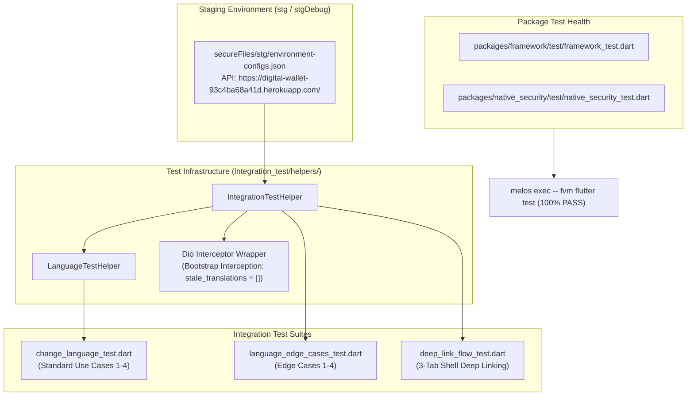
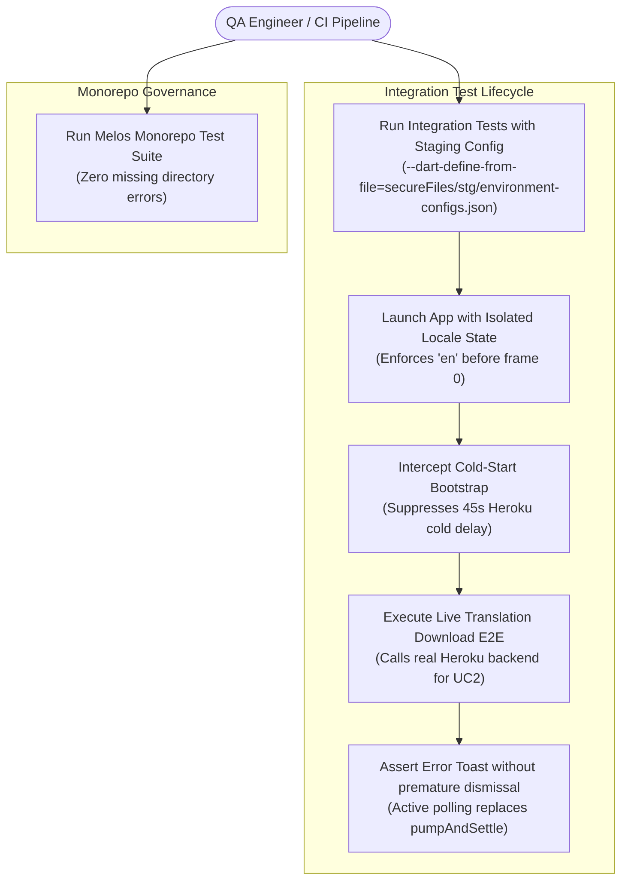
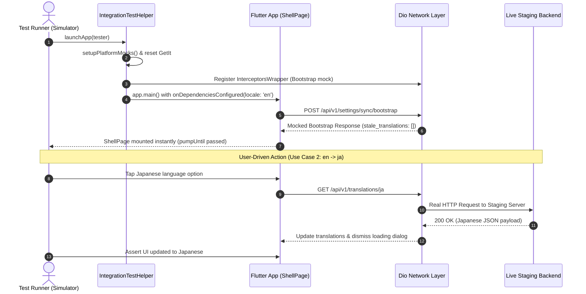

# Epic Overview: Test Suite & Integration Test Remediation (Staging-Aware)

## 1. Meta Data
- **Epic Name**: `test_suite_remediation`
- **Status**: In Progress (Stage 2 — Dev Designer)
- **Target Release**: v1.0.0-stg
- **Platform**: `Flutter` (Melos monorepo)
- **Source Spec**: [2026-09-17-test-suite-remediation-design.md](2026-09-17-test-suite-remediation-design.md)

---

## 2. Background
During demo verification and automated testing workflows on branch `develop`, several test suites suffered from failures and flakiness:
1. **Heroku Staging Cold-Start Bottleneck**: When running UI integration tests against the live Staging backend (`secureFiles/stg/environment-configs.json`), cold-starts on Heroku take up to 45 seconds. The initial `POST /api/v1/settings/sync/bootstrap` frequently causes Flutter `pumpUntil` or `pumpAndSettle` calls to time out or triggers unexpected background OTA translation downloads.
2. **Timing & Animation Races in Integration Tests**:
   - In `language_edge_cases_test.dart` (Edge Case 2), `waitForLoadingToDisappear` called `pumpAndSettle()`, automatically dismissing the error `SnackBar` before `expect(find.byType(SnackBar))` ran.
   - In `language_edge_cases_test.dart` (Edge Case 4), `pumpAndSettle(Duration(seconds: 5))` hung indefinitely on looping Lottie splash animations during cold-start locale recovery tests.
   - In `change_language_test.dart`, arbitrary delays (`humanDelay(1200)`) caused inconsistent UI state evaluations.
   - Tests did not reset the singleton `LocalizationManager` back to `'en'` before starting, causing cross-test locale contamination.
3. **Monorepo Package Test Failures**: `packages/framework` and `packages/native_security` lacked a `test/` directory, causing `melos exec -- fvm flutter test` to abort with exit code 1 (`Test directory "test" not found.`).
4. **Scope Isolation**: Branch `super_app_template` contained solutions for these issues alongside unmigrated features (`wallet`, `transaction`, `trends`, `authentication`, `onboard`, 5-tab shell). The remediation must be ported to `develop` while strictly preserving `develop`'s 3-tab shell architecture (`HomeDashboardPage`, `ScannerPage`, `SettingsPage`).

---

## 3. Goals & Non-Goals

### Goals
- Create a reusable, staging-aware `IntegrationTestHelper` that intercepts Heroku `bootstrap` calls to eliminate 45s cold starts, while preserving live E2E network calls for user-initiated translation actions.
- Eliminate all race conditions in `change_language_test.dart`, `language_edge_cases_test.dart`, and `deep_link_flow_test.dart`.
- Add test stubs to `packages/framework` and `packages/native_security` so that `melos exec -- fvm flutter test` passes 100% across all packages.
- Ensure 100% of integration tests pass cleanly when executed with `--dart-define-from-file=secureFiles/stg/environment-configs.json`.

### Non-Goals
- Migrating `wallet`, `transaction`, `trends`, `authentication`, or `onboard` features to `develop`.
- Modifying `develop`'s 3-tab navigation shell (`HomeDashboardPage`, `ScannerPage`, `SettingsPage`) or changing `ShellConfig.tabCount = 3`.
- Altering unit test tab expectations in `packages/platform/test/deep_link_parser_test.dart` or `test/shell/shell_mode_test.dart`.

---

## 4. Architecture & Technical Design

### 4.1 High-Level Architecture

### 4.2 Use Cases (Actors & Interactions)

### 4.3 Sequence Diagram (Staging Launch & OTA Verification)

---

## 5. BDD Test Scenarios Summary
The exhaustive 5-dimension BDD specification is located in [bdd_scenarios.md](bdd_scenarios.md):
1. **Happy Paths**: Clean startup with English locale, standard 3-tab deep link transitions, live staging Japanese download.
2. **Edge Cases & Boundaries**: Rapid multi-language switching race conditions, cold-start SharedPreferences locale recovery.
3. **State Transitions**: `ShellBloc` tab transitions (0: Home, 1: Scanner, 2: Settings), `SettingsBloc` language sync states.
4. **Async & Race Conditions**: Loading dialog mount synchronization (`pump(100ms)`), non-dismissing SnackBar observation.
5. **Failures & Resilience**: Translation download failure displaying error SnackBar, Heroku cold start delay suppression.

---

## 6. Rollout Strategy & Mitigation
- **Phased Implementation**:
  1. Scaffold test helper and package stubs.
  2. Remediate integration test files.
  3. Verify with full Melos and simulator test runs.
- **Rollback Plan**:
  - All changes are confined to `integration_test/` and `packages/*/test/`. If any regression occurs, changes can be reverted with `git checkout -- integration_test/ packages/`.
- **Zero Production Risk**: No shippable production code in `lib/` or feature domains is modified.

---

## 7. Kanban Tasks Breakdown
- [Task 01: Create Staging IntegrationTestHelper and Update LanguageTestHelper](../../features/task_01_create_staging_integration_test_helper.md)
- [Task 02: Add Package Test Stubs for Framework and Native Security](../../features/task_02_add_package_test_stubs_for_framework_and_native_security.md)
- [Task 03: Remediate Language Integration Tests](../../features/task_03_remediate_language_integration_tests.md)
- [Task 04: Remediate Deep Link Integration Test for 3-Tab Shell](../../features/task_04_remediate_deep_link_integration_test.md)
- [Task 05: Host Acceptance Tests and Quality Check](../../features/task_05_host_acceptance_tests_and_quality_check.md)
