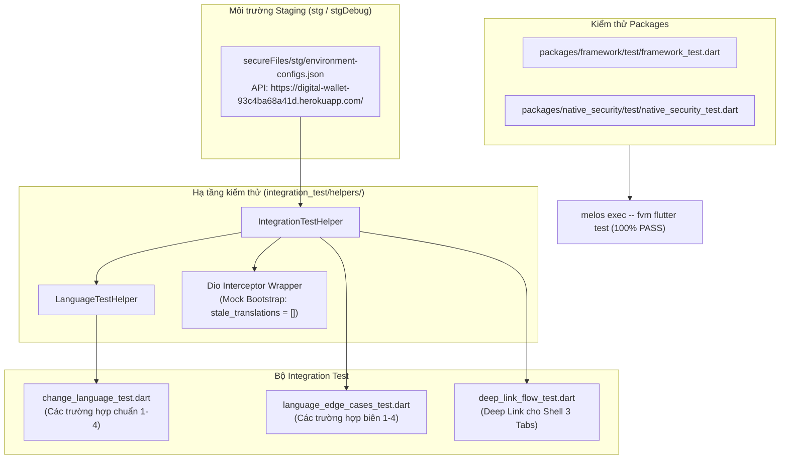
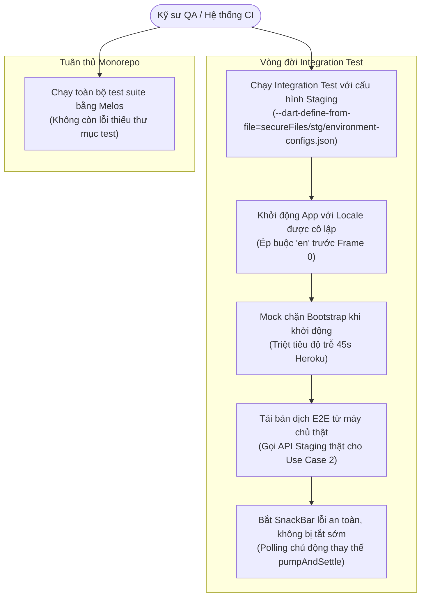
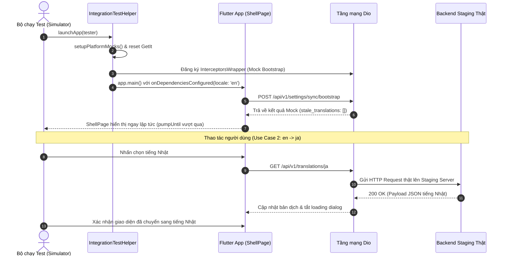

# Tổng quan Epic: Chuẩn hóa & Khắc phục Lỗi Bộ Test Cases (Tương thích Staging)

## 1. Meta Data
- **Tên Epic**: `test_suite_remediation`
- **Trạng thái**: Done
- **Phiên bản mục tiêu**: v1.0.0-stg
- **Nền tảng**: `Flutter` (Melos monorepo)
- **Tài liệu đặc tả nguồn**: [2026-09-17-test-suite-remediation-design.md](2026-09-17-test-suite-remediation-design.md)

---

## 2. Bối cảnh
Trong quá trình chạy thử demo và quy trình kiểm thử tự động trên nhánh `develop`, nhiều bộ test gặp lỗi hoặc thiếu ổn định (flakiness):
1. **Nghẽn Cold-Start 45 giây trên Heroku Staging**: Khi chạy integration test trỏ tới môi trường Staging thật (`secureFiles/stg/environment-configs.json`), thời gian khởi động nguội của Heroku có thể lên tới 45 giây. Lệnh gọi khởi tạo `POST /api/v1/settings/sync/bootstrap` khiến `pumpUntil` hoặc `pumpAndSettle` của Flutter bị timeout, hoặc kích hoạt tải ngầm bản dịch OTA không mong muốn.
2. **Lỗi Race Condition & Timing trong Integration Tests**:
   - Trong `language_edge_cases_test.dart` (Edge Case 2), `waitForLoadingToDisappear` gọi `pumpAndSettle()`, vô tình làm tắt thanh thông báo lỗi `SnackBar` trước khi câu lệnh `expect(find.byType(SnackBar))` kịp kiểm tra.
   - Trong `language_edge_cases_test.dart` (Edge Case 4), `pumpAndSettle(Duration(seconds: 5))` bị treo vô hạn do animation Lottie của Splash screen lặp lại liên tục trong kịch bản phục hồi ngôn ngữ sau cold-start.
   - Trong `change_language_test.dart`, việc sử dụng thời gian chờ cố định (`humanDelay(1200)`) gây đánh giá sai lệch trạng thái hiển thị của dialog loading.
   - Các test cases không tự động reset singleton `LocalizationManager` về `'en'` trước khi bắt đầu, dẫn đến việc dữ liệu locale bị nhiễm chéo giữa các test.
3. **Lỗi chạy kiểm thử Monorepo bằng Melos**: `packages/framework` và `packages/native_security` thiếu thư mục `test/`, khiến lệnh `melos exec -- fvm flutter test` bị dừng đột ngột với mã lỗi 1 (`Test directory "test" not found.`).
4. **Cô lập phạm vi (Scope Isolation)**: Nhánh `super_app_template` đã có các bản fix nhưng lại chứa kèm nhiều tính năng mới chưa migrate (`wallet`, `transaction`, `trends`, `authentication`, `onboard`, shell 5 tabs). Cần đưa các bản sửa lỗi sang `develop` nhưng vẫn phải bảo toàn nghiêm ngặt kiến trúc 3 tabs hiện tại của `develop` (`HomeDashboardPage`, `ScannerPage`, `SettingsPage`).

---

## 3. Mục tiêu & Giới hạn phạm vi

### Mục tiêu
- Xây dựng tiện ích dùng chung `IntegrationTestHelper` có khả năng nhận diện Staging, mock riêng endpoint `bootstrap` của Heroku để triệt tiêu thời gian cold-start 45s nhưng vẫn cho phép các hành động tải ngôn ngữ của người dùng gọi trực tiếp tới backend thật.
- Khắc phục triệt để các lỗi race condition trong `change_language_test.dart`, `language_edge_cases_test.dart` và `deep_link_flow_test.dart`.
- Bổ sung test stubs cho `packages/framework` và `packages/native_security` để lệnh `melos exec -- fvm flutter test` chạy thành công 100% trên toàn bộ packages.
- Đảm bảo 100% integration tests chạy pass khi sử dụng cấu hình `--dart-define-from-file=secureFiles/stg/environment-configs.json`.

### Giới hạn phạm vi (Non-Goals)
- Không migrate các tính năng `wallet`, `transaction`, `trends`, `authentication` hoặc `onboard` vào nhánh `develop`.
- Không thay đổi cấu trúc thanh điều hướng 3 tabs của `develop` (`HomeDashboardPage`, `ScannerPage`, `SettingsPage`) hay sửa `ShellConfig.tabCount = 3`.
- Không sửa đổi kỳ vọng số lượng tab trong các unit test `packages/platform/test/deep_link_parser_test.dart` và `test/shell/shell_mode_test.dart`.

---

## 4. Kiến trúc & Thiết kế kỹ thuật

### 4.1 Kiến trúc tổng thể

### 4.2 Use Cases (Tác nhân & Tương tác)

### 4.3 Biểu đồ tuần tự (Khởi động Staging & Tải bản dịch OTA)

---

## 5. Tóm tắt Kịch bản BDD
Toàn bộ kịch bản BDD 5 chiều được định nghĩa đầy đủ tại [bdd_scenarios.md](bdd_scenarios.md):
1. **Happy Paths**: Khởi động sạch với tiếng Anh, điều hướng deep link 3 tabs, tải tiếng Nhật E2E từ staging thật.
2. **Edge Cases & Boundaries**: Đổi nhanh nhiều ngôn ngữ liên tiếp (race condition), phục hồi locale sau cold-start từ SharedPreferences.
3. **State Transitions**: Chuyển đổi tab trong `ShellBloc` (0: Home, 1: Scanner, 2: Settings), trạng thái đồng bộ ngôn ngữ trong `SettingsBloc`.
4. **Async & Race Conditions**: Bắt kịp frame hiển thị của loading dialog (`pump(100ms)`), kiểm tra SnackBar mà không làm mất widget.
5. **Failures & Resilience**: Hiển thị SnackBar khi tải bản dịch thất bại, loại bỏ độ trễ cold start Heroku.

---

## 6. Chiến lược Triển khai & Giảm thiểu Rủi ro
- **Triển khai theo giai đoạn**:
  1. Tạo test helper và package test stubs.
  2. Khắc phục lỗi trong các file integration test.
  3. Kiểm chứng toàn diện với Melos và Simulator.
- **Kế hoạch Rollback**:
  - Mọi thay đổi chỉ nằm trong `integration_test/` và `packages/*/test/`. Nếu có vấn đề, chỉ cần `git checkout -- integration_test/ packages/`.
- **Không có rủi ro sản phẩm**: Không chỉnh sửa mã nguồn sản phẩm xuất xưởng (`lib/`) hay domain nghiệp vụ.

---

## 7. Phân rã Kanban Tasks
- [Task 01: Tạo Staging IntegrationTestHelper và cập nhật LanguageTestHelper](task_01_create_staging_integration_test_helper.md)
- [Task 02: Bổ sung Package Test Stubs cho Framework và Native Security](task_02_add_package_test_stubs_for_framework_and_native_security.md)
- [Task 03: Chuẩn hóa bộ Language Integration Tests](task_03_remediate_language_integration_tests.md)
- [Task 04: Chuẩn hóa Deep Link Integration Test cho Shell 3 Tabs](task_04_remediate_deep_link_integration_test.md)
- [Task 05: Host Acceptance Tests và Quality Check](task_05_host_acceptance_tests_and_quality_check.md)
