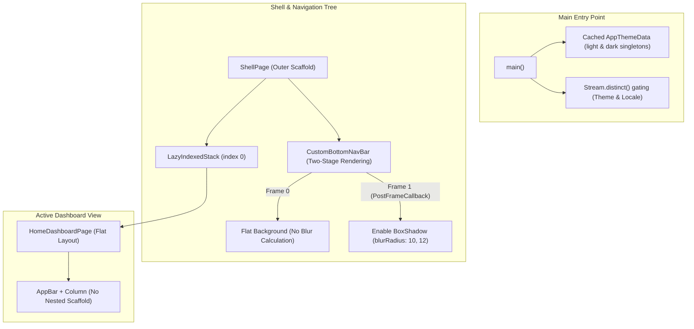

# View Rendering Optimization for Cold Start Performance

- **Epic Slug**: `view_rendering_optimization`
- **Date**: 2026-09-17
- **Author**: Antigravity Pair Programming
- **Status**: Approved by User (Stage 1 Gate 1)

---

## 1. Problem Statement

While asynchronous bootstrapping and tab mounting have been optimized via `LazyIndexedStack` and parallel `Future.wait`, the First Contentful Paint (FCP) and view rendering during cold start still present perceptible overhead due to three primary bottlenecks:

1. **Nested Scaffold Overhead**:
   - `ShellPage` establishes an outer `Scaffold` providing the app-wide scaffold layout and bottom navigation bar.
   - `HomeDashboardPage` (the active tab 0 mounted on frame 0) wraps its content inside another full `Scaffold(appBar: AppBar(...), body: ...)`.
   - **Impact**: Duplicate `ScaffoldLayout` calculations, double `MediaQuery` padding listeners, and redundant `FocusScope` / `RenderCustomMultiChildLayoutBox` allocations on the initial frame.

2. **Dynamic `ThemeData` Instantiation in Build Tree**:
   - In `lib/main.dart`, both Light and Dark `ThemeData` objects (and all sub-schemes, extensions, and factories) are instantiated dynamically inside `StreamBuilder.builder` on every stream tick.
   - **Impact**: Heavy object allocation and configuration traversal right when the Flutter pipeline is preparing its first render objects.

3. **Frame 0 BoxShadow Rasterization & GPU Shader Overhead**:
   - `CustomBottomNavBar` applies `BoxShadow(blurRadius: 10)` across the entire screen width, and the elevated center scanner item applies `BoxShadow(blurRadius: 12)`.
   - On the very first frame, the GPU raster cache is empty. The graphics pipeline must rasterize complex Gaussian blur convolutions on frame 0, increasing the critical path to first pixels.

4. **Ungated Theme and Localization Streams**:
   - `ThemeManager.instance.themeModeStream` and `LocalizationManager.instance.localeStream` lack `distinct()` gating, allowing duplicate stream ticks to trigger rebuilds of the entire `MaterialApp.router` tree.

---

## 2. Technical Architecture & Solutions

### Component A: Nested Scaffold Elimination (`HomeDashboardPage`)
- Remove the internal `Scaffold` from `HomeDashboardPage`.
- Structure `HomeDashboardPage` with a clean, single-pass layout:
  - Top header / title bar using an `AppBar` or a lightweight `SafeArea` + custom header widget.
  - Body wrapped in `Center` / `Padding` / `Column`.
- Benefits: Eliminates redundant `ScaffoldLayout` passes and collapses the widget hierarchy on the initial frame.

### Component B: Static Cached `AppThemeData` & Stream Gating (`main.dart`)
- Create an `AppThemeData` utility class providing pre-built, cached static instances:
  - `AppThemeData.lightTheme`
  - `AppThemeData.darkTheme`
- In `lib/main.dart`:
  - Pass cached `AppThemeData.lightTheme` and `AppThemeData.darkTheme` directly to `MaterialApp.router`.
  - Apply `.distinct()` to `themeModeStream` and `localeStream` to eliminate duplicate tree rebuilds.

### Component C: Two-Stage First Paint for `CustomBottomNavBar`
- Maintain 100% visual fidelity: All blur radius values (`10`, `12`), offsets, colors, and opacity remain identical to original design.
- Introduce staged decoration in `CustomBottomNavBar`:
  - On **Frame 0**, render the bottom bar and elevated center button with solid background colors and borders, skipping shadow rasterization.
  - On **Frame 1** (via `addPostFrameCallback`), activate the `BoxShadow` list.
  - This removes Gaussian convolution from the critical path of the first painted frame, dropping first-frame raster latency while preserving the visual aesthetic instantly after.

---

## 3. Aesthetic Preservation
- All visual elements remain visually identical:
  - Blur radius on bottom bar: `10`
  - Blur radius on center QR button: `12`
  - Colors, typography, icon sizes, and dimensions: 100% preserved.

---

## 4. Verification Plan

### Automated Tests
1. **No Nested Scaffold Assertion**:
   - Widget test verifying that rendering `ShellPage` results in exactly 1 `Scaffold` in the widget tree for the Home tab.
2. **Two-Stage Rendering Verification**:
   - Widget test verifying that `CustomBottomNavBar` renders successfully in both initial and post-frame states.
3. **Stream Deduplication**:
   - Unit test or widget test verifying that duplicate stream events on theme/locale do not trigger rebuilds.
4. **Full Test Suite & Analyzer**:
   - `melos test` -> 74+ tests pass.
   - `fvm flutter analyze` -> 0 issues found.
