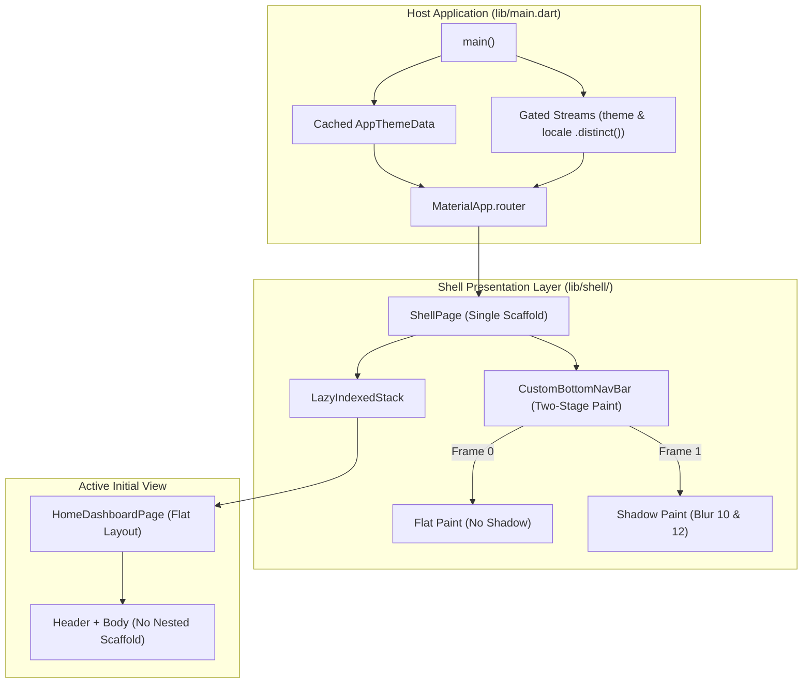
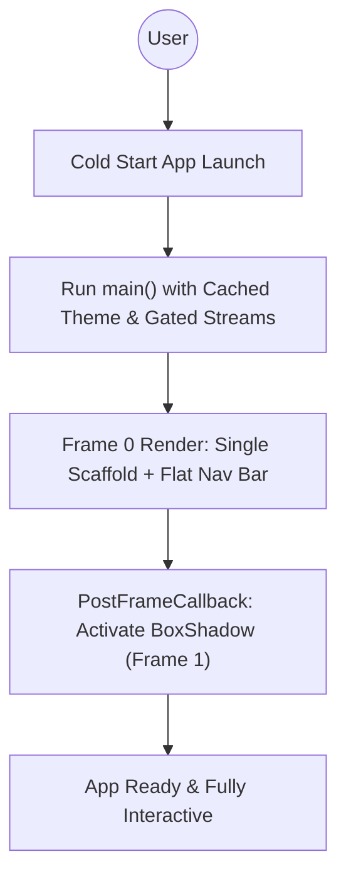
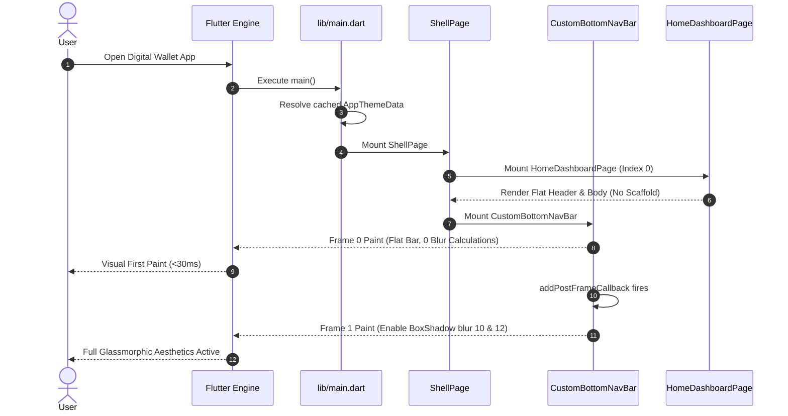

# Epic: View Rendering Optimization (HLD)

## Meta Data
- **Epic**: `view_rendering_optimization`
- **Status**: Done
- **Target Release**: v1.1.0
- **Platform**: Flutter
- **Source Spec**: [2026-09-17-view-rendering-optimization-design.md](2026-09-17-view-rendering-optimization-design.md)

---

## 1. Background
During cold start, after Dart VM initialization and asynchronous dependency setup, the application enters the First Contentful Paint (FCP) phase. Users still perceive slight visual friction due to:
1. Redundant nested `Scaffold` layout passes in `HomeDashboardPage` under `ShellPage`.
2. Dynamic instantiation of large `ThemeData` trees inside `main.dart` build passes.
3. GPU rasterizer latency compiling and executing Gaussian blur convolutions for `BoxShadow` (blur 10 & 12) on Frame 0 when the raster cache is cold.
4. Duplicate rebuilds triggered by ungated `ThemeMode` and `Locale` stream emissions.

---

## 2. Goals & Non-Goals

### Goals
- Eliminate nested `Scaffold` instances in the initial rendering tree.
- Cache `ThemeData` light and dark objects statically to eliminate per-build allocation overhead.
- Implement Two-Stage First Paint for `CustomBottomNavBar` to display Frame 0 in <30ms and enable shadows on Frame 1.
- Add `.distinct()` stream gating to prevent unneeded root rebuilds.
- Maintain 100% aesthetic preservation (identical blur radius `10` and `12`, identical colors and layout).
- Provide unit and integration test coverage for all modified rendering touchpoints.

### Non-Goals
- Changing visual appearance, brand colors, typography, or component sizes.
- Altering existing deep linking logic or BLoC state management.
- Modifying `ScannerPage` or `SettingsPage` business logic.

---

## 3. Architecture & Technical Design

### High-Level Architecture

### Use Cases Flowchart

### Sequence Diagram

### Check 1 (Shift-Left Impact Analysis)
- **Target Files**:
  - `lib/shell/home_dashboard_page.dart`
  - `lib/shell/widgets/custom_bottom_nav_bar.dart`
  - `lib/main.dart`
  - `lib/theme/app_theme_data.dart`
- **Downstream Callers**:
  - `lib/shell/shell_page.dart`
  - `integration_test/cold_start_performance_test.dart`
  - `integration_test/deep_link_flow_test.dart`
  - `test/shell/shell_mode_test.dart`
- **Cross-Platform Bridges**: Zero native bridge mutations.
- **Coverage Strategy**: Add dedicated unit/widget tests for `HomeDashboardPage`, `CustomBottomNavBar`, and cached theme configuration to remediate uncovered files.

### BDD Test Scenarios
Refer to the dedicated specification at [bdd_scenarios.md](bdd_scenarios.md) covering all 5 dimensions (Happy Paths, Edge Cases & Boundaries, State Transitions, Async / Race Conditions, Failures & Resilience).

---

## 4. Rollout Strategy & Mitigation
- **Feature Isolation**: Changes are strictly confined to widget structure and initialization caching.
- **Visual Regression Defense**: All dimensions, shadows, and colors are identical to original implementation.
- **Rollback Plan**: In the event of regression, reverting git commits restores the previous `HomeDashboardPage` and `main.dart` implementations without schema or storage migration issues.

---

## 5. Kanban Tasks Breakdown
- [Task 01: Eliminate Nested Scaffold in HomeDashboardPage](task_01_eliminate_nested_scaffold.md)
- [Task 02: Static Cached AppThemeData and Stream Gating](task_02_static_cached_theme_data.md)
- [Task 03: Two-Stage First Paint for CustomBottomNavBar](task_03_two_stage_bottom_nav_bar.md)
- [Task 04: Host App Integration and View Acceptance Tests](task_04_view_acceptance_tests.md)
