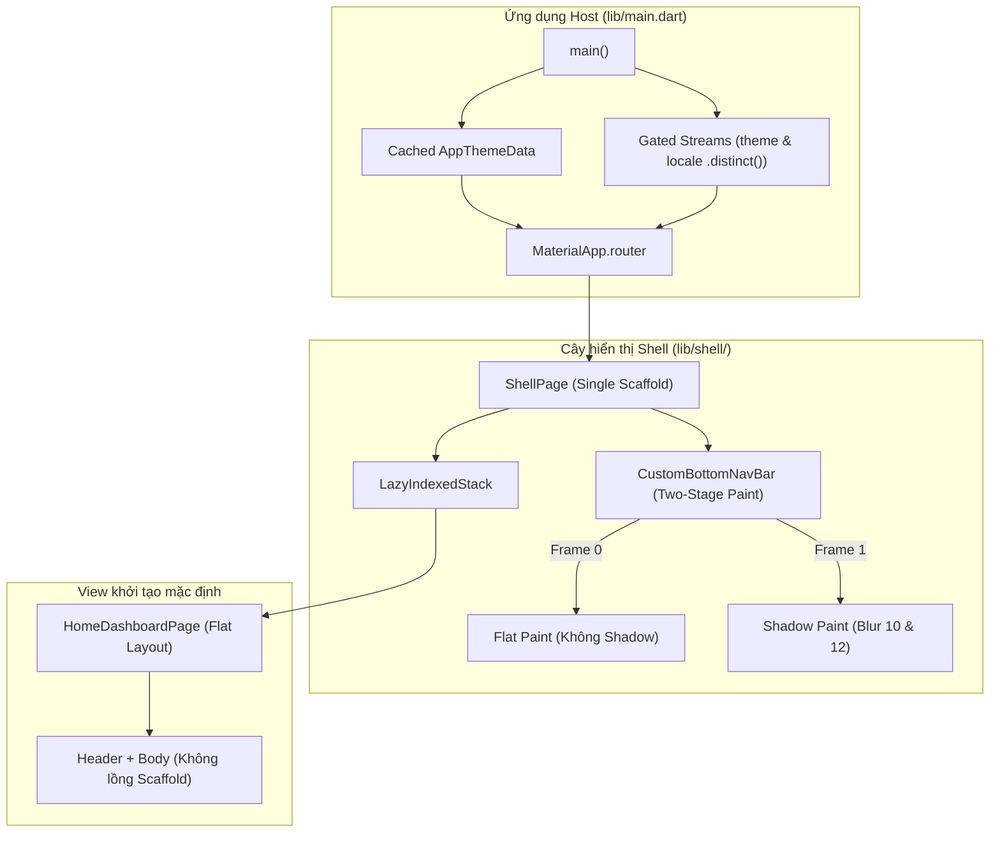
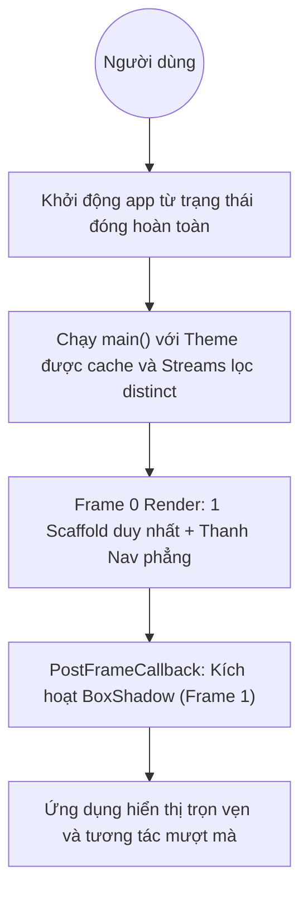
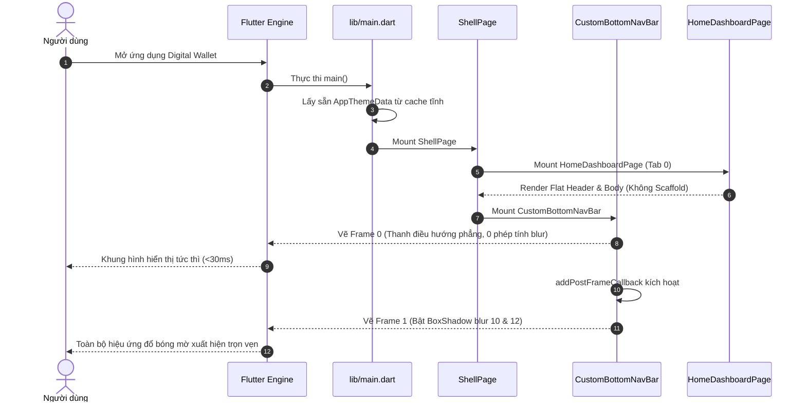

# Epic: Tối ưu hoá Render Views trong Cold Start (HLD)

## Meta Data
- **Epic**: `view_rendering_optimization`
- **Trạng thái**: Done
- **Phiên bản mục tiêu**: v1.1.0
- **Nền tảng**: Flutter
- **Tài liệu Spec nguồn**: [2026-09-17-view-rendering-optimization-design.md](2026-09-17-view-rendering-optimization-design.md)

---

## 1. Bối cảnh
Trong quá trình khởi động nguội (Cold Start), sau khi Dart VM và việc khởi tạo các dependency bất đồng bộ hoàn tất, ứng dụng bước vào giai đoạn hiển thị khung hình đầu tiên (First Contentful Paint - FCP). Người dùng vẫn cảm nhận độ trễ nhỏ do các nguyên nhân:
1. Lồng ghép `Scaffold` trùng lặp: `HomeDashboardPage` nằm bên trong `ShellPage` nhưng lại tạo thêm một instance `Scaffold` độc lập khác.
2. Khởi tạo lại các object `ThemeData` kích thước lớn liên tục trong các lượt build của `main.dart`.
3. Trễ xử lý rasterizer trên GPU khi phải biên dịch shader và tính toán làm mờ Gaussian cho `BoxShadow` (blur 10 & 12) tại Frame 0 khi bộ đệm raster chưa được làm ấm.
4. Rebuild cây widget không cần thiết do các stream `ThemeMode` và `Locale` chưa được lọc sự kiện trùng lặp (`distinct()`).

---

## 2. Mục tiêu & Giới hạn phạm vi

### Mục tiêu
- Loại bỏ `Scaffold` lồng nhau trong cây widget ban đầu.
- Cache tĩnh các đối tượng `ThemeData` (light & dark) để triệt tiêu chi phí cấp phát bộ nhớ mỗi lần build.
- Áp dụng cơ chế Two-Stage First Paint cho `CustomBottomNavBar` để render Frame 0 trong <30ms và kích hoạt bóng đổ ở Frame 1.
- Bổ sung bộ lọc `.distinct()` cho các stream để chặn rebuild dư thừa.
- Bảo toàn 100% độ thẩm mỹ thiết kế (giữ nguyên bán kính làm mờ `10` và `12`, giữ nguyên màu sắc và kích thước).
- Cung cấp đầy đủ unit/widget test và integration test cho các điểm chạm hiển thị.

### Giới hạn phạm vi (Non-Goals)
- Không thay đổi thiết kế giao diện, màu thương hiệu hay kích thước widget.
- Không thay đổi logic deep link hay state management BLoC hiện có.
- Không chỉnh sửa logic nghiệp vụ của `ScannerPage` hay `SettingsPage`.

---

## 3. Kiến trúc & Thiết kế kỹ thuật

### Kiến trúc tổng thể (High-Level Architecture)

### Sơ đồ trường hợp sử dụng (Use Cases)

### Sơ đồ tuần tự (Sequence Diagram)

### Phân tích tác động Shift-Left (Check 1)
- **Các file đích**:
  - `lib/shell/home_dashboard_page.dart`
  - `lib/shell/widgets/custom_bottom_nav_bar.dart`
  - `lib/main.dart`
  - `lib/theme/app_theme_data.dart`
- **Các caller chịu ảnh hưởng**:
  - `lib/shell/shell_page.dart`
  - `integration_test/cold_start_performance_test.dart`
  - `integration_test/deep_link_flow_test.dart`
  - `test/shell/shell_mode_test.dart`
- **Cầu nối Native**: Không thay đổi bất kỳ MethodChannel nào.
- **Chiến lược kiểm thử**: Viết mới các unit/widget test chuyên biệt cho `HomeDashboardPage`, `CustomBottomNavBar` và cấu hình theme để đảm bảo độ bao phủ kiểm thử cao.

### Kịch bản kiểm thử BDD
Xem chi tiết tại [bdd_scenarios.md](bdd_scenarios.md) bao phủ toàn diện 5 chiều kiểm thử bắt buộc (Happy Paths, Edge Cases, State Transitions, Async/Concurrency, Failures & Resilience).

---

## 4. Chiến lược triển khai & Giảm thiểu rủi ro
- **Cách ly thay đổi**: Tác động chỉ giới hạn trong cấu trúc cây widget và cơ chế cache của khởi tạo theme.
- **Bảo vệ thẩm mỹ**: Mọi kích thước, bán kính mờ và màu sắc đều giữ nguyên tuyệt đối.
- **Kế hoạch Rollback**: Nếu có phát sinh lỗi, việc revert commit sẽ khôi phục ngay trạng thái trước mà không làm ảnh hưởng đến dữ liệu hay database.

---

## 5. Danh sách Kanban Tasks
- [Task 01: Loại bỏ Nested Scaffold trong HomeDashboardPage](task_01_eliminate_nested_scaffold.md)
- [Task 02: Cache tĩnh AppThemeData và Lọc Streams](task_02_static_cached_theme_data.md)
- [Task 03: Two-Stage First Paint cho CustomBottomNavBar](task_03_two_stage_bottom_nav_bar.md)
- [Task 04: Tích hợp Host App và Kiểm thử nghiệm thu Views](task_04_view_acceptance_tests.md)
