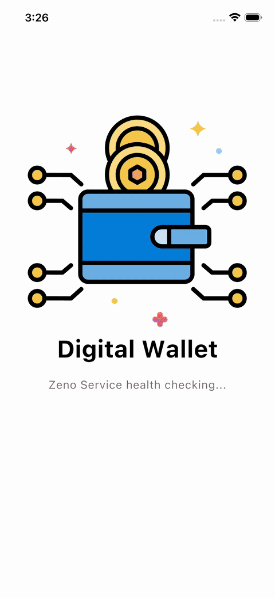
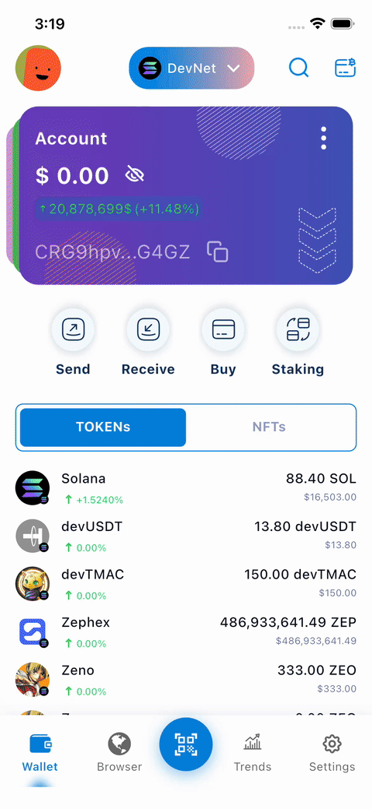

# BLOC DIGITAL WALLET

A modern digital wallet app built with **Flutter**, following **Clean Architecture** and **MVI (Model-View-Intent)** pattern.

---

## Table of Contents

- [I. Architecture](#️-architecture)
  - [1. Clean Architecture + MVI](#i-clean-architecture--mvi)
  - [2. MVI Mechanism](#ii-mvi-mechanism)
  - [3. Feature-First Organization](#iii-feature-first-organization)
- [II. Documents](#-documents)
  - [1. Getting Started](#1-getting-started)
  - [2. Architecture](#2-architecture)
  - [3. Development](#3-development)
  - [4. Mason](#4-mason)
  - [5. Environment](#5-environment)
  - [6. AI Agents](#6-ai-agents)
  - [7. AI Agent Skills](#7-ai-agent-skills)
  - [8. Task Templates](#8-task-templates)
- [III. Demo](#-demo)
- [IV. References](#-references)
  - [1. UI/UX Design](#1-uiux-design)
  - [2. API Documents](#2-api-documents)
  - [3. Architecture & Patterns](#3-architecture--patterns)
  - [4. Flutter Packages](#4-flutter-packages)
- [V. License](#-license)


---

## 🏗️ Architecture

### I. Clean Architecture + MVI

#### 1. Core Concepts

| Principle | Description |
|-----------|-------------|
| **Dependency Rule** | `Presentation → Domain ← Data`. Domain knows nothing about outer layers. |
| **Separation of Concerns** | UI, business logic, and data handling are strictly separated. |
| **Testability** | Each layer can be tested independently. |
| **Pure Domain** | Domain layer must be Pure Dart (no Flutter imports). |

#### 2. Data Flow Diagram

```mermaid
%%{init: {'flowchart': {'subGraphTitleMargin': 40, 'diagramPadding': 30}}}%%
graph LR
    %% --- LAYER DEFINITIONS ---
    subgraph Presentation_Layer ["Presentation"]
        View["View (Widget)"]
        BLoC["BLoC"]
    end

    subgraph Domain_Layer ["Domain"]
        UseCase["Use Case"]
        RepoInterface(["Repository Interface"])
    end

    subgraph Data_Layer ["Data"]
        RepoImpl["Repository Impl"]
        DataSource["Remote/Local Data Source"]
    end

    %% --- DATA FLOW ---
    View -- "1. Send Action" --> BLoC
    BLoC -- "2. Call UseCase" --> UseCase
    UseCase -- "2a. Call Repo Interface" --> RepoInterface
    RepoInterface -. "implements" .-> RepoImpl
    RepoImpl -- "2b. Call Data Source" --> DataSource

    DataSource -- "3a. Return Data" --> RepoImpl
    RepoImpl -- "3b. Map to Entity" --> UseCase
    UseCase -- "3. Return Result" --> BLoC

    BLoC -- "4. Update State" --> View
    BLoC -. "5. Emit Event" .-> View

    %% --- STYLING ---
    classDef interface fill:#fffde7,stroke:#fbc02d,stroke-width:1px,stroke-dasharray: 5 5;
    class RepoInterface interface;
    style Presentation_Layer fill:#C7FDCB,stroke:#02CC0C,stroke-width:2px;
    style Data_Layer fill:#A7DAF2,stroke:#088DF3,stroke-width:2px;
    style Domain_Layer fill:#F4F0C0,stroke:#fbc02d,stroke-width:2px;
```



> [!IMPORTANT]
> **Important Rules**
> 1. **Dependency Rule:** `Presentation` -> `Domain` <- `Data`. Presentation MUST NOT call Data directly.
> 2. **No Flutter in Domain:** Domain layer must be `Pure Dart`.
> 3. **Unidirectional Data Flow:** `View` -> `BLoC` -> `Domain` -> `Data` -> `Domain` -> `BLoC` -> `View`.

---

### II. MVI Mechanism

#### 1. Core Components

| Component | Type | Direction | Responsibility |
| :--- | :--- | :--- | :--- |
| **Action** | INPUT | View ➡️ BLoC | User actions (e.g., Button click) |
| **State** | DATA | BLoC ➡️ View | UI state for rendering (Persistent) |
| **Event** | OUTPUT | BLoC ➡️ View | One-time effects (Toast, Navigation) |

#### 2. Full Data Flow

```
┌───────────────────────────────────────────────────────────────────────────┐
│                         PRESENTATION LAYER                                │
│                                                                           │
│   ┌─────────────────────┐     1. Action (Input)   ┌─────────────────┐     │
│   │      ViewModel      │ ◀────────────────────── │      View       │     │
│   │   ┌─────────────┐   │ ──────────────────────▶ │    (Widget)     │     │
│   │   │    BLoC     │   │   9. emit() / emitEvent └─────────────────┘     │
│   │   └─────────────┘   │                                                 │
│   └─────────────────────┘                                                 │
│             │                                                             │
│             │ 2. Call UseCase                                             │
└─────────────│─────────────────────────────────────────────────────────────┘
              │
              ▼
┌───────────────────────────────────────────────────────────────────────────┐
│                           DOMAIN LAYER                                    │
│                                                                           │
│   ┌─────────────────┐   3. Call Repo     ┌─────────────────────┐          │
│   │                 │ ─────────────────▶ │     Repository      │          │
│   │     UseCase     │                    │    (Interface)      │          │
│   │                 │ ◀───────────────── │                     │          │
│   └─────────────────┘   8. Either<F,E>   └─────────────────────┘          │
│                                                    │                      │
│                                                    │ implements           │
└────────────────────────────────────────────────────│──────────────────────┘
                                                     │
                                                     ▼
┌───────────────────────────────────────────────────────────────────────────┐
│                            DATA LAYER                                     │
│                                                                           │
│   ┌─────────────────┐   4. Call DS       ┌─────────────────────┐          │
│   │   DataSource    │ ◀───────────────── │   Repository Impl   │          │
│   │ (Remote/Local)  │                    │                     │          │
│   └─────────────────┘                    └─────────────────────┘          │
│           │                                        ▲                      │
│           │ 5. API/DB Call                         │ 7. Return Entity     │
│           ▼                                        │                      │
│   ┌─────────────────┐   6. Map to Entity ┌─────────────────────┐          │
│   │   Model (DTO)   │ ─────────────────▶ │       Entity        │          │
│   │    Response     │                    │    (Pure Dart)      │          │
│   └─────────────────┘                    └─────────────────────┘          │
│                                                                           │
└───────────────────────────────────────────────────────────────────────────┘
```

### III. Feature-First Organization

#### Directory Structure

```
lib/
├── core/                    # Shared infrastructure
│   ├── architecture/        # MVI base classes (BaseAction, BaseState, MviBloc)
│   ├── errors/              # Failures & exceptions
│   ├── network/             # API clients (Dio, interceptors)
│   └── storage/             # Local storage (Hive, SharedPreferences)
│
├── features/                # Feature modules
│   └── {feature}/
│       ├── data/
│       │   ├── datasources/
│       │   │   ├── {feature}_local_datasource.dart
│       │   │   └── {feature}_remote_datasource.dart
│       │   ├── models/
│       │   │   └── {feature}_model.dart (+.freezed.dart, +.g.dart)
│       │   └── repositories/
│       │       └── {feature}_repository_impl.dart
│       ├── domain/
│       │   ├── entities/
│       │   │   └── {feature}_entity.dart
│       │   ├── repositories/
│       │   │   └── {feature}_repository.dart
│       │   └── usecases/
│       │       └── get_{feature}_usecase.dart
│       └── presentation/
│           ├── models/
│           │   └── {feature}_ui_model.dart
│           └── {feature}/
│               ├── {feature}_action.dart
│               ├── {feature}_bloc.dart
│               ├── {feature}_event.dart
│               ├── {feature}_page.dart
│               └── {feature}_state.dart
│
├── di/                      # Dependency injection
└── generated/               # Auto-generated (assets, colors, translations)
```

#### Architecture Layer Details

| Layer | Component | Responsibility |
|-------|-----------|----------------|
| 🟢 **Presentation** | View (Widget) | Render UI based on State. No business logic. |
| | BLoC | Manages State, processes Actions. Single entry: `onAction()`. |
| 🟡 **Domain** | Entity | Pure Dart objects. **MUST use `@freezed`**. |
| | Repository Interface | Contract for data ops. Returns `Either<Failure, Entity>`. |
| | UseCase | Encapsulates business logic. Single responsibility. |
| 🔵 **Data** | Model (DTO) | Matches API response. **MUST use `@freezed` + `@JsonSerializable`**. |
| | DataSource | Remote (Dio/Retrofit) or Local (Hive). Throws Exceptions. |
| | Repository Impl | Implements interface. Maps Model → Entity. Converts Exceptions → Failures. |

> ⚠️ **CRITICAL**: Domain layer must be **Pure Dart**. No `import 'package:flutter/*'`!


---

## 📚 Documents

### 1. Getting Started
| Document | Description |
|----------|-------------|
| [Quick Start](docs/getting-started/QUICK_START.md) | Setup in 5 minutes |
| [Quick Reference](docs/getting-started/QUICK_REFERENCE.md) | Cheat sheet with code templates |

### 2. Architecture
| Document | Description |
|----------|-------------|
| [Architecture Guide](docs/architecture/ARCHITECTURE.md) | Complete architecture overview |
| [App Initializer](docs/architecture/app_initialization.md) | Startup logic guide |

### 3. Development
| Document | Description |
|----------|-------------|
| [Implementation Guide](docs/development/IMPLEMENTATION_GUIDE.md) | Step-by-step feature creation |
| [Theme Tailor Guide](docs/development/THEME_TAILOR_GUIDE.md) | Theming system |
| [Slang Localization](docs/development/SLANG_LOCALIZATION_GUIDE.md) | i18n setup |

### 4. Mason
| Document | Description |
|----------|-------------|
| [Mason Guide](docs/mason/MASON_GUIDE.md) | Code generation |

### 5. Environment
| Document | Description |
|----------|-------------|
| [Flavors Setup](docs/environment/FLAVORS_SETUP_COMPLETE.md) | Build variants |

### 6. AI Agents
| Document | Description |
|----------|-------------|
| [AI Agent README](docs/ai-agents/AI_AGENT_README.md) | Guide for AI assistants |
| [Double Check Guide](docs/ai-agents/DOUBLE_CHECK_GUIDE.md) | Verification steps |

### 7. AI Agent Skills
| Skill | Description |
|-------|-------------|
| [api_integration](.agent/skills/api_integration/SKILL.md) | Automate API request handling from model generation to Data Source integration |
| [check_secure_files](.agent/skills/check_secure_files/SKILL.md) | Verify required secure config files for all environments (dev, stg, prd) |
| [copy_secure_configurations](.agent/skills/copy_secure_configurations/SKILL.md) | Copy secure config files to Android and iOS project paths |
| [create_new_feature](.agent/skills/create_new_feature/SKILL.md) | Create features following Clean Architecture + MVI pattern |
| [json_to_freezed_model](.agent/skills/json_to_freezed_model/SKILL.md) | Parse JSON and create freezed object classes |
| [setup_keybindings](.agent/skills/setup_keybindings/SKILL.md) | Merge workspace keybindings into global IDE configuration |
| [setup_variants](.agent/skills/setup_variants/SKILL.md) | Automate build variants (flavors) setup for Android and iOS |

### 8. Task Templates
| Document | Description |
|----------|-------------|
| [Prompt Templates](docs/task-prompt-templates/README.md) | Ready-to-use AI prompts |

---

## 🎬 Demo

<table>
  <tr>
    <td align="center"><b>Splash & Onboard</b></td>
    <td align="center"><b>Wallet List</b></td>
    <td align="center"><b>Token Details</b></td>
  </tr>
  <tr>
    <td></td>
    <td></td>
    <td></td>
  </tr>
  <tr>
    <td></td>
    <td></td>
    <td></td>
  </tr>
</table>

---

## 🔗 References

### 1. UI/UX Design
-   [MetaMask Redesign on Figma][0] - Web 3.0 wallet redesign case study used as design inspiration.

### 2. API Documents
-   [Swagger Docs][1] - Interactive API documentation for backend endpoints.
-   [API Repository][2] - Backend API source code on GitHub that based on the Django Ninja Rest Framework.

### 3. Architecture & Patterns
-   [Flutter BLoC][3] - Official BLoC library documentation.
-   [Clean Architecture][4] - Uncle Bob's original Clean Architecture article.
-   [MVI Pattern][5] - Model-View-Intent pattern explanation by Hannes Dorfmann.
-   [Dependency Manager][6] - Dependency Manager — An Approach to Multiple Repositories in Flutter.

### 4. Flutter Packages
-   [AutoRoute][7] - Declarative routing with code generation.
-   [Freezed][8] - Immutable data classes with union types.
-   [Mason][9] - Template-based code generation.
-   [Theme Tailor][10] - Type-safe theming system.
-   [Slang][11] - Type-safe localization.


[0]: https://www.figma.com/design/uy4hISX1JFBu02QMpBKBql/Case-Study--Web-3.0---MetaMask-Redesign--Community-?m=auto&t=i8dTyUCu7EZFdKiT-6
[1]: https://digital-wallet-93c4ba68a41d.herokuapp.com/api/v1/docs
[2]: https://github.com/DanhDue/django_digital_wallet
[3]: https://bloclibrary.dev
[4]: https://blog.cleancoder.com/uncle-bob/2012/08/13/the-clean-architecture.html
[5]: http://hannesdorfmann.com/android/mosby3-mvi-1
[6]: https://gpalma.pt/blog/dependency_manager/
[7]: https://pub.dev/packages/auto_route
[8]: https://pub.dev/packages/freezed
[9]: https://pub.dev/packages/mason
[10]: https://pub.dev/packages/theme_tailor
[11]: https://pub.dev/packages/slang

---

## 📝 License

Copyright © 2026, one of DanhDue ExOICTIF projects. All rights reserved.

---

Built with ❤️ using Clean Architecture + MVI
