# Architecture: MVI Mechanism
*(Feature-First Clean Architecture)*

This document describes the Data Flow and Naming Conventions used in the project.

## 1. Core Concepts

Core components follow these conventions:

| Component | Type | Direction | Meaning & Responsibility |
| :--- | :--- | :--- | :--- |
| **Action** | **INPUT** | **View ➡️ BLoC** | **User actions.** <br> Triggers processing logic (e.g., Button click, Key press). |
| **State** | **DATA** | **BLoC ➡️ View** | **UI state.** <br> Data needed to render the screen (Persistent). View listens to State to rebuild. |
| **Event** | **OUTPUT** | **BLoC ➡️ View** | **One-time events (Side Effect).** <br> UI control commands without state storage (e.g., Toast, Navigation, Dialog). |

## 2. Data Flow Diagram

The flow is **Unidirectional**:

```mermaid
%%{init: {'flowchart': {'subGraphTitleMargin': 40, 'diagramPadding': 30}}}%%
graph LR
    %% --- LAYER DEFINITIONS ---
    subgraph Presentation_Layer ["Presentation"]
        p_pad[ ]:::hidden
        View["Compose/Widget"]
        BLoC["BLoC/ViewModel"]
    end

    subgraph Domain_Layer ["Domain"]
        dom_pad[ ]:::hidden
        UseCase["Use Case"]
        %% Interface in Domain to ensure Dependency Rule
        RepoInterface(["Repository Interface"])
    end

    subgraph Data_Layer ["Data"]
        data_pad[ ]:::hidden
        %% Implementation in Data, depends on Interface in Domain
        RepoImpl["Repository Impl"]
        DataSource["Remote/Local Data Source"]
    end

    %% --- DATA FLOW ---

    %% Step 1: From UI downwards
    View -- "1. Send Action (Input)" --> BLoC
    BLoC -- "2. Call UseCase" --> UseCase
    UseCase -- "2a. Call Repo Interface" --> RepoInterface

    %% Dashed arrow represents Implementation (Data) executing Interface (Domain)
    RepoInterface -. "implements" .-> RepoImpl
    RepoImpl -- "2b. Call Data Source (API/DB)" --> DataSource

    %% Step 2: From Data back up
    DataSource -- "3a. Return DTO/Raw Data" --> RepoImpl
    RepoImpl -- "3b. Map to Entity & Return to Domain" --> UseCase
    UseCase -- "3. Return processing result" --> BLoC

    %% Step 3: Update UI
    BLoC -- "4. Update State (Data)" --> View
    BLoC -. "5. Emit Event (Side Effect)" .-> View

    %% --- STYLING ---
    classDef action fill:#e1f5fe,stroke:#01579b,stroke-width:2px,color:#01579b;
    classDef state fill:#e8f5e9,stroke:#2e7d32,stroke-width:2px,color:#2e7d32;
    classDef event fill:#fff3e0,stroke:#ef6c00,stroke-width:2px,color:#ef6c00,stroke-dasharray: 5 5;
    classDef interface fill:#fffde7,stroke:#fbc02d,stroke-width:1px,stroke-dasharray: 5 5;
    classDef hidden fill:none,stroke:none,color:none;

    %% Apply styles to special nodes
    class RepoInterface interface;
    style Presentation_Layer fill:#C7FDCB,stroke:#02CC0C,stroke-width:2px;
    style Data_Layer fill:#A7DAF2,stroke:#088DF3,stroke-width:2px;
    style Domain_Layer fill:#F4F0C0,stroke:#fbc02d,stroke-width:2px;

    %% Color important arrows in Presentation Layer
    linkStyle 0 stroke:#01579b,stroke-width:2px;
    linkStyle 7 stroke:#2e7d32,stroke-width:2px;
    linkStyle 8 stroke:#ef6c00,stroke-width:2px,stroke-dasharray: 5 5;
```



<br/>

> [!IMPORTANT]
> **Important Rules**
>
> 1. **Dependency Rule:** `Presentation` -> `Domain` <- `Data`. Presentation MUST NOT call Data directly. Domain MUST NOT import anything from Presentation or Data.
> 2. **No Flutter in Domain:** Domain layer must be `Pure Dart`. If you see `import 'package:flutter/*'` in Domain, it violates architecture.
> 3. **Unidirectional Data Flow:** Data always flows in a circle: `View` -> `BLoC` -> `Domain` -> `Data` -> `Domain` -> `BLoC` -> `View`.

## 📐 Architecture Layers

### Layer Breakdown

Architecture is divided into 3 main layers, strictly adhering to the Dependency Rule: **Outer layers depend on inner layers; inner layers know nothing about outer layers.**

#### 🟢 1. Presentation Layer (UI & State)
*Contains code related to user interface and user experience.*

* **View (Compose/Widget):**
    * Flutter widgets or Composable functions.
    * **Responsibility:** Render UI based on current `State`.
    * **Principle:** "Dumb View". Contains no business logic, doesn't call APIs directly. Only receives data to display and reports user actions (`Action`) to BLoC.
* **BLoC (Business Logic Component):**
    * **Responsibility:** Manages UI state (`State`), processes `Action` from View, and interacts with Domain Layer (UseCase).
    * **State Holder:** Holds `Stream<State>` for View to listen.
    * **Event Emitter:** Emits `Stream<Event>` for one-time events (Navigation, Toast).
    * **Single Entry Point:** `onAction(action)` - the ONLY method View should call.
* **Contract (State/Action/Event):**
    * Defines communication protocol between View and BLoC (see section 1).

#### 🟡 2. Domain Layer (Business Logic - The Core)
*The heart of the application. Contains pure business logic, independent of Flutter Framework (Context, Widget, Material...).*

* **UseCase (Interactor):**
    * **Responsibility:** Encapsulates specific business logic (e.g., `LoginUseCase`, `GetWalletBalanceUseCase`).
    * **Single Responsibility:** Each UseCase does one thing only.
    * **Orchestrator:** Coordinates data flow (Calls Repository, validates data, calculates...).
* **Entity (Domain Model):**
    * **Responsibility:** Objects representing business data (e.g., `User`, `Wallet`).
    * **Pure Dart:** No library Annotations (Freezed, Json). Contains only data needed for the app.
* **Repository Interface:**
    * **Responsibility:** Defines "Contract" for fetching/storing data (e.g., `Future<Either<Failure, User>> getUser()`).
    * **Abstraction:** Helps Domain not care where data comes from (Server or Local DB).

#### 🔵 3. Data Layer (Implementation & Infrastructure)
*Where technical details are implemented. Responsible for providing data to Domain.*

* **Repository Implementation:**
    * **Responsibility:** Implements Domain's Interface.
    * **Decision Maker:** Decides where to get data (Cache first or API first?).
    * **Coordinator:** Calls DataSource and Maps raw data (DTO) to Entity.
* **DataSource (Remote/Local):**
    * **Remote:** Works with Network (Retrofit, Dio, API Client).
    * **Local:** Works with Database (Hive, SharedPreferences, Secure Storage).
* **Model (DTO - Data Transfer Object):**
    * **Responsibility:** Data model matching 1:1 with Server response or Database table.
    * **Annotations:** Contains `@freezed`, `@JsonSerializable`, etc.
* **Mapper:**
    * **Responsibility:** Converts between `Model` <-> `Entity`. Ensures API changes don't directly affect Domain.

## 3. Implementation Details

### A. Contract Definition (State/Action/Event)

File: `features/wallet/presentation/mvi/wallet_action.dart`, `wallet_state.dart`, `wallet_event.dart`

```dart
// 1. STATE: What UI needs to display (Persistent state)
sealed class WalletState extends BaseState with EquatableMixin {
  const WalletState();
}

class WalletInitial extends WalletState {
  const WalletInitial();
  @override
  List<Object?> get props => [];
}

class WalletLoading extends WalletState {
  const WalletLoading();
  @override
  List<Object?> get props => [];
}

class WalletLoaded extends WalletState {
  final WalletEntity wallet;
  const WalletLoaded(this.wallet);
  @override
  List<Object?> get props => [wallet];
}

class WalletError extends WalletState {
  final String message;
  const WalletError(this.message);
  @override
  List<Object?> get props => [message];
}

// 2. ACTION (INPUT): What User does
sealed class WalletAction extends BaseAction {
  const WalletAction();
}

class LoadWalletAction extends WalletAction {
  final String address;
  const LoadWalletAction(this.address);
}

class RefreshWalletAction extends WalletAction {
  const RefreshWalletAction();
}

// 3. EVENT (OUTPUT): Instant control commands (Fire and forget)
sealed class WalletEvent extends BaseEvent {
  const WalletEvent();
}

class NavigateToDetailEvent extends WalletEvent {
  final String address;
  const NavigateToDetailEvent(this.address);
}

class ShowSuccessMessageEvent extends WalletEvent {
  final String message;
  const ShowSuccessMessageEvent(this.message);
}
```

### B. Processing in BLoC

File: `features/wallet/presentation/mvi/wallet_bloc.dart`

```dart
@injectable
class WalletBloc extends MviBloc<WalletAction, WalletState, WalletEvent> {
  final GetWalletUseCase getWalletUseCase;

  WalletBloc({required this.getWalletUseCase}) 
      : super(const WalletInitial());

  // Single Entry Point - ONLY method View calls
  @override
  Future<void> onAction(WalletAction action, Emitter<WalletState> emit) async {
    switch (action) {
      case LoadWalletAction(:final address):
        await _loadWallet(address, emit);
      case RefreshWalletAction():
        await _refresh(emit);
    }
  }

  Future<void> _loadWallet(String address, Emitter<WalletState> emit) async {
    // 1. Update State -> Loading
    emit(const WalletLoading());

    // 2. Call Domain
    final result = await getWalletUseCase(address);

    result.fold(
      (failure) {
        // 3a. Update State -> Error
        emit(WalletError(failure.message));
        // 4a. Emit Event -> Show error
        emitEvent(ShowErrorMessageEvent(failure.message));
      },
      (wallet) {
        // 3b. Update State -> Loaded
        emit(WalletLoaded(wallet));
        // 4b. Emit Event -> Show success
        emitEvent(const ShowSuccessMessageEvent('Wallet loaded successfully'));
      },
    );
  }

  Future<void> _refresh(Emitter<WalletState> emit) async {
    // Refresh logic
  }
}
```

### C. Display in View (Flutter Widget)

File: `features/wallet/presentation/pages/wallet_page.dart`

```dart
class WalletPage extends StatelessWidget {
  final String address;
  
  const WalletPage({super.key, required this.address});

  @override
  Widget build(BuildContext context) {
    return BlocProvider(
      create: (_) => getIt<WalletBloc>()
        ..onAction(LoadWalletAction(address)),
      child: const _WalletView(),
    );
  }
}

class _WalletView extends StatelessWidget {
  const _WalletView();

  @override
  Widget build(BuildContext context) {
    return Scaffold(
      appBar: AppBar(title: const Text('Wallet')),
      body: BlocConsumer<WalletBloc, WalletState>(
        // 1. Listen to EVENTS (Side Effects)
        listener: (context, state) {
          context.read<WalletBloc>().events.listen((event) {
            switch (event) {
              case NavigateToDetailEvent(:final address):
                // Navigate to detail
                Navigator.push(context, MaterialPageRoute(
                  builder: (_) => DetailPage(address: address),
                ));
              case ShowSuccessMessageEvent(:final message):
                // Show success message
                ScaffoldMessenger.of(context).showSnackBar(
                  SnackBar(content: Text(message)),
                );
            }
          });
        },
        // 2. Build UI based on STATE
        builder: (context, state) {
          return switch (state) {
            WalletLoading() => const Center(
                child: CircularProgressIndicator(),
              ),
            WalletLoaded(:final wallet) => Column(
                children: [
                  Text('Balance: ${wallet.balance}'),
                  Text('Address: ${wallet.address}'),
                ],
              ),
            WalletError(:final message) => Center(
                child: Text('Error: $message'),
              ),
            _ => const SizedBox(),
          };
        },
      ),
      floatingActionButton: FloatingActionButton(
        // 3. Send ACTION when User interacts
        onPressed: () {
          context.read<WalletBloc>().onAction(
            const RefreshWalletAction(),
          );
        },
        child: const Icon(Icons.refresh),
      ),
    );
  }
}
```

## 🔄 Complete MVI Flow

```
User Interaction (Tap button, Type text, etc.)
    ↓
Dispatch Action via bloc.onAction(action)
    ↓
BLoC receives Action in onAction() method
    ↓
BLoC processes Action (may call UseCase)
    ↓
UseCase executes business logic
    ↓
UseCase calls Repository Interface
    ↓
Repository Impl decides caching strategy
    ↓
Repository calls DataSource (Remote/Local)
    ↓
DataSource fetches raw data (DTO/Model)
    ↓
Repository maps Model to Entity
    ↓
UseCase receives Entity, applies business rules
    ↓
BLoC receives result from UseCase
    ↓
BLoC emits new State via emit(state)
    ↓
BLoC optionally emits Event via emitEvent(event)
    ↓
View rebuilds with new State (via BlocBuilder/BlocConsumer)
    ↓
View reacts to Event (Navigation, Toast, Dialog)
```
## 4. Key Architecture Principles

### 1. **Unidirectional Data Flow**
Data flows in one direction only: View → BLoC → Domain → Data → Domain → BLoC → View

**Never:**
- ❌ View calling Repository directly
- ❌ Domain importing Presentation classes
- ❌ Domain importing Data classes

### 2. **Separation of Concerns**
- **Action**: What the user wants to do (Input)
- **State**: What the UI should display (Persistent data)
- **Event**: One-time UI reactions (Side effects - fire and forget)

### 3. **Immutability**
All States, Actions, and Events are immutable:
- Use `sealed class` for exhaustive pattern matching
- Use `const` constructors
- Use `Equatable` or `@freezed` for value equality

### 4. **Single Entry Point**
BLoC has ONLY ONE entry point for all Actions:

```dart
// ✅ CORRECT - Single entry point
context.read<WalletBloc>().onAction(LoadWalletAction(address));

// ❌ WRONG - Multiple entry points
context.read<WalletBloc>().add(LoadWalletAction(address));
context.read<WalletBloc>().loadWallet(address);
```

### 5. **No Android/Flutter in Domain**
Domain layer must be **Pure Dart**:

```dart
// ❌ WRONG - Flutter imports in Domain
import 'package:flutter/material.dart';

class UserEntity {
  final Color themeColor; // Flutter type!
}

// ✅ CORRECT - Pure Dart
class UserEntity {
  final String themeColorHex; // Pure Dart type
}
```

### 6. **Feature-First Organization**
Code organized by feature, not by layer:

```
lib/
├── core/                    # Shared code
│   ├── architecture/        # MVI base classes
│   │   ├── mvi_base.dart   # BaseAction, BaseState, BaseEvent
│   │   └── mvi_bloc.dart   # MviBloc implementation
│   ├── errors/             # Failures & exceptions
│   ├── network/            # API clients
│   └── storage/            # Local storage
├── features/               # Feature modules
│   ├── wallet/            # Feature: Wallet
│   │   ├── data/
│   │   │   ├── datasources/
│   │   │   ├── models/
│   │   │   └── repositories/
│   │   ├── domain/
│   │   │   ├── entities/
│   │   │   ├── repositories/
│   │   │   └── usecases/
│   │   └── presentation/
│   │       ├── mvi/
│   │       │   ├── wallet_action.dart
│   │       │   ├── wallet_state.dart
│   │       │   ├── wallet_event.dart
│   │       │   └── wallet_bloc.dart
│   │       ├── pages/
│   │       └── widgets/
│   └── transaction/       # Feature: Transaction
│       ├── data/
│       ├── domain/
│       └── presentation/
└── di/                    # Dependency injection
```

## 5. Naming Conventions

### Action Naming (User Input)
Pattern: `Verb + Noun + Action`

```dart
// ✅ Good examples
class LoadWalletAction extends WalletAction {}
class CreateTransactionAction extends TransactionAction {}
class UpdateProfileAction extends ProfileAction {}
class DeleteAccountAction extends AccountAction {}

// ❌ Bad examples
class WalletLoad extends WalletAction {}      // Wrong order
class GetWallet extends WalletAction {}        // Missing "Action" suffix
class Load extends WalletAction {}             // Too generic
```

### State Naming (UI Data)
Pattern: `Noun + Status/Adjective`

```dart
// ✅ Good examples
class WalletInitial extends WalletState {}
class WalletLoading extends WalletState {}
class WalletLoaded extends WalletState {}
class WalletError extends WalletState {}
class WalletEmpty extends WalletState {}

// ❌ Bad examples
class LoadingWallet extends WalletState {}     // Wrong order
class WalletLoadState extends WalletState {}   // Redundant "State"
class Loading extends WalletState {}           // Too generic
```

### Event Naming (One-time Effects)
Pattern: `Verb + Noun` or `Show/Navigate + What`

```dart
// ✅ Good examples
class ShowSuccessMessageEvent extends WalletEvent {}
class NavigateToDetailEvent extends WalletEvent {}
class ShowErrorDialogEvent extends WalletEvent {}
class TransactionCreatedEvent extends WalletEvent {}

// ❌ Bad examples
class SuccessMessage extends WalletEvent {}         // Missing verb
class NavigateEvent extends WalletEvent {}          // Too generic
class ShowSuccessMessageState extends WalletEvent {} // Wrong suffix
```

## 6. Modern Flutter Stack

### State Management
- **flutter_bloc**: ^8.1.6
- **bloc**: ^8.1.4
- **bloc_concurrency**: ^0.2.5
- **rxdart**: ^0.28.0

### Dependency Injection
- **get_it**: ^9.2.0
- **injectable**: ^2.5.0

### Networking
- **dio**: ^5.9.0
- **retrofit**: ^4.9.2
- **pretty_dio_logger**: ^1.4.0

### Code Generation
- **freezed**: ^3.2.4
- **json_serializable**: ^6.11.3
- **build_runner**: ^2.10.4
- **mason_cli**: For feature generation

### Storage
- **hive**: ^2.2.3
- **shared_preferences**: ^2.3.4
- **flutter_secure_storage**: ^10.0.1

### Functional Programming
- **dartz**: ^0.10.1
- **equatable**: ^2.0.8

### Logging
- **talker_flutter**: ^5.1.9
- **logger**: ^2.5.0

## 7. Code Generation

### Using Mason (Feature Generation)

```bash
# Install bricks
mason get

# Generate complete MVI feature
mason make mvi_feature --feature_name wallet

# This generates:
# - Domain: entities, repositories, use cases
# - Data: models, data sources, repository impl
# - Presentation: actions, states, events, bloc, pages
```

### Using build_runner (Model Generation)

```bash
# Generate code for Freezed, Json Serializable, Injectable
flutter pub run build_runner build --delete-conflicting-outputs

# Watch mode (auto-regenerate on file changes)
flutter pub run build_runner watch --delete-conflicting-outputs
```

## 8. Best Practices

### ✅ DO: Use Sealed Classes

```dart
sealed class WalletState extends BaseState {}

// Exhaustive pattern matching
Widget build(BuildContext context, WalletState state) {
  return switch (state) {
    WalletInitial() => InitialView(),
    WalletLoading() => LoadingView(),
    WalletLoaded() => LoadedView(state.wallet),
    WalletError() => ErrorView(state.message),
  }; // Compiler ensures all cases handled
}
```

### ✅ DO: Separate State from Events

```dart
// ❌ Bad: Including navigation in state
class WalletLoadedWithNav extends WalletState {
  final WalletEntity wallet;
  final bool shouldNavigate; // Wrong!
}

// ✅ Good: Separate concerns
class WalletLoaded extends WalletState {
  final WalletEntity wallet;
}

class NavigateToDetailEvent extends WalletEvent {}
```

### ✅ DO: Use Single Entry Point

```dart
// ✅ Correct
@override
Future<void> onAction(WalletAction action, Emitter<WalletState> emit) async {
  switch (action) {
    case LoadWalletAction(): // handle
    case RefreshWalletAction(): // handle
  }
}

// ❌ Wrong: Multiple entry points
void loadWallet() { }
void refreshWallet() { }
@override
void onAction(WalletAction action) { }
```

### ✅ DO: Use Either for Error Handling

```dart
// In Repository
Future<Either<Failure, WalletEntity>> getWallet(String address) async {
  try {
    final data = await dataSource.getWallet(address);
    return Right(data.toEntity());
  } on ServerException catch (e) {
    return Left(ServerFailure(message: e.message));
  }
}

// In BLoC
final result = await getWalletUseCase(address);
result.fold(
  (failure) => emit(WalletError(failure.message)),
  (wallet) => emit(WalletLoaded(wallet)),
);
```

### ❌ DON'T: Put Business Logic in View

```dart
// ❌ Wrong
ElevatedButton(
  onPressed: () {
    if (address.isNotEmpty && amount > 0) { // Business logic in View!
      bloc.onAction(CreateTransactionAction(address, amount));
    }
  },
)

// ✅ Correct: Validation in UseCase
ElevatedButton(
  onPressed: () {
    bloc.onAction(CreateTransactionAction(address, amount));
  },
)

// In UseCase:
Future<Either<Failure, Transaction>> call(String address, double amount) {
  if (address.isEmpty) return Left(ValidationFailure('Address required'));
  if (amount <= 0) return Left(ValidationFailure('Invalid amount'));
  // ...
}
```

## 9. Testing

### Unit Tests (Use Cases)

```dart
test('should return wallet when repository succeeds', () async {
  // Arrange
  when(() => mockRepository.getWallet(any()))
      .thenAnswer((_) async => Right(tWallet));

  // Act
  final result = await useCase('address');

  // Assert
  expect(result, Right(tWallet));
  verify(() => mockRepository.getWallet('address')).called(1);
});
```

### BLoC Tests

```dart
blocTest<WalletBloc, WalletState>(
  'emits [Loading, Loaded] when LoadWalletAction succeeds',
  build: () => WalletBloc(getWalletUseCase: mockUseCase),
  seed: () => const WalletInitial(),
  act: (bloc) => bloc.onAction(LoadWalletAction('address')),
  expect: () => [
    const WalletLoading(),
    WalletLoaded(tWallet),
  ],
);
```

## 10. Troubleshooting

### State Not Updating

**Problem:** BLoC emits state but UI doesn't rebuild

**Solutions:**
1. Ensure State extends `Equatable` with correct `props`
2. Check `BlocProvider` wraps the widget tree
3. Use `const` constructors for States
4. Verify `emit()` is called in BLoC

### Event Not Firing

**Problem:** Event emitted but listener not triggered

**Solutions:**
1. Ensure listening to `bloc.events` stream
2. Check listener setup in `BlocConsumer` or separate `StreamBuilder`
3. Verify `emitEvent()` is called before BLoC is closed

### Domain Layer Dependencies

**Problem:** Domain imports Flutter/Material

**Solutions:**
1. Remove all `package:flutter/*` imports from Domain
2. Use pure Dart alternatives (String instead of Color, etc.)
3. Keep Domain completely framework-agnostic

## 📚 Resources

- [Clean Architecture by Uncle Bob](https://blog.cleancoder.com/uncle-bob/2012/08/13/the-clean-architecture.html)
- [MVI Pattern](https://github.com/oldergod/android-architecture)
- [BLoC Library](https://bloclibrary.dev/)
- [Dartz Documentation](https://pub.dev/packages/dartz)
- [Mason Documentation](https://docs.brickhub.dev/)

---

**Happy Coding! 🚀**
