# Architecture: Clean Architecture + MVI
*(Feature-First Organization)*

This document is the **authoritative architecture guide** for the bloc_digital_wallet project.

---

## Table of Contents

- [I. Clean Architecture + MVI Diagram](#i-clean-architecture--mvi-diagram)
  - [1. Core Concepts](#1-core-concepts)
  - [2. Data Flow Diagram](#2-data-flow-diagram)
- [II. MVI Mechanism](#ii-mvi-mechanism)
  - [1. Core Concepts](#1-core-concepts-1)
  - [2. Data Flow Diagram](#2-data-flow-diagram-1)
- [III. Feature-First Organization & Architecture Layers](#iii-feature-first-organization--architecture-layers)
  - [1. Directory Structure](#1-directory-structure)
  - [2. Architecture Layer Details](#2-architecture-layer-details)
  - [3. Usage with Mason](#3-usage-with-mason)
- [IV. Modern Flutter Stack](#iv-modern-flutter-stack)
- [V. Code Examples & Best Practices](#v-code-examples--best-practices)
  - [1. Contract Definition](#1-contract-definition-actionstateevent)
  - [2. BLoC Implementation](#2-bloc-implementation)
  - [3. View Implementation](#3-view-implementation)
  - [4. Critical Rules](#4-critical-rules)
- [VI. References](#vi-references)
  - [1. Implementation Guides](#1-implementation-guides)
  - [2. Mason & Code Generation](#2-mason--code-generation)
  - [3. AI Agent Resources](#3-ai-agent-resources)
  - [4. External Resources](#4-external-resources)
- [VII. Summary](#vii-summary)
  - [1. Architecture at a Glance](#1-architecture-at-a-glance)
  - [2. Key Principles](#2-key-principles)
  - [3. Quick Commands](#3-quick-commands)

---

## I. Clean Architecture + MVI Diagram

### 1. Core Concepts

| Principle | Description |
|-----------|-------------|
| **Dependency Rule** | `Presentation → Domain ← Data`. Domain knows nothing about outer layers. |
| **Separation of Concerns** | UI, business logic, and data handling are strictly separated. |
| **Testability** | Each layer can be tested independently. |
| **Pure Domain** | Domain layer must be Pure Dart (no Flutter imports). |

### 2. Data Flow Diagram



```mermaid
%%{init: {'flowchart': {'subGraphTitleMargin': 40, 'diagramPadding': 30}}}%%
graph LR
    %% --- LAYER DEFINITIONS ---
    subgraph Presentation_Layer ["Presentation"]
        View["View (Widget)"]
        BLoC["BLoC"]
    end

    subgraph Domain_Layer ["Domain"]
        UseCase["Use Case"]
        RepoInterface(["Repository Interface"])
    end

    subgraph Data_Layer ["Data"]
        RepoImpl["Repository Impl"]
        DataSource["Remote/Local Data Source"]
    end

    %% --- DATA FLOW ---
    View -- "1. Send Action" --> BLoC
    BLoC -- "2. Call UseCase" --> UseCase
    UseCase -- "2a. Call Repo Interface" --> RepoInterface
    RepoInterface -. "implements" .-> RepoImpl
    RepoImpl -- "2b. Call Data Source" --> DataSource

    DataSource -- "3a. Return Data" --> RepoImpl
    RepoImpl -- "3b. Map to Entity" --> UseCase
    UseCase -- "3. Return Result" --> BLoC

    BLoC -- "4. Update State" --> View
    BLoC -. "5. Emit Event" .-> View

    %% --- STYLING ---
    classDef interface fill:#fffde7,stroke:#fbc02d,stroke-width:1px,stroke-dasharray: 5 5;
    class RepoInterface interface;
    style Presentation_Layer fill:#C7FDCB,stroke:#02CC0C,stroke-width:2px;
    style Data_Layer fill:#A7DAF2,stroke:#088DF3,stroke-width:2px;
    style Domain_Layer fill:#F4F0C0,stroke:#fbc02d,stroke-width:2px;
```

### Layer Dependency Rules

```
Allowed Dependencies:
  Presentation → Domain
  Data → Domain
  Domain → (no dependencies on other layers)

Forbidden:
  ❌ Domain → Presentation
  ❌ Domain → Data
  ❌ Domain → Flutter/Material
  ❌ Presentation → Data (must go through Domain)
```

---

## II. MVI Mechanism

### 1. Core Concepts

Three core components with specific naming and responsibilities:

| Component | Type | Direction | Responsibility |
|-----------|------|-----------|----------------|
| **Action** | INPUT | View → BLoC | User actions. Triggers processing logic (e.g., Button click, Key press). |
| **State** | DATA | BLoC → View | UI state. Data needed to render the screen (Persistent). View listens to State to rebuild. |
| **Event** | OUTPUT | BLoC → View | One-time events (Side Effect). UI control commands without state storage (e.g., Toast, Navigation). |

#### Action (User Input)
- **Base Class**: `BaseAction`
- **Naming**: `{Verb}{Noun}Action`
- **Examples**: `LoadWalletAction`, `CreateTransactionAction`, `UpdateProfileAction`
- **Flow**: View → BLoC
- **Properties**: `sealed class`, `const constructors`

#### State (Persistent UI Data)
- **Base Class**: `BaseState`
- **Naming**: `{Noun}{Status/Adjective}`
- **Examples**: `WalletInitial`, `WalletLoading`, `WalletLoaded`, `WalletError`
- **Flow**: BLoC → View (rebuild)
- **Properties**: `sealed class`, extends `Equatable`

#### Event (One-time Side Effect)
- **Base Class**: `BaseEvent`
- **Naming**: `{Verb}{Noun}` or `Show/Navigate{What}`
- **Examples**: `ShowSuccessMessage`, `NavigateToDetail`, `ShowErrorDialog`
- **Flow**: BLoC → View (once, handled by listener)
- **Properties**: `sealed class`, `const constructors`

### 2. Data Flow Diagram

**Unidirectional Data Flow:**

```
┌───────────────────────────────────────────────────────────────────────────┐
│                         PRESENTATION LAYER                                │
│                                                                           │
│   ┌─────────────────────┐     1. Action (Input)   ┌─────────────────┐     │
│   │      ViewModel      │ ◀────────────────────── │      View       │     │
│   │   ┌─────────────┐   │ ──────────────────────▶ │    (Widget)     │     │
│   │   │    BLoC     │   │   9. emit() / emitEvent └─────────────────┘     │
│   │   └─────────────┘   │                                                 │
│   └─────────────────────┘                                                 │
│             │                                                             │
│             │ 2. Call UseCase                                             │
└─────────────│─────────────────────────────────────────────────────────────┘
              │
              ▼
┌───────────────────────────────────────────────────────────────────────────┐
│                           DOMAIN LAYER                                    │
│                                                                           │
│   ┌─────────────────┐   3. Call Repo     ┌─────────────────────┐          │
│   │                 │ ─────────────────▶ │     Repository      │          │
│   │     UseCase     │                    │    (Interface)      │          │
│   │                 │ ◀───────────────── │                     │          │
│   └─────────────────┘   8. Either<F,E>   └─────────────────────┘          │
│                                                    │                      │
│                                                    │ implements           │
└────────────────────────────────────────────────────│──────────────────────┘
                                                     │
                                                     ▼
┌───────────────────────────────────────────────────────────────────────────┐
│                            DATA LAYER                                     │
│                                                                           │
│   ┌─────────────────┐   4. Call DS       ┌─────────────────────┐          │
│   │   DataSource    │ ◀───────────────── │   Repository Impl   │          │
│   │ (Remote/Local)  │                    │                     │          │
│   └─────────────────┘                    └─────────────────────┘          │
│           │                                        ▲                      │
│           │ 5. API/DB Call                         │ 7. Return Entity     │
│           ▼                                        │                      │
│   ┌─────────────────┐   6. Map to Entity ┌─────────────────────┐          │
│   │   Model (DTO)   │ ─────────────────▶ │       Entity        │          │
│   │    Response     │                    │    (Pure Dart)      │          │
│   └─────────────────┘                    └─────────────────────┘          │
│                                                                           │
└───────────────────────────────────────────────────────────────────────────┘
```

**Complete Flow:**

```
User Interaction (Tap, Type, etc.)
    ↓
View dispatches Action via bloc.onAction(action)
    ↓
BLoC receives Action in onAction() method
    ↓
BLoC calls UseCase (Domain)
    ↓
UseCase calls Repository Interface
    ↓
Repository Impl decides caching strategy
    ↓
Repository calls DataSource (Remote/Local)
    ↓
DataSource returns raw data (DTO/Model)
    ↓
Repository maps Model → Entity
    ↓
UseCase returns Either<Failure, Entity>
    ↓
BLoC emits new State via emit(state)
    ↓
BLoC optionally emits Event via emitEvent(event)
    ↓
View rebuilds with new State (via BlocBuilder/BlocConsumer)
    ↓
View reacts to Event (Navigation, Toast, Dialog)
```

---

## III. Feature-First Organization & Architecture Layers

### 1. Directory Structure

```
lib/
├── core/                    # Shared infrastructure
│   ├── architecture/        # MVI base classes (BaseAction, BaseState, MviBloc)
│   ├── errors/              # Failures & exceptions
│   ├── network/             # API clients (Dio, interceptors)
│   └── storage/             # Local storage (Hive, SharedPreferences)
│
├── features/                # Feature modules
│   └── {feature}/
│       ├── data/
│       │   ├── datasources/
│       │   │   ├── {feature}_local_datasource.dart
│       │   │   └── {feature}_remote_datasource.dart
│       │   ├── models/
│       │   │   └── {feature}_model.dart (+.freezed.dart, +.g.dart)
│       │   └── repositories/
│       │       └── {feature}_repository_impl.dart
│       ├── domain/
│       │   ├── entities/
│       │   │   └── {feature}_entity.dart
│       │   ├── repositories/
│       │   │   └── {feature}_repository.dart
│       │   └── usecases/
│       │       ├── get_{feature}_usecase.dart
│       │       ├── get_all_{feature}s_usecase.dart
│       │       ├── {subfeature_1}_usecase.dart      # Added by mvi_subfeature
│       │       └── {subfeature_2}_usecase.dart      # Added by mvi_subfeature
│       └── presentation/
│           ├── models/
│           │   └── {feature}_ui_model.dart (+.freezed.dart, +.g.dart)
│           ├── {feature}/                           # Main feature page
│           │   ├── {feature}_action.dart
│           │   ├── {feature}_bloc.dart
│           │   ├── {feature}_event.dart
│           │   ├── {feature}_page.dart
│           │   └── {feature}_state.dart
│           ├── {subfeature_1}/                      # Subfeature 1 (mvi_subfeature)
│           └── {subfeature_2}/                      # Subfeature 2 (mvi_subfeature)
│
├── di/                      # Dependency injection
│   ├── injection.dart
│   └── injection.config.dart
│
└── generated/               # Auto-generated (assets, colors, translations)
```

### 2. Architecture Layer Details

#### 🟢 Presentation Layer (UI & State)

| Component | Responsibility |
|-----------|----------------|
| **View (Widget)** | Render UI based on State. "Dumb View" - no business logic, no API calls. |
| **BLoC** | Manages State, processes Actions, interacts with Domain. Single entry point: `onAction()`. |
| **Contract** | Defines Action/State/Event communication protocol between View and BLoC. |

#### 🟡 Domain Layer (Business Logic - The Core)

| Component | Responsibility |
|-----------|----------------|
| **Entity** | Pure Dart objects representing business data. No annotations (@freezed, @Json). |
| **Repository Interface** | Defines contract for data operations. Returns `Either<Failure, Entity>`. |
| **UseCase** | Encapsulates specific business logic. Single responsibility. Orchestrates data flow. |

> ⚠️ **CRITICAL**: Domain layer must be **Pure Dart**. If you see `import 'package:flutter/*'` in Domain, it's wrong!

#### 🔵 Data Layer (Implementation & Infrastructure)

| Component | Responsibility |
|-----------|----------------|
| **Model (DTO)** | Data matching 1:1 with API response or DB table. Uses `@freezed`, `@JsonSerializable`. |
| **DataSource** | Remote (Dio, Retrofit) or Local (Hive, SharedPreferences). Throws Exceptions on error. |
| **Repository Impl** | Implements Domain interface. Decides cache strategy. Maps Model → Entity. Converts Exceptions → Failures. |

### 3. Usage with Mason

#### a. Quick Reference

| Command | Description |
|---------|-------------|
| `mason make mvi_feature --feature_name <name>` | Create a new feature module |
| `mason make mvi_subfeature --module_name <mod> --subfeature_name <name>` | Add a subfeature to a module |
| `mason make remove_feature --feature_name <name>` | Remove a feature module |
| `mason make remove_subfeature --module_name <mod> --subfeature_name <name>` | Remove a subfeature |

#### b. Decision Tree

```
Need to add new functionality?
│
├─ Is there an existing module for this domain?
│  │
│  ├─ YES → Use mvi_subfeature
│  │         Examples:
│  │         - Add "Forgot Password" to authentication
│  │         - Add "Transfer Money" to wallet
│  │
│  └─ NO → Use mvi_feature
│           Examples:
│           - Create authentication module
│           - Create wallet module
```

#### c. `mvi_feature` - Create New Module

Generates a complete feature module (14 files) with its own domain, data, and presentation layers.

**Command:**
```bash
mason make mvi_feature --feature_name wallet
```

**What It Does:**
- Creates `lib/features/<name>/` structure
- **Automatically adds** the route to `lib/app_router.dart`
- **Automatically runs** `build_runner` and `dart format`

**Generated Structure (14 files):**
```
lib/features/<name>/
├── data/
│   ├── datasources/
│   │   ├── <name>_local_datasource.dart
│   │   └── <name>_remote_datasource.dart
│   ├── models/
│   │   └── <name>_model.dart
│   └── repositories/
│       └── <name>_repository_impl.dart
├── domain/
│   ├── entities/
│   │   └── <name>_entity.dart
│   ├── repositories/
│   │   └── <name>_repository.dart
│   └── usecases/
│       ├── get_<name>_usecase.dart
│       └── get_all_<name>s_usecase.dart
└── presentation/
    ├── models/
    │   └── <name>_ui_model.dart
    └── <name>/
        ├── <name>_action.dart
        ├── <name>_bloc.dart
        ├── <name>_event.dart
        ├── <name>_page.dart
        └── <name>_state.dart
```

#### d. `mvi_subfeature` - Add to Existing Module

Adds a nested feature (7 files) inside an existing module, reusing the parent's data layer infrastructure.

**Command:**
```bash
mason make mvi_subfeature --module_name wallet --subfeature_name transfer
```

**Interactive Prompts:**
1. `Entity name?` - Press Enter to use module's main entity, or specify a new one
2. `Create a new data model?` - Y/n (default: No)
3. `Create a new entity?` - Y/n (default: No)

**What It Does:**
- Adds files to existing `lib/features/<module>/`
- **Automatically adds** the route to `lib/app_router.dart`
- **Automatically runs** `build_runner` and `dart format`

**Generated Structure (7 files):**
```
lib/features/<module>/
├── domain/
│   └── usecases/
│       └── <subfeature>_usecase.dart          # NEW
└── presentation/
    └── <subfeature>/                          # NEW folder
        ├── models/
        │   └── <subfeature>_ui_model.dart
        ├── <subfeature>_action.dart
        ├── <subfeature>_bloc.dart
        ├── <subfeature>_event.dart
        ├── <subfeature>_page.dart
        └── <subfeature>_state.dart
```

#### e. Automated Workflows

| Manual Step | Automated? | Description |
|-------------|------------|-------------|
| Creating files | ✅ | Mason creates all necessary files |
| Registering Route | ✅ | Hooks inject the route into `app_router.dart` |
| Dependency Injection | ❌ | **Manual.** Register new repositories/usecases in `lib/di/injection.dart` |
| Code Generation | ✅ | `build_runner` runs automatically |
| Formatting | ✅ | `dart format` runs automatically |

> 📖 **See**: [Mason Guide](../mason/MASON_GUIDE.md) for full details and troubleshooting.


---

## IV. Modern Flutter Stack

| Category | Packages | Purpose |
|----------|----------|---------|
| **State Management** | `flutter_bloc`, `bloc_concurrency` | MVI pattern with BLoC |
| **Dependency Injection** | `get_it`, `injectable` | Auto-registration, lazy singletons |
| **Networking** | `dio`, `retrofit`, `pretty_dio_logger` | Type-safe API clients |
| **Storage** | `hive`, `shared_preferences`, `flutter_secure_storage` | Local persistence |
| **Code Generation** | `freezed`, `json_serializable`, `build_runner`, `mason_cli` | Immutable models, feature scaffolding |
| **Functional** | `dartz`, `equatable` | Either type, value equality |
| **Theming** | `theme_tailor` | Type-safe themes via `context.appThemes` |
| **Localization** | `slang` | Type-safe translations via `context.t` |
| **Logging** | `talker_flutter`, `logger` | Debug logging |
| **Testing** | `mocktail`, `bloc_test` | Mocking, BLoC testing |

---

## V. Code Examples & Best Practices

### 1. Contract Definition (Action/State/Event)

```dart
// ═══════════════ STATE ═══════════════
sealed class WalletState extends BaseState with EquatableMixin {
  const WalletState();
}

class WalletInitial extends WalletState {
  const WalletInitial();
  @override List<Object?> get props => [];
}

class WalletLoading extends WalletState {
  const WalletLoading();
  @override List<Object?> get props => [];
}

class WalletLoaded extends WalletState {
  final WalletEntity wallet;
  const WalletLoaded(this.wallet);
  @override List<Object?> get props => [wallet];
}

class WalletError extends WalletState {
  final String message;
  const WalletError(this.message);
  @override List<Object?> get props => [message];
}

// ═══════════════ ACTION ═══════════════
sealed class WalletAction extends BaseAction {
  const WalletAction();
}

class LoadWalletAction extends WalletAction {
  final String address;
  const LoadWalletAction(this.address);
}

class RefreshWalletAction extends WalletAction {
  const RefreshWalletAction();
}

// ═══════════════ EVENT ═══════════════
sealed class WalletEvent extends BaseEvent {
  const WalletEvent();
}

class ShowSuccessMessageEvent extends WalletEvent {
  final String message;
  const ShowSuccessMessageEvent(this.message);
}

class NavigateToDetailEvent extends WalletEvent {
  final String address;
  const NavigateToDetailEvent(this.address);
}
```

### 2. BLoC Implementation

```dart
@injectable
class WalletBloc extends MviBloc<WalletAction, WalletState, WalletEvent> {
  final GetWalletUseCase _getWalletUseCase;

  WalletBloc({required GetWalletUseCase getWalletUseCase})
      : _getWalletUseCase = getWalletUseCase,
        super(const WalletInitial());

  // Single Entry Point - ONLY method View calls
  @override
  Future<void> onAction(WalletAction action, Emitter<WalletState> emit) async {
    switch (action) {
      case LoadWalletAction(:final address):
        await _loadWallet(address, emit);
      case RefreshWalletAction():
        await _refresh(emit);
    }
  }

  Future<void> _loadWallet(String address, Emitter<WalletState> emit) async {
    emit(const WalletLoading());

    final result = await _getWalletUseCase(address);

    result.fold(
      (failure) {
        emit(WalletError(failure.message));
        emitEvent(ShowErrorMessageEvent(failure.message));
      },
      (wallet) {
        emit(WalletLoaded(wallet));
        emitEvent(const ShowSuccessMessageEvent('Wallet loaded!'));
      },
    );
  }
}
```

### 3. View Implementation

```dart
class WalletPage extends StatelessWidget {
  final String address;
  const WalletPage({super.key, required this.address});

  @override
  Widget build(BuildContext context) {
    return BlocProvider(
      create: (_) => getIt<WalletBloc>()
        ..onAction(LoadWalletAction(address)),
      child: const _WalletView(),
    );
  }
}

class _WalletView extends StatelessWidget {
  const _WalletView();

  @override
  Widget build(BuildContext context) {
    return Scaffold(
      appBar: AppBar(title: Text(context.t.walletTitle)), // ✅ Use context.t
      body: BlocConsumer<WalletBloc, WalletState>(
        // 1. Listen to EVENTS (Side Effects)
        listener: (context, state) {
          context.read<WalletBloc>().events.listen((event) {
            switch (event) {
              case ShowSuccessMessageEvent(:final message):
                ScaffoldMessenger.of(context).showSnackBar(
                  SnackBar(content: Text(message)),
                );
              case NavigateToDetailEvent(:final address):
                Navigator.push(context, MaterialPageRoute(
                  builder: (_) => DetailPage(address: address),
                ));
            }
          });
        },
        // 2. Build UI based on STATE
        builder: (context, state) {
          return switch (state) {
            WalletLoading() => const Center(child: CircularProgressIndicator()),
            WalletLoaded(:final wallet) => _buildContent(context, wallet),
            WalletError(:final message) => Center(child: Text('Error: $message')),
            _ => const SizedBox(),
          };
        },
      ),
      floatingActionButton: FloatingActionButton(
        onPressed: () {
          // 3. Send ACTION when User interacts
          context.read<WalletBloc>().onAction(const RefreshWalletAction());
        },
        child: const Icon(Icons.refresh),
      ),
    );
  }

  Widget _buildContent(BuildContext context, WalletEntity wallet) {
    return Column(
      children: [
        Text('Balance: ${wallet.balance}',
            style: context.appThemes.headlineSmall), // ✅ Use context.appThemes
        Text('Address: ${wallet.address}',
            style: context.appThemes.bodyMedium),
      ],
    );
  }
}
```

### 4. Critical Rules

#### 🎨 Theming (MANDATORY)

```dart
// ✅ ALWAYS use context.appThemes
context.appThemes.bodyMedium.copyWith(color: context.appThemes.primaryColor)
context.appThemes.surfaceColor
context.appThemes.headlineSmall

// ❌ NEVER use Theme.of(context) or hardcoded colors
Theme.of(context).textTheme.bodyMedium  // ❌
Colors.red                               // ❌
Color(0xFF123456)                        // ❌
```

#### 🌐 Localization (MANDATORY)

```dart
// ✅ ALWAYS use context.t
Text(context.t.walletTitle)
Text(context.t.authWelcomeBack)

// ❌ NEVER use hardcoded strings
Text("My Wallet")    // ❌
Text('Welcome Back') // ❌
```

#### ✅ Single Entry Point (MANDATORY)

```dart
// ✅ Correct
context.read<WalletBloc>().onAction(LoadWalletAction(address));

// ❌ Wrong - Multiple entry points
context.read<WalletBloc>().add(LoadWalletAction(address));
context.read<WalletBloc>().loadWallet(address);
```

#### ✅ After Every Change (MANDATORY)

```bash
# 1. Format code
dart format lib/

# 2. Analyze (MUST show "No issues found!")
flutter analyze --no-fatal-infos

# 3. Run code generation (if models/DI changed)
flutter pub run build_runner build --delete-conflicting-outputs
```

---

## VI. References

### 1. Implementation Guides
- **[Implementation Guide](../development/IMPLEMENTATION_GUIDE.md)** - Step-by-step feature creation tutorial
- **[Quick Reference](../getting-started/QUICK_REFERENCE.md)** - Developer cheat sheet
- **[Quick Start](../getting-started/QUICK_START.md)** - 5-minute getting started

### 2. Mason & Code Generation
- **[Mason Guide](../mason/MASON_GUIDE.md)** - Feature generation guide
- **[Mason Integration](../mason/MASON_INTEGRATION.md)** - Integration details
- **[Mason Syntax](../mason/MASON_SYNTAX.md)** - Template syntax reference

### 3. AI Agent Resources
- **[AI Agent Context](../ai-agents/AI_AGENT_CONTEXT.md)** - Patterns and templates
- **[AI Agent Workflows](../ai-agents/AI_AGENT_WORKFLOWS.md)** - Step-by-step workflows

### 4. External Resources
- [Clean Architecture by Uncle Bob](https://blog.cleancoder.com/uncle-bob/2012/08/13/the-clean-architecture.html)
- [BLoC Library](https://bloclibrary.dev/)
- [Mason Documentation](https://docs.brickhub.dev/)

---

## VII. Summary

### 1. Architecture at a Glance

| Aspect | Implementation |
|--------|---------------|
| **Architecture** | Clean Architecture (3 layers) + MVI |
| **Structure** | Feature-first in `lib/features/` |
| **State Management** | `flutter_bloc` with Action/State/Event |
| **DI** | `get_it` + `injectable` (auto-registration) |
| **Code Generation** | `mason` (features), `build_runner` (models/DI) |
| **Theming** | `theme_tailor` via `context.appThemes` |
| **Localization** | `slang` via `context.t` |

### 2. Key Principles

1. ✅ **Unidirectional Data Flow** - View → BLoC → Domain → Data → Domain → BLoC → View
2. ✅ **Separation of Concerns** - Each layer has single responsibility
3. ✅ **Immutability** - All States, Actions, Events are immutable
4. ✅ **Single Entry Point** - BLoC has only `onAction()` method
5. ✅ **Pure Domain** - No Flutter imports in Domain layer
6. ✅ **Feature-First** - Code organized by feature, not by layer

### 3. Quick Commands

```bash
# Create new feature
mason make mvi_feature --feature_name wallet

# Add to existing feature
mason make mvi_subfeature

# Generate all code
melos genAlls

# Analyze (must show "No issues found!")
flutter analyze --no-fatal-infos
```

---

**This architecture ensures: Scalability • Testability • Maintainability • Consistency**

**Happy Coding! 🚀**
