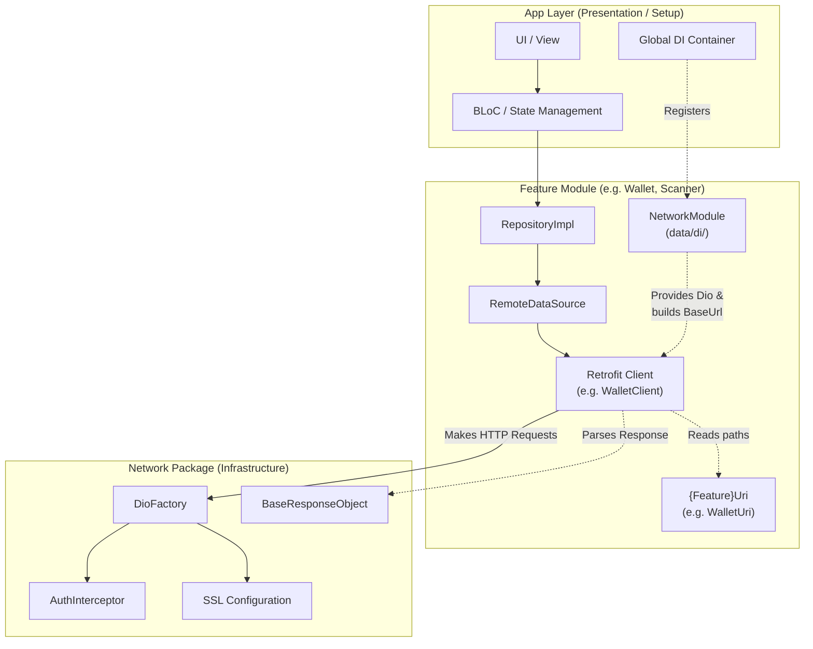

# Networking Architecture

This document describes the networking architecture for the `bloc_digital_wallet` project. It outlines how the core network infrastructure interacts with feature modules while strictly adhering to Clean Architecture principles.

---

## Table of Contents
- [1. Core Philosophy](#1-core-philosophy)
- [2. Networking Architecture Diagram](#2-networking-architecture-diagram)
- [3. Core Components](#3-core-components)
- [4. Decentralized AppUri & Path Parameters](#4-decentralized-appuri--path-parameters)
- [5. Dependency Injection (DI)](#5-dependency-injection-di)

---

## 1. Core Philosophy

The networking layer in this project is split into two distinct areas:
1.  **Infrastructure (The `network` package)**: Handles the heavy lifting (HTTP clients, SSL, interceptors, error mapping). It is entirely agnostic to business features.
2.  **Implementation (Feature Modules)**: Each feature module defines its own endpoints, API clients, and response models.

> [!CRITICAL]
> **The Dependency Rule:** The `network` package MUST NEVER depend on or know about feature modules (e.g., `scanner`, `wallet`). Feature modules depend on the `network` package for core utilities.

---

## 2. Networking Architecture Diagram

The following diagram illustrates how the App Layer, Feature Modules, and Network Package interact:



---

## 3. Core Components

### 2.1 The `network` Package
Located in `packages/network/`, this package provides:
-   **`DioFactory`**: Configures the base `Dio` instance with timeouts, logging, and interceptors.
-   **Interceptors**: 
    -   `AuthInterceptor`: Automatically injects Bearer tokens and handles `401 Unauthorized` token refreshing logic.
    -   `TalkerDioLogger`: Logs network requests/responses for debugging.
-   **Security**: SSL Pinning configurations (`AutoSslConfiguration`, `HardenedSslPinning`).
-   **Base Models**: `BaseResponseObject<T>` used to parse standard API wrapper responses.

### 2.2 Feature Module Clients
Located in `packages/{feature}/lib/data/datasources/remote/`:
-   We use **Retrofit** (`@RestApi`) to generate type-safe HTTP clients.
-   Clients are defined as `abstract class {Feature}Client` and generated via `build_runner`.

---

## 4. Decentralized AppUri & Path Parameters

To prevent the `network` package from becoming a bottleneck "God Class", URI constants are strictly decentralized.

### The Rule
Each module **must own** its API endpoints. There is no global `AppUri` for feature endpoints.

### ✅ Correct Pattern (Per-Module URI)
1.  Create `data/datasources/remote/{feature}_uri.dart`.
2.  Define module-specific paths and parameters inside.

```dart
// packages/wallet/lib/data/datasources/remote/wallet_uri.dart
class WalletUri {
  static const String wallets = 'wallets';
  static const String tokens = 'tokens';
  static const String accounts = 'accounts';
  
  // Feature-specific path parameters
  static const String pathAddress = '/{address}'; 
}
```

Usage in the Retrofit Client:
```dart
import 'package:wallet/data/datasources/remote/wallet_uri.dart';

@RestApi()
abstract class TokenClient {
  factory TokenClient(Dio dio, {String? baseUrl}) = _TokenClient;

  @GET('/${WalletUri.accounts}${WalletUri.pathAddress}')
  Future<BaseResponseObject<List<TokenListModel>>> getTokenAccounts(
    @Path("address") String address,
  );
}
```

### ❌ Incorrect Pattern
-   **DO NOT** add feature strings (e.g., `static const String wallets = 'wallets';`) to `packages/network/lib/app_uri.dart`.
-   **DO NOT** create a global `UriPathParameters` class in the network package.

---

## 5. Dependency Injection (DI)

Retrofit clients require a `Dio` instance and an explicit `baseUrl`. 

> [!WARNING]
> **Layer Violation Risk:** Network DI modules MUST be placed in the `data/di/` directory of the feature package, NOT in `lib/di/`. The `lib/di/` folder is reserved strictly for assembling the module's dependencies via `configureModuleDependencies()`.

### Example Implementation

```dart
// packages/wallet/lib/data/di/network_module.dart
import 'package:network/extensions/string_ext.dart';
import 'package:wallet/data/datasources/remote/wallet_uri.dart';

@module
abstract class WalletNetworkModule {
  @lazySingleton
  TokenClient tokenClient(Dio dio) =>
      TokenClient(dio, baseUrl: WalletUri.tokens.buildAppUri());
}
```

### Key DI Rules:
1.  **Class Naming**: Must be `{Feature}NetworkModule` (e.g., `WalletNetworkModule`).
2.  **Explicit BaseUrl**: Always use `{Feature}Uri.service.buildAppUri()` to pass the `baseUrl`. Never instantiate a client with just `Dio` because the default Dio `baseUrl` might not match your specific microservice path.
3.  **Extension**: `.buildAppUri()` is provided by importing `package:network/extensions/string_ext.dart`.
