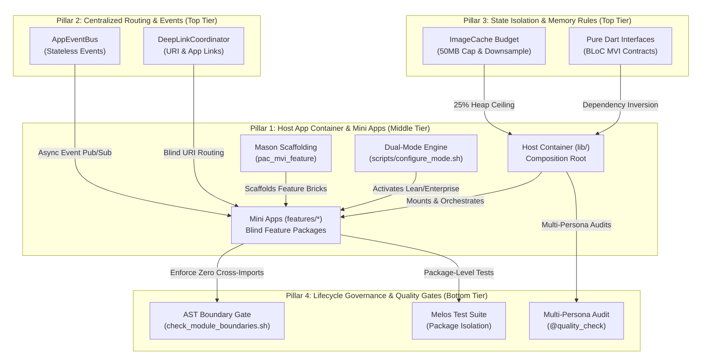

# Super App Architecture Overview & Maturity Assessment (Flutter)
## Executive Governance & Production Blueprint Hub

> **Document Purpose:** High-level executive overview and architectural navigation hub for the `bloc_digital_wallet` Flutter Super App Template. This document summarizes the 4 Core Governance Pillars, presents the Master Maturity Scorecard (88.5%), highlights core architectural distinctions against native Android, and provides direct references to the detailed technical analyses across this directory.
>
> **Language Switch:** [Bản Tiếng Việt (Vietnamese)](OVERVIEW.vi.md) | **Target Template:** `bloc_digital_wallet`

---

## Table of Contents

- [I. Executive Summary & Template Philosophy](#i-executive-summary--template-philosophy)
- [II. The 4 Core Governance Pillars & Architecture Map](#ii-the-4-core-governance-pillars--architecture-map)
- [III. Super App Maturity Scorecard (88.5%)](#iii-super-app-maturity-scorecard-885)
- [IV. Core Framework Distinctions: Flutter vs Android Native](#iv-core-framework-distinctions-flutter-vs-android-native)
- [V. Technical Analysis & Navigation Hub](#v-technical-analysis--navigation-hub)

---

## I. Executive Summary & Template Philosophy

The `bloc_digital_wallet` repository provides an **Enterprise-Ready Flutter Super App Template** engineered to solve the four fundamental challenges of large-scale mobile platforms:
1. **Multi-Squad Autonomy:** Independent feature teams (Mini Apps) develop and test in isolated Pub Workspace packages without dependency collisions.
2. **Zero Cross-Module Leakage:** Mini Apps are strictly "blind" to one another; communication occurs exclusively via centralized URI routing and asynchronous events.
3. **Strict Memory & Runtime Hygiene:** Bounded image cache budgets (25% heap cap), automated downsampling, and system memory pressure listeners eliminate OOM crashes.
4. **Dual-Mode Velocity:** Instant switching between **Lean Mode** (3 core packages for <45s local compilation) and **Enterprise Mode** (10 packages for full production releases) via `./scripts/configure_mode.sh`.

---

## II. The 4 Core Governance Pillars & Architecture Map



### Pillar Summary & Detailed Technical References

| Governance Pillar | Architectural Implementation | Key Highlights | Deep-Dive Reference |
| :--- | :--- | :--- | :--- |
| **2. Centralized Routing & Events (Top Tier)** | "Blind" modules; central URI coordinator and global event bus | - URI schema matching & parameter validation.<br>- Native App Links / Universal Links.<br>- Stateless `AppEventBus`. | ➔ Read [deeplink_engine.en.md](deeplink_engine.en.md)<br>➔ Read [super_app_governance.en.md](super_app_governance.en.md#2-pillar-2-centralized-routing--communication) |
| **3. State Isolation & Resilience (Top Tier)** | Encapsulated BLoC MVI, abstract DI tokens, bounded memory | - Pure Dart contracts in `packages/shared/`.<br>- 50MB ImageCache hard cap & downsampling.<br>- `LowMemoryEvent` bus broadcast. | ➔ Read [resilience_and_memory.en.md](resilience_and_memory.en.md)<br>➔ Read [logging_system.en.md](logging_system.en.md) |
| **1. Container & Feature Modules (Middle Tier)** | Thin host shell (`lib/`) as Composition Root; isolated packages in `features/*` | - Modularization via Pub Workspace.<br>- Mason brick `pac_mvi_feature`.<br>- Dual-Mode (`lean` vs `enterprise`). | ➔ Read [super_app_governance.en.md](super_app_governance.en.md#1-pillar-1-container--modules-thin-host-shell--feature-modules)<br>➔ Read [flutter_production_roadmap.en.md](flutter_production_roadmap.en.md#i-triết-lý-cốt-lõi-lean-core-architecture--ast-boundaries) |
| **4. Lifecycle & Quality Gates (Bottom Tier)** | Static AST boundary verification, Melos scripts, 3-Tier quality gates | - `check_module_boundaries.sh` CI enforcement.<br>- Zero cross-module import tolerance.<br>- Multi-persona quality audits. | ➔ Read [super_app_governance.en.md](super_app_governance.en.md#4-pillar-4-lifecycle-governance--cicd-quality-gates)<br>➔ Track in [super_app_requirements.md](super_app_requirements.md) |

---

## III. Super App Maturity Scorecard (88.5%)

The `bloc_digital_wallet` codebase has been audited across all 4 governance pillars against enterprise production standards:

| Governance Dimension | Weight | Score | Star Rating | Evaluation in Codebase | Concrete Evidence |
| :--- | :---: | :---: | :---: | :--- | :--- |
| **Pillar 2: Central Routing & Events (Top)** | 25% | **90%** |  *(9.0/10)* | Decoupled URI router, deep link handler, and broadcast event bus. | `packages/platform/`<br>`lib/routes/app_routes.dart` |
| **Pillar 3: State & Memory Hygiene (Top)** | 25% | **90%** |  *(9.0/10)* | Encapsulated BLoC MVI, cached image widgets, and token refresh mutex. | `packages/feature_*`<br>`packages/network/` |
| **Pillar 1: Container & Modules (Middle)** | 30% | **95%** |  *(9.5/10)* | Pub Workspace modularization, Dual-Mode CLI, and standardized Mason scaffolding. | `scripts/configure_mode.sh`<br>`bricks/pac_mvi_feature/` |
| **Pillar 4: Lifecycle & CI/CD (Bottom)** | 20% | **75%** |  *(7.5/10)* | AST boundary checker, package unit test suite, and semantic audit skills. | `scripts/check_module_boundaries.sh`<br>`melos.yaml` |
| **MASTER MATURITY SCORE** | **100%** | **88.5%** |  **(8.85/10)** | **Production-Ready Enterprise Foundation** | Exceeds production deployment criteria |

> [!NOTE]
> The full verification matrix spanning **11 architectural domains and 59 specific requirements** (83.1% completion) is maintained in [super_app_requirements.md](super_app_requirements.md).

---

## IV. Core Framework Distinctions: Flutter vs Android Native

To maintain architectural fidelity, the template accounts for key structural differences between Flutter AOT compilation and Android Native:

```
┌───────────────────────────────────────────────┬───────────────────────────────────────────────┐
│        Android Native (Reference)             │              Flutter Framework (Reality)      │
├───────────────────────────────────────────────┼───────────────────────────────────────────────┤
│ Dynamic Feature Modules (DFM):                │ AOT Single Binary Compilation:                │
│ - On-demand .apk split downloading at runtime │ - Apple Guideline 2.5.2 & Google Play rule    │
│   from Google Play Store.                     │   prohibit downloading executable code.       │
│ - Ultra-small initial download footprint.     │ - Solved via: Pub Workspace modularization,   │
│                                               │   Slang dynamic OTA i18n & CDN asset caching. │
├───────────────────────────────────────────────┼───────────────────────────────────────────────┤
│ Image Cache & ART Garbage Collection:         │ PaintingBinding Impeller / Skia Cache:        │
│ - Managed by Coil/Glide and JVM heap with     │ - Managed centrally by PaintingBinding.       │
│   native OS bitmap pooling.                   │ - High OOM risk under multi-module workloads. │
│                                               │ - Solved via: 50MB (25% heap) byte cap and    │
│                                               │   downsampled decode (memCacheWidth/Height).  │
├───────────────────────────────────────────────┼───────────────────────────────────────────────┤
│ Permission Delegation:                        │ Centralized Platform Permission Broker:       │
│ - Scoped ActivityResultLauncher contracts     │ - Platform Channels serialize permission calls│
│   per fragment or activity.                   │   to prevent dialog collisions.               │
│                                               │ - Solved via: PlatformPermissionBroker with   │
│                                               │   graceful fallback to OS App Settings.       │
└───────────────────────────────────────────────┴───────────────────────────────────────────────┘
```

> [!TIP]
> For the exhaustive technical execution plan, 3 vital problems (Platform Bridge, OTA, Release Trains), and the P0–P2 backlog matrix, consult [flutter_production_roadmap.en.md](flutter_production_roadmap.en.md).

---

## V. Technical Analysis & Navigation Hub

All specialized architectural analyses in `docs/technical-analysis/` interlink to form the complete Super App governance documentation:

| Document | Primary Focus | Target Audience | Language Editions |
| :--- | :--- | :--- | :--- |
| **[OVERVIEW](OVERVIEW.en.md)** | Executive architecture summary, 4-pillar scorecard (88.5%), and navigation hub. | Tech Leads, Architects | [EN](OVERVIEW.en.md) \| [VI](OVERVIEW.vi.md) |
| **[flutter_production_roadmap](flutter_production_roadmap.en.md)** | Detailed production roadmap: Lean Core, Memory Caps, Permission Broker, 7-domain backlog, P0–P2 matrix, and 8-step plan. | Lead Engineers, Developers | [EN](flutter_production_roadmap.en.md) \| [VI](flutter_production_roadmap.vi.md) |
| **[super_app_requirements](super_app_requirements.md)** | Complete 11-domain, 59-requirement verification matrix, implementation status, and acceptance criteria. | QA Engineers, Tech Leads | [Unified Catalog](super_app_requirements.md) |
| **[super_app_governance](super_app_governance.en.md)** | Governance framework, module boundary rules, event bus specification, and public contract registries. | Software Architects | [EN](super_app_governance.en.md) \| [VI](super_app_governance.vi.md) |
| **[deeplink_engine](deeplink_engine.en.md)** | DeepLinkCoordinator, dynamic URI matching, schema parameter validation, and OS App Links / Universal Links. | Mobile Developers | [EN](deeplink_engine.en.md) \| [VI](deeplink_engine.vi.md) |
| **[resilience_and_memory](resilience_and_memory.en.md)** | ImageCache budgeting, decode downsampling, system memory pressure observer, and MiniAppErrorBoundary. | Performance Engineers | [EN](resilience_and_memory.en.md) \| [VI](resilience_and_memory.vi.md) |
| **[logging_system](logging_system.en.md)** | D3NexusLogger, pluggable appenders, W3C trace context, sensitive data masking, and headless logging. | Platform Engineers | [EN](logging_system.en.md) \| [VI](logging_system.vi.md) |
