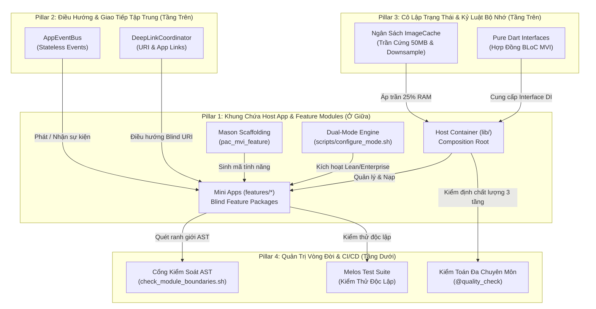

# Tổng Quan Kiến Trúc & Đánh Giá Mức Độ Trưởng Thành Super App (Flutter)
## Trung Tâm Điều Hành Quản Trị & Bản Thiết Kế Sản Xuất

> **Mục đích tài liệu:** Bản tóm lược điều hành cấp cao và trung tâm điều hướng kiến trúc cho Flutter Super App Template `bloc_digital_wallet`. Tài liệu tổng hợp 4 Trụ Cột Quản Trị Cốt Lõi, Bảng Điểm Trưởng Thành Tổng Thể (88.5%), phân tích khác biệt kỹ thuật so với Native Android, và cung cấp các liên kết tham chiếu trực tiếp đến các tài liệu phân tích kỹ thuật chuyên sâu trong thư mục này.
>
> **Chuyển đổi ngôn ngữ:** [English Edition](OVERVIEW.en.md) | **Dự án mục tiêu:** `bloc_digital_wallet`

---

## Mục Lục

- [I. Tóm Tắt Điều Hành & Triết Lý Template](#i-tóm-tắt-điều-hành--triết-lý-template)
- [II. 4 Trụ Cột Quản Trị Cốt Lõi & Bản Đồ Kiến Trúc](#ii-4-trụ-cột-quản-trị-cốt-lõi--bản-đồ-kiến-trúc)
- [III. Bảng Điểm Trưởng Thành Super App (88.5%)](#iii-bảng-điểm-trưởng-thành-super-app-885)
- [IV. Khác Biệt Nền Tảng Cốt Lõi: Flutter vs Android Native](#iv-khác-biệt-nền-tảng-cốt-lõi-flutter-vs-android-native)
- [V. Trung Tâm Điều Hướng Tài Liệu Kỹ Thuật](#v-trung-tâm-điều-hướng-tài-liệu-kỹ-thuật)

---

## I. Tóm Tắt Điều Hành & Triết Lý Template

Mã nguồn `bloc_digital_wallet` cung cấp một **Flutter Super App Template Chuẩn Doanh Nghiệp (Enterprise-Ready)** được thiết kế để giải quyết 4 bài toán sống còn của các nền tảng ứng dụng quy mô lớn:
1. **Quyền Tự Trị Đa Đội Ngũ (Multi-Squad Autonomy):** Các squad tính năng độc lập (Mini Apps) phát triển và kiểm thử trong các package Pub Workspace riêng biệt mà không lo xung đột mã nguồn.
2. **Triệt Tiêu Rò Rỉ Ranh Giới (Zero Cross-Module Leakage):** Các Mini App hoàn toàn "mù" về nhau; mọi giao tiếp được thực hiện thông qua điều hướng URI tập trung và cơ chế phát sự kiện bất đồng bộ.
3. **Kỷ Luật Bộ Nhớ & Tối Ưu Runtime:** Giới hạn ImageCache nghiêm ngặt (trần 25% heap ~ 50MB), tự động downsample ảnh khi giải mã, và lắng nghe áp lực bộ nhớ hệ điều hành để triệt tiêu lỗi sập nguồn OOM.
4. **Tốc Độ Phát Triển Hai Chế Độ (Dual-Mode):** Chuyển đổi linh hoạt giữa **Lean Mode** (3 package cốt lõi, build <45s trên máy dev) và **Enterprise Mode** (10 package đầy đủ cho bản phát hành sản xuất) qua lệnh `./scripts/configure_mode.sh`.

---

## II. 4 Trụ Cột Quản Trị Cốt Lõi & Bản Đồ Kiến Trúc



### Bảng Tổng Hợp 4 Trụ Cột & Liên Kết Chuyên Sâu

| Trụ Cột Quản Trị | Hiện Thực Kiến Trúc Thực Tế | Điểm Nhấn Nổi Bật | Tài Liệu Chi Tiết Tham Chiếu |
| :--- | :--- | :--- | :--- |
| **2. Điều Hướng & Giao Tiếp Tập Trung (Nằm Trên)** | Nguyên tắc module "mù" (Blind); điều hướng qua bộ định tuyến URI và bus sự kiện | - Khớp schema URI và kiểm tra hợp lệ tham số.<br>- Tích hợp Native App Links / Universal Links.<br>- Bus sự kiện toàn cục không trạng thái `AppEventBus`. | ➔ Xem [deeplink_engine.vi.md](deeplink_engine.vi.md)<br>➔ Xem [super_app_governance.vi.md](super_app_governance.vi.md#2-trụ-cột-2-centralized-routing--communication-điều-hướng-tập-trung--giao-tiếp-phi-trực-tiếp) |
| **3. Cô Lập Trạng Thái & Kỷ Luật Bộ Nhớ (Nằm Trên)** | Đóng gói BLoC MVI, phụ thuộc vào interface Dart thuần, kiểm soát dung lượng RAM | - Hợp đồng interface thuần trong `packages/shared/`.<br>- Trần cứng 50MB ImageCache & decode downsample.<br>- Phát sự kiện dọn dẹp `LowMemoryEvent`. | ➔ Xem [resilience_and_memory.vi.md](resilience_and_memory.vi.md)<br>➔ Xem [logging_system.vi.md](logging_system.vi.md) |
| **1. Khung Chứa & Mô-đun (Nằm Giữa)** | Host App (`lib/`) đóng vai trò Composition Root tinh gọn; các feature độc lập tại `features/*` | - Phân vùng Monorepo qua Pub Workspace.<br>- Sinh mã chuẩn mực qua Mason `pac_mvi_feature`.<br>- Vận hành 2 chế độ (`lean` vs `enterprise`). | ➔ Xem [super_app_governance.vi.md](super_app_governance.vi.md#1-trụ-cột-1-container--modules-khung-chứa-tinh-gọn--mô-đun-tính-năng)<br>➔ Xem [flutter_production_roadmap.vi.md](flutter_production_roadmap.vi.md#i-triết-lý-cốt-lõi-lean-core-architecture--ast-boundaries) |
| **4. Quản Trị Vòng Đời & Kiểm Soát CI (Nằm Dưới)** | Kiểm soát ranh giới AST tĩnh, script Melos độc lập, quy chuẩn kiểm thử 3 tầng | - Chặn commit vi phạm qua `check_module_boundaries.sh`.<br>- Không chấp nhận bất kỳ import chéo nào giữa features.<br>- Bộ kiểm toán đa chuyên môn qua `@quality_check`. | ➔ Xem [super_app_governance.vi.md](super_app_governance.vi.md#4-trụ-cột-4-lifecycle-governance--cicd-quality-gates-quản-trị-vòng-đời--cổng-kiểm-soát-chất-lượng)<br>➔ Theo dõi tại [super_app_requirements.md](super_app_requirements.md) |

---

## III. Bảng Điểm Trưởng Thành Super App (88.5%)

Mã nguồn `bloc_digital_wallet` được thẩm định trên cả 4 trụ cột quản trị theo tiêu chuẩn khắt khe dành cho sản phẩm doanh nghiệp:

| Trục Quản Trị Cốt Lõi | Tỷ Trọng | Điểm Số | Đánh Giá Sao | Thực Tế Codebase | Bằng Chứng Mã Nguồn |
| :--- | :---: | :---: | :---: | :--- | :--- |
| **Trụ Cột 2: Điều Hướng & Sự Kiện (Trên)** | 25% | **90%** |  *(9.0/10)* | Bộ điều phối URI phân tầng, DeepLink parser, và EventBus phát sóng. | `packages/platform/`<br>`lib/routes/app_routes.dart` |
| **Trụ Cột 3: Trạng Thái & Bộ Nhớ (Trên)** | 25% | **90%** |  *(9.0/10)* | BLoC MVI thuần khiết, ImageCache 50MB trần cứng, Mutex refresh token. | `packages/feature_*`<br>`packages/network/` |
| **Trụ Cột 1: Khung Chứa & Mô-đun (Giữa)** | 30% | **95%** |  *(9.5/10)* | Tách bạch Pub Workspace, CLI Dual-Mode, Mason bricks chuẩn hóa. | `scripts/configure_mode.sh`<br>`bricks/pac_mvi_feature/` |
| **Trụ Cột 4: Vòng Đời & CI/CD (Dưới)** | 20% | **75%** |  *(7.5/10)* | Chặn vi phạm AST qua pre-commit, Melos test suite, kiểm toán đa tầng. | `scripts/check_module_boundaries.sh`<br>`melos.yaml` |
| **ĐIỂM TRƯỞNG THÀNH TỔNG THỂ** | **100%** | **88.5%** |  **(8.85/10)** | **Nền Tảng Super App Chuẩn Doanh Nghiệp** | Sẵn sàng mở rộng production |

> [!NOTE]
> Ma trận kiểm định chi tiết gồm **11 lĩnh vực kiến trúc và 59 tiêu chí kiểm thử** (tỷ lệ hoàn thành 83.1%) được duy trì và cập nhật liên tục tại [super_app_requirements.md](super_app_requirements.md).

---

## IV. Khác Biệt Nền Tảng Cốt Lõi: Flutter vs Android Native

Nhằm đảm bảo tính chính xác trong triển khai thực tế, template phân định rõ các khác biệt kỹ thuật mấu chốt giữa biên dịch Flutter AOT và Android Native:

```
┌───────────────────────────────────────────────┬───────────────────────────────────────────────┐
│        Android Native (Tham Chiếu)            │              Flutter Framework (Thực Tế)      │
├───────────────────────────────────────────────┼───────────────────────────────────────────────┤
│ Dynamic Feature Modules (DFM):                │ Biên Dịch AOT Single Binary:                  │
│ - Tải runtime các file .apk split theo nhu    │ - Quy định Apple 2.5.2 & Google Play nghiêm   │
│   cầu từ Google Play Store.                   │   cấm tải mã thực thi nhị phân từ xa.         │
│ - Dung lượng tải ban đầu siêu nhỏ.            │ - Giải pháp: Tách biệt Pub Workspace, đa ngôn │
│                                               │   ngữ Slang OTA động & lưu đệm asset từ CDN.  │
├───────────────────────────────────────────────┼───────────────────────────────────────────────┤
│ Quản Lý Bộ Nhớ & ART Garbage Collection:      │ Quản Lý Cache Impeller / Skia:                │
│ - Quản lý bởi Coil/Glide và JVM heap với kỹ   │ - Quản lý tập trung qua PaintingBinding.      │
│   thuật native bitmap pooling từ HĐH.         │ - Nguy cơ OOM cao khi nhiều Mini App tải ảnh. │
│                                               │ - Giải pháp: Khóa trần 50MB (25% heap) và bắt │
│                                               │   buộc downsample khi decode ảnh.             │
├───────────────────────────────────────────────┼───────────────────────────────────────────────┤
│ Phân Phối Quyền Hệ Thống:                     │ Bộ Điều Phối Quyền Tập Trung:                 │
│ - Hợp đồng ActivityResultLauncher phân lập    │ - Platform Channel tuần tự hóa các yêu cầu để │
│   độc lập theo từng Activity/Fragment.        │   tránh va chạm hội thoại quyền trên màn hình.│
│                                               │ - Giải pháp: PlatformPermissionBroker với luồng│
│                                               │   hướng dẫn mở App Settings mượt mà.          │
└───────────────────────────────────────────────┴───────────────────────────────────────────────┘
```

> [!TIP]
> Để xem toàn bộ kế hoạch thực thi chi tiết, 3 bài toán sống còn (Platform Bridge, OTA, Release Trains), và ma trận backlog P0–P2, hãy tham khảo [flutter_production_roadmap.vi.md](flutter_production_roadmap.vi.md).

---

## V. Trung Tâm Điều Hướng Tài Liệu Kỹ Thuật

Tất cả các tài liệu phân tích kiến trúc trong `docs/technical-analysis/` được kết nối chặt chẽ tạo thành bộ quy chuẩn quản trị Super App toàn diện:

| Tài Liệu | Trọng Tâm Chính | Đối Tượng Sử Dụng | Bản Ngôn Ngữ |
| :--- | :--- | :--- | :--- |
| **[OVERVIEW](OVERVIEW.vi.md)** | Tóm tắt điều hành kiến trúc, bảng điểm trưởng thành 4 trụ cột (88.5%), và trung tâm điều hướng. | Tech Leads, Architects | [EN](OVERVIEW.en.md) \| [VI](OVERVIEW.vi.md) |
| **[flutter_production_roadmap](flutter_production_roadmap.vi.md)** | Lộ trình sản xuất chuyên sâu: Lean Core, Trần RAM, Permission Broker, Backlog 7 lĩnh vực, Ma trận P0–P2 và Kế hoạch 8 bước. | Lead Engineers, Developers | [EN](flutter_production_roadmap.en.md) \| [VI](flutter_production_roadmap.vi.md) |
| **[super_app_requirements](super_app_requirements.md)** | Danh mục 11 lĩnh vực, 59 tiêu chí kiểm định kiến trúc, trạng thái hoàn thành và tiêu chuẩn nghiệm thu. | QA Engineers, Tech Leads | [Bản Hợp Nhất](super_app_requirements.md) |
| **[super_app_governance](super_app_governance.vi.md)** | Khung quản trị 4 trụ cột, quy chuẩn ranh giới module, đặc tả Event Bus và đăng ký Route công khai. | Software Architects | [EN](super_app_governance.en.md) \| [VI](super_app_governance.vi.md) |
| **[deeplink_engine](deeplink_engine.vi.md)** | DeepLinkCoordinator, so khớp URI động, kiểm thực tham số schema và tích hợp App Links / Universal Links. | Mobile Developers | [EN](deeplink_engine.en.md) \| [VI](deeplink_engine.vi.md) |
| **[resilience_and_memory](resilience_and_memory.vi.md)** | Ngân sách ImageCache, downsample giải mã ảnh, quan sát áp lực bộ nhớ và MiniAppErrorBoundary. | Performance Engineers | [EN](resilience_and_memory.en.md) \| [VI](resilience_and_memory.vi.md) |
| **[logging_system](logging_system.vi.md)** | D3NexusLogger, kiến trúc appender mở rộng, W3C trace context, che giấu dữ liệu nhạy cảm và headless logging. | Platform Engineers | [EN](logging_system.en.md) \| [VI](logging_system.vi.md) |
