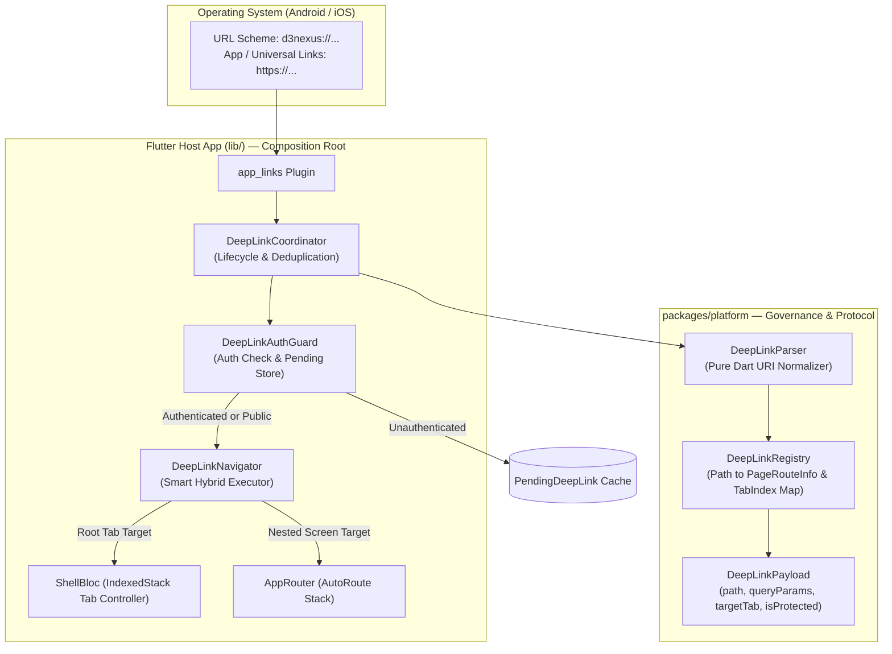
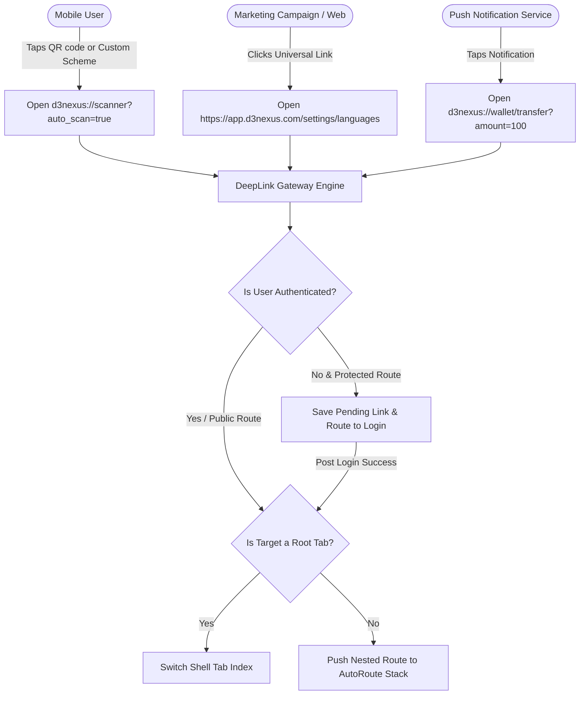
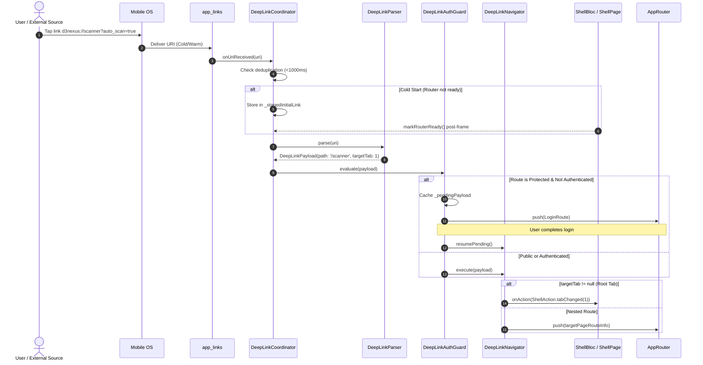

# Epic: DeepLink Router Engine

> **Source Epic:** `.devtool/epic/deeplink_router_engine` — **Status:** Implemented  
> Moved to `docs/technical-analysis/` for developer discoverability.

## Table of Contents
1. [Meta Data](#meta-data)
2. [Background](#background)
3. [Goals & Non-Goals](#goals--non-goals)
4. [Architecture & Technical Design](#architecture--technical-design)
   - [High-Level Architecture](#high-level-architecture)
   - [Use Cases](#use-cases)
   - [Sequence Diagram](#sequence-diagram)
5. [Rollout Strategy & Mitigation](#rollout-strategy--mitigation)
6. [Kanban Tasks Breakdown](#kanban-tasks-breakdown)

---

## Meta Data
- **Epic Name:** `deeplink_router_engine`
- **Status:** `implemented`
- **Target Release:** Flutter Super App Template v1.1
- **Source Spec:** [2026-09-11-external-deeplink-engine-design.md](2026-09-11-external-deeplink-engine-design.md)
- **Reference Implementations:**
  - Android: `android_digital_wallet/.devtool/epic/deeplink_router_engine/`
  - iOS: `iOSDigitalWallet/.devtool/epic/deeplink_router_engine/`

---

## Background
In a modular **Super App** architecture, Mini Apps (feature modules) must remain completely decoupled ("blind" to each other). While internal navigation between packages was previously established using route string constants (`DeepLinkRoutes` in `packages/platform`), the application lacked an **External Deep Link & Central Routing Engine**.

As a consequence:
1. The app could not handle OS-level deep link intents such as Custom URL Schemes (`d3nexus://...`), Android App Links, or iOS Universal Links (`https://app.d3nexus.com/...`).
2. There was no mechanism to handle Cold Start timing safely (preventing dropped links while the Flutter Engine and Router initialize).
3. There was no centralized Auth Guard with Pending Deep Link preservation to resume navigation after user authentication.
4. There was no Smart Hybrid Navigation to coordinate switching `ShellPage` tabs versus pushing sub-routes onto the `AutoRoute` stack.

This epic establishes a centralized, platform-grade Deep Link Gateway to fulfill Pillar 2 ("Centralized Communication & Routing") of the Super App Governance Framework.

---

## Goals & Non-Goals

### Goals
- **Protocol & Parsing Separation:** Implement `DeepLinkPayload`, `DeepLinkParser`, and `DeepLinkRegistry` in `packages/platform` (Pure Dart, 100% testable without Flutter UI dependencies).
- **Multi-Protocol Support:** Support Custom Scheme (`d3nexus://...`) and HTTPS Universal/App Links (`https://app.d3nexus.com/...`).
- **Timing & Lifecycle Management:**
  - Cold Start: Buffer initial link in `_stagedInitialLink` until `ShellPage` signals `markRouterReady()`.
  - Warm Start: Stream links with deduplication (< 1000ms threshold).
- **Centralized Auth Guard:** Intercept protected routes when unauthenticated, cache `PendingDeepLink`, redirect to Login, and auto-resume upon `LoginSuccessEvent`.
- **Smart Hybrid Navigation:** Automatically switch `ShellPage` tab index if target is a root tab (Home, Scanner, Settings); push onto `AutoRoute` stack if target is a nested screen.
- **Mason Brick Auto-Wiring:** Update `pac_mvi_feature` post-gen hook to register newly created features into `DeepLinkRegistry` automatically.

### Non-Goals
- Replacing `auto_route` with custom Navigator 2.0.
- Dynamic runtime code loading (Flutter compiles ahead-of-time into a single binary).
- Web browser history synchronization for Flutter Web.

---

## Architecture & Technical Design

### High-Level Architecture

### Use Cases

### Sequence Diagram

---

## Rollout Strategy & Mitigation

### Phased Rollout
1. **Phase 1: Foundation (Protocol & Parsing)**: Implement pure Dart parser and registry in `packages/platform`. Zero runtime risk to host app.
2. **Phase 2: Native Manifest & Dependency Setup**: Wire `app_links` in host app with minimal intent filters.
3. **Phase 3: Coordinator & Navigation Core**: Integrate `DeepLinkCoordinator` and `DeepLinkNavigator` with `ShellBloc`.
4. **Phase 4: Tooling & Automation**: Update `pac_mvi_feature` Mason brick to automate route registration.

### Mitigation & Fallback
- **Unknown Routes:** If a malformed or unregistered URI is received, `DeepLinkParser` gracefully falls back to `DeepLinkRoutes.home` (Tab 0) and emits a non-fatal warning log via `D3NexusLogger`.
- **Safe Staging:** Cold start links are only dispatched after the router signals readiness, preventing `NavigatorState` detachment.

---

## Kanban Tasks Breakdown
- [x] [Task 1: Platform DeepLink Protocol, Parser & Registry](../../features/done/task_1_deeplink_protocol_and_parser.md)
- [x] [Task 2: Native OS Configuration & AppLinks Integration](../../features/done/task_2_native_os_and_app_links.md)
- [x] [Task 3: DeepLink Coordinator, Auth Guard & Deduplication](../../features/done/task_3_deeplink_coordinator_and_auth_guard.md)
- [x] [Task 4: Shell Lifecycle Integration & Smart Hybrid Navigation](../../features/done/task_4_shell_lifecycle_and_hybrid_navigation.md)
- [x] [Task 5: Mason Brick Automation & E2E Integration Tests](../../features/done/task_5_mason_brick_and_integration_tests.md)
