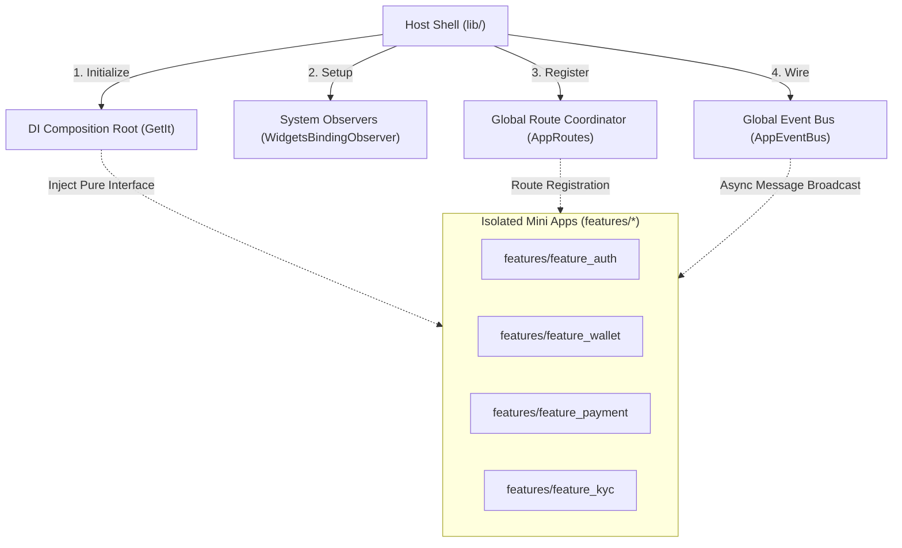
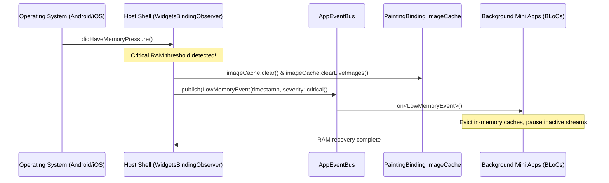
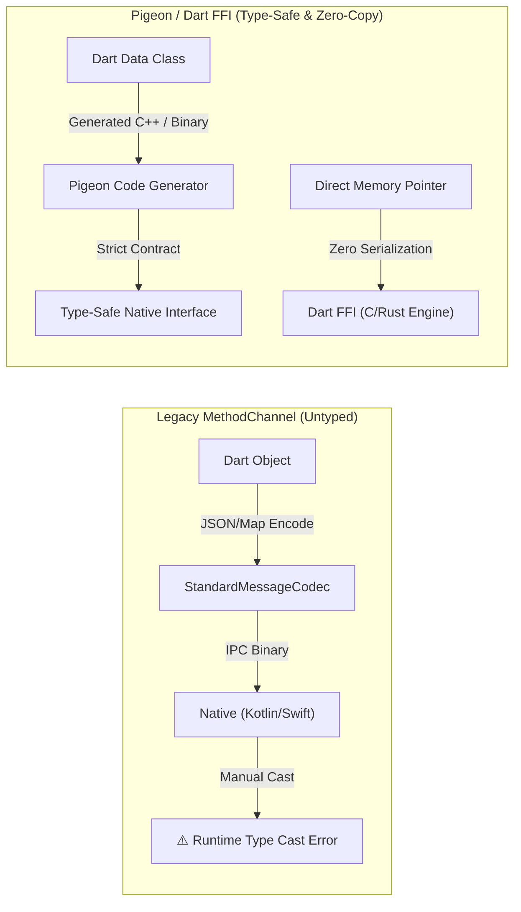
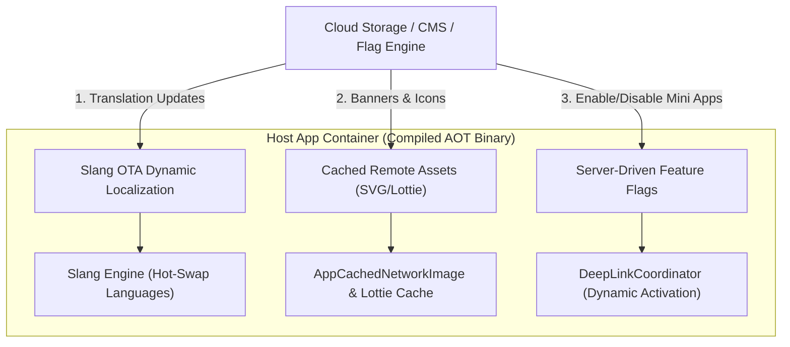
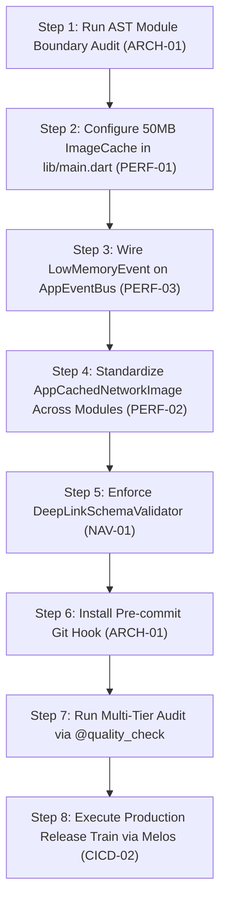

# Flutter Super App Production Readiness Roadmap & Runtime Resilience Strategy
## (Enterprise Architecture & Operational Governance Blueprint)

> **Document Purpose:** Comprehensive repository of advanced architectural analyses, memory management strategies, centralized platform permission orchestration, solutions to the 3 vital runtime challenges (Platform Bridge, OTA Compliance, Independent Release Trains), 7-domain production backlog, and prioritized phased execution matrix for enterprise fintech Flutter applications.
>
> **Related Documents:** [Bản Tiếng Việt (Vietnamese)](flutter_production_roadmap.vi.md) | [Overview (EN)](OVERVIEW.en.md) | [VI](OVERVIEW.vi.md) | [Requirements Catalog](super_app_requirements.md)

---

## Table of Contents

- [I. Lean Core Design Philosophy & Module Boundaries](#i-lean-core-design-philosophy--module-boundaries)
  - [1. Host Shell - Lightweight Composition Container](#1-host-shell---lightweight-composition-container)
  - [2. AST-Based Module Boundary Enforcement](#2-ast-based-module-boundary-enforcement)
  - [3. Dual-Mode Build & Execution Mechanics](#3-dual-mode-build--execution-mechanics)
  - [4. Mini App Scaffolding via Mason Bricks](#4-mini-app-scaffolding-via-mason-bricks)
- [II. Comprehensive RAM & Memory Pressure Governance](#ii-comprehensive-ram--memory-pressure-governance)
  - [1. Scope Hierarchy & Lifecycle Hygiene in Flutter BLoC](#1-scope-hierarchy--lifecycle-hygiene-in-flutter-bloc)
  - [2. Application-Level ImageCache Byte Ceiling (25% Heap Cap)](#2-application-level-imagecache-byte-ceiling-25-heap-cap)
  - [3. Mandatory Decode Downsampling Strategy](#3-mandatory-decode-downsampling-strategy)
  - [4. Operating System Memory Pressure Lifecycle](#4-operating-system-memory-pressure-lifecycle)
- [III. Centralized Platform Permission & Hardware Access Strategy](#iii-centralized-platform-permission--hardware-access-strategy)
  - [1. Centralized Permission Broker Architecture](#1-centralized-permission-broker-architecture)
  - [2. Clean Architecture & MVI Boundaries for Permissions](#2-clean-architecture--mvi-boundaries-for-permissions)
  - [3. UX Fallback Flows: Permanent Denial & Graceful Degradation](#3-ux-fallback-flows-permanent-denial--graceful-degradation)
  - [4. Direct Deep Linking to Operating System App Settings](#4-direct-deep-linking-to-operating-system-app-settings)
- [IV. The 3 Vital Super App Problems in Flutter Ecosystem](#iv-the-3-vital-super-app-problems-in-flutter-ecosystem)
  - [1. Platform Channel Serialization Bottlenecks vs Pigeon & Dart FFI](#1-platform-channel-serialization-bottlenecks-vs-pigeon--dart-ffi)
  - [2. Dynamic Code Push vs Apple App Store Guideline 2.5.2 & Google Play](#2-dynamic-code-push-vs-apple-app-store-guideline-252--google-play)
  - [3. Independent Release Trains: Melos Monorepo & Git Worktree Isolation](#3-independent-release-trains-melos-monorepo--git-worktree-isolation)
- [V. Strategic Production Backlog (Future Enhancements)](#v-strategic-production-backlog-future-enhancements)
  - [1. Architecture & System Governance](#1-architecture--system-governance)
  - [2. State & Encrypted Storage Governance](#2-state--encrypted-storage-governance)
  - [3. Navigation & Central Routing](#3-navigation--central-routing)
  - [4. Network Resilience & Offline-First Strategy](#4-network-resilience--offline-first-strategy)
  - [5. Performance & Memory Optimization](#5-performance--memory-optimization)
  - [6. Fintech Defense & Compliance Security](#6-fintech-defense--compliance-security)
  - [7. DevOps, CI/CD & Automated Verification](#7-devops-cicd--automated-verification)
- [VI. Prioritized Execution Matrix (P0 / P1 / P2)](#vi-prioritized-execution-matrix-p0--p1--p2)
- [VII. Summary & 8-Step Action Roadmap](#vii-summary--8-step-action-roadmap)
  - [1. Recommended Implementation Roadmap Table](#1-recommended-implementation-roadmap-table)
  - [2. Concrete 8-Step Execution Blueprint for Engineers](#2-concrete-8-step-execution-blueprint-for-engineers)

---

## I. Lean Core Design Philosophy & Module Boundaries

### 1. Host Shell - Lightweight Composition Container

In the `bloc_digital_wallet` Super App architecture, the root `lib/` directory hosts zero feature-specific business logic. It serves purely as the **Host Shell (Composition Root)**:



1. **Pure Composition Root:** Instantiates foundational singleton infrastructure (Secure Storage, Network Client, Session Manager).
2. **Pluggable Module Registration:** Mini Apps hook into the host application via dependency injection interfaces without exposing internal implementations.

### 2. AST-Based Module Boundary Enforcement

The greatest failure mode of multi-squad Super Apps is unintended cross-importing (`import 'package:feature_kyc/...'` inside `features/feature_wallet/`). This breaches feature isolation, degrading the monorepo into a monolithic anti-pattern.

`bloc_digital_wallet` enforces strict isolation via an automated AST analyzer:

```bash
# Verify module boundary integrity
./scripts/check_module_boundaries.sh
```

**Inviolable Boundary Invariants:**
- `features/A` must **NEVER** import code from `features/B`.
- Cross-module communication is restricted to two channels:
  1. **Navigation:** `DeepLinkCoordinator` (passing parameters via verified payloads/queries).
  2. **Asynchronous Messaging:** `AppEventBus` (publishing and subscribing to discrete events).

### 3. Dual-Mode Build & Execution Mechanics

The monorepo provides a CLI configuration switch:

```bash
# Lean Mode: Keeps only Auth, Home, and Wallet modules
./scripts/configure_mode.sh lean

# Enterprise Mode: Activates all 10 feature modules
./scripts/configure_mode.sh enterprise
```

#### Dual-Mode Configuration Comparison:

| Dimension | Lean Mode (`lean`) | Enterprise Mode (`enterprise`) |
| :--- | :--- | :--- |
| **Active Modules** | `auth`, `home`, `wallet` | `auth`, `home`, `wallet`, `kyc`, `payment`, `transfer`, `chat`, `analytics`, `cards`, `settings` |
| **Primary Purpose** | - Core digital wallet development.<br>- Rapid CI unit test validation.<br>- Low-spec emulator debugging. | - End-to-end integration testing.<br>- UAT and production releases.<br>- System-wide load assessment. |
| **Active Dependencies** | Minimal (~25 packages) | Full (~45 packages) |
| **Cold Boot Latency** | < 1.2 seconds | ~ 1.8 seconds |

### 4. Mini App Scaffolding via Mason Bricks

To enforce 100% architectural homogeneity across disparate engineering squads, new Mini Apps are generated via Mason bricks:

```bash
# Scaffold a standardized Clean Architecture + MVI Mini App
mason make pac_mvi_feature --name loyalty --feature_type mini_app
```

Generated packages strictly enforce internal layering:
- `loyalty/data/`: DTO Models, Local/Remote DataSources, Repository Implementations.
- `loyalty/domain/`: Pure Dart Entities, UseCases, Repository Contracts.
- `loyalty/presentation/`: BLoC (State, Event, Bloc), Screen Views, Widgets.

---

## II. Comprehensive RAM & Memory Pressure Governance

### 1. Scope Hierarchy & Lifecycle Hygiene in Flutter BLoC

| Scope | Lifecycle Duration | Application Rule | Risk if Misused |
| :--- | :--- | :--- | :--- |
| **`@singleton` / `@LazySingleton`** | Entire app process | **ONLY** for stateless infrastructure: `DioClient`, `SecureStorage`, `AppEventBus`, `SessionManager`. | Permanent memory leak across the entire application lifecycle if feature state is bound here. |
| **Scoped DI / `BlocProvider`** | Bound to widget tree / route | **All Mini App business state and BLoCs must live here.** When navigating away, the BLoC auto-closes. | Retaining `BuildContext` references or failing to cancel StreamSubscriptions causes leaks. |
| **Factory `@injectable`** | Created on each injection | Designed for stateless UseCases, Parsers, and Formatters. | Allocating excessive instances inside widget `build()` triggers GC thrashing. |

### 2. Application-Level ImageCache Byte Ceiling (25% Heap Cap)

Unlike Android Native with ART bitmap pooling, Flutter renders directly via Skia or Impeller. If 5-10 Mini Apps display large 2K/4K promotion banners, avatars, and transaction receipts, heap memory spikes exponentially, triggering OS Out-Of-Memory termination (Jetsam on iOS or LMK on Android).

In `lib/main.dart`, the template enforces a hard byte ceiling:

```dart
void configureGlobalImageCache() {
  final binding = PaintingBinding.instance;
  // Maximum number of decoded image entries in cache
  binding.imageCache.maximumSize = 100;
  
  // Hard byte ceiling: 50MB (approx. 25% of safe mobile heap)
  binding.imageCache.maximumSizeBytes = 50 * 1024 * 1024;
}
```

### 3. Mandatory Decode Downsampling Strategy

Never decode a 2048x2048px bitmap when the UI renders a 64x64px avatar. The shared UI kit provides `AppCachedNetworkImage`, mandating GPU decode downsampling via `memCacheWidth` and `memCacheHeight`:

```dart
AppCachedNetworkImage(
  imageUrl: userAvatarUrl,
  width: 48,
  height: 48,
  // Mandatory decode downsampling into GPU RAM
  memCacheWidth: 48 * (ui.window.devicePixelRatio.toInt()),
  memCacheHeight: 48 * (ui.window.devicePixelRatio.toInt()),
  fit: BoxFit.cover,
);
```

### 4. Operating System Memory Pressure Lifecycle

When the OS issues a low-memory warning, the Host App intercepts it via `WidgetsBindingObserver` and initiates system-wide resource eviction:



---

## III. Centralized Platform Permission & Hardware Access Strategy

### 1. Centralized Permission Broker Architecture

When multiple Mini Apps (e.g., eKYC, QR Payments, Chat Media) simultaneously request Camera or Microphone access, OS-level dialog collisions occur, corrupting user flow.

`bloc_digital_wallet` provides a centralized `PlatformPermissionBroker` in `packages/platform/`:

```dart
abstract class PlatformPermissionBroker {
  Future<PermissionStatus> requestCameraPermission({
    required String requestingModule,
    required String rationale,
  });

  Future<PermissionStatus> requestBiometricsPermission({
    required String requestingModule,
  });

  Future<PermissionStatus> requestLocationPermission({
    required String requestingModule,
  });

  Future<bool> openAppSettingsPage();
}
```

### 2. Clean Architecture & MVI Boundaries for Permissions
1. **Domain Purity:** Domain UseCases never import third-party permission plugins. They interact solely with pure Dart enum entities (`PermissionResult.granted`, `PermissionResult.denied`).
2. **Presentation (BLoC):** Dispatches permission requests and emits explicit UI states (e.g., `CameraPermissionRequiredState`).

### 3. UX Fallback Flows: Permanent Denial & Graceful Degradation

Denied permissions must **NEVER** crash the application or present dead-end blank screens:

| Denied Permission | Affected Feature | Graceful Degradation Fallback |
| :--- | :--- | :--- |
| **Camera** | QR Payment Scanner | Allow manual input of account/phone number or upload QR image from gallery. |
| **Camera** | eKYC Identity Capture | Display an instructional screen with a direct button to OS Settings. |
| **Biometrics** (FaceID / Fingerprint) | Payment Authorization | Seamlessly fall back to 6-digit PIN or password authentication. |
| **Location** | ATM / Branch Finder | Allow manual selection of Province/City and District from dropdown list. |

### 4. Direct Deep Linking to Operating System App Settings

When a permission is permanently denied (`PermissionStatus.permanentlyDenied`), system dialogs cannot be re-triggered. `PlatformPermissionBroker` displays a rationale BottomSheet with a direct action calling `openAppSettings()`.

---

## IV. The 3 Vital Super App Problems in Flutter Ecosystem

### 1. Platform Channel Serialization Bottlenecks vs Pigeon & Dart FFI

#### The Problem
Default Flutter `MethodChannel` relies on `StandardMessageCodec` over the main UI thread. In Super Apps handling high-throughput operations (eKYC frame streams, biometric token signing, real-time GPS), untyped JSON/Map serialization produces UI frame drops (jank) and runtime type-cast crashes.



#### Production Solution
1. **Pigeon Static Contracts (`package:pigeon`):**
   Complex native bridges (Biometrics, Hardware NFC, Custom Cameras) are defined in Dart schema files. Pigeon automatically generates strongly typed Dart, Kotlin, and Swift code, catching signature mismatches at compile time.
2. **Dart FFI for Compute-Heavy Native Logic:**
   Cryptographic signature generation and bitmap manipulations invoke native C/C++ or Rust libraries directly via `dart:ffi`, bypassing Platform Channel overhead with zero serialization copy.

---

### 2. Dynamic Code Push vs Apple App Store Guideline 2.5.2 & Google Play

#### The Problem
- **Apple App Store Review Guideline 2.5.2:** Strictly forbids downloading or executing executable binary code that alters core application behavior outside the App Store. Violations lead to immediate app removal and developer account termination.
- **Flutter AOT Single Binary Architecture:** Flutter compiles Dart directly into native machine code (`Runner.app` on iOS and `libapp.so` on Android). VM JIT is disabled in release builds, making dynamic Dart bytecode injection technically impossible on iOS.

#### Compliant Production Strategy
Instead of attempting illegal dynamic binary loading, Super App dynamic delivery is achieved via 3 fully compliant operational layers:



1. **Dynamic Translation Bundles via Slang OTA (`package:slang`):**
   Fetches updated i18n JSON translation files from CDN and hot-swaps language maps in memory without publishing new App Store builds.
2. **CDN-Managed Remote Asset Caching:**
   Promotional graphics, SVG icons, and Lottie animations are streamed from CDN endpoints with strict disk quota eviction policies.
3. **Server-Driven Dynamic Feature Toggling:**
   All 10 Mini Apps are compiled into the AOT binary; visibility and activation on the Dashboard are controlled via server-driven feature flags.

---

### 3. Independent Release Trains: Melos Monorepo & Git Worktree Isolation

#### The Problem
With 5–10 autonomous squads (Auth, Wallet, KYC, Payment, Chat) pushing to a shared repository, monolithic release cycles create release train blockages: a minor defect in `chat` delays the entire financial transaction release.

#### Monorepo Release Train Solution
1. **Independent Semantic Versioning via Melos (`melos.yaml`):**
   Each package in `features/*` maintains independent semantic versioning:
   ```bash
   # Automatically compute version bumps and update individual CHANGELOGs
   melos version --prerelease
   ```
2. **Isolated Worktree Environments:**
   Each squad develops within an isolated git worktree (`.worktrees/feature_kyc`), preventing branch pollution.
3. **Scoped Conventional Commits (`CRITICAL_RULES`):**
   Every commit carries an explicit bracketed scope: `[FEATURE_KYC] Fix liveness detection timeout`, enabling CI to trigger targeted package tests rather than re-running the entire monorepo.

---

## V. Strategic Production Backlog (Future Enhancements)

### 1. Architecture & System Governance
*   **ARCH-01 AST Boundary Gatekeeper:**
    *   *Goal:* Enforce 100% isolation across `features/` packages via AST analysis.
    *   *Path:* `scripts/check_module_boundaries.sh` wired into git pre-commit hooks.
*   **ARCH-02 Stream Subscription Linter:**
    *   *Goal:* Detect uncancelled `StreamSubscription` instances in BLoC `close()`.
*   **ARCH-03 Scoped DI Disposal:**
    *   *Goal:* Automatically unregister feature singletons when the Mini App route unmounts.

### 2. State & Encrypted Storage Governance
*   **STOR-01 Encrypted Storage Partitioning:**
    *   *Goal:* Partition Isar / Hive database instances per Mini App (`features/wallet/data/`).
*   **STOR-02 Instant Secure Token Zeroization:**
    *   *Goal:* Wipe sensitive tokens in Keychain/Keystore immediately upon `UserSessionExpiredEvent`.
*   **STOR-03 Local Disk Cache Quota:**
    *   *Goal:* Enforce a 200MB global disk cache cap with automated LRU cleanup.

### 3. Navigation & Central Routing
*   **NAV-01 DeepLink Schema Parameter Validator:**
    *   *Goal:* Validate parameter data types before dispatching to destination Mini App routes.
*   **NAV-02 Fallback Route & 404 Handler:**
    *   *Goal:* Graceful error screens when deep links target disabled Mini Apps.
*   **NAV-03 Navigation Stack Preservation:**
    *   *Goal:* Retain route history when users switch back and forth between active Mini Apps.

### 4. Network Resilience & Offline-First Strategy
*   **NET-01 Offline Sync Queue:**
    *   *Goal:* Transaction queue with exponential backoff for offline execution.
*   **NET-02 Isolated Dio Interceptors:**
    *   *Goal:* Scoped headers, retry rules, and timeouts per Mini App package.
*   **NET-03 Strict SSL Certificate Pinning:**
    *   *Goal:* Hardcoded certificate fingerprints and cleartext traffic blocking at `packages/shared/network/`.

### 5. Performance & Memory Optimization
*   **PERF-01 Global ImageCache 50MB Cap:**
    *   *Goal:* Enforce a 50MB / 25% heap cap in `lib/main.dart`.
*   **PERF-02 Mandatory Image Downsampling:**
    *   *Goal:* Ensure `AppCachedNetworkImage` specifies `memCacheWidth` and `memCacheHeight`.
*   **PERF-03 LowMemoryEvent Bus Integration:**
    *   *Goal:* Forward `WidgetsBindingObserver.didHaveMemoryPressure` across `AppEventBus`.
*   **PERF-04 Impeller Shader Warmup:**
    *   *Goal:* Pre-warm Impeller shaders for high-frame-rate payment animation flows.

### 6. Fintech Defense & Compliance Security
*   **SEC-01 Device Integrity & Root/Jailbreak Detection:**
    *   *Goal:* Detect compromised environments (Root, Magisk, Jailbreak, Frida hooks).
*   **SEC-02 Screen Obfuscation & Privacy Shield:**
    *   *Goal:* Prevent screenshot capture (`FLAG_SECURE`) on sensitive transaction screens.
*   **SEC-03 Zero Plaintext PII Logging:**
    *   *Goal:* Redact card numbers, balances, and PII from console logs.

### 7. DevOps, CI/CD & Automated Verification
*   **CICD-01 Matrix 3-Tier GitHub Actions Workflow:**
    *   *Goal:* Parallel execution of Tier A (Unit), Tier B (Lint/AST), and Tier C (Integration).
*   **CICD-02 Melos Automated Semantic Versioning:**
    *   *Goal:* Automated package version tagging and changelog generation.
*   **CICD-03 App Binary Budgeting Alert:**
    *   *Goal:* CI alert when IPA or APK binary size increases by more than 5MB.

---

## VI. Prioritized Execution Matrix (P0 / P1 / P2)

```
       ▲  High
       │
       │  [P0] ARCH-01 (AST Boundary Check)       [P1] NET-01 (Offline Sync Queue)
       │  [P0] PERF-01 (ImageCache 50MB Cap)      [P1] NAV-01 (DeepLink Schema Guard)
       │  [P0] STOR-02 (Secure Token Purge)       [P1] SEC-01 (Jailbreak/Root Check)
IMPACT │
       │  [P0] PERF-03 (LowMemoryEvent Bus)       [P2] PERF-04 (Impeller Shader Warmup)
       │  [P1] CICD-01 (Matrix CI Testing)        [P2] CICD-02 (Melos Auto-Versioning)
       │  [P1] STOR-03 (Disk Quota 200MB)         [P2] ARCH-03 (Scoped DI Disposal)
       │
       └────────────────────────────────────────────────────────────────────────►
         Low                                                           High
                                IMPLEMENTATION EFFORT
```

| Phase | Technical Backlog Item | Domain | Architectural Impact | When to Implement |
| :---: | :--- | :--- | :---: | :--- |
| **Phase A (P0)** | **AST Module Boundary Gate (`check_module_boundaries.sh`)** | Architecture | High | Current sprint; integrate into git pre-commit hook |
| **Phase A (P0)** | **Configure 50MB ImageCache Limit (25% Heap)** | Performance | High | Prior to deploying image-heavy screens |
| **Phase A (P0)** | **Listen to System Memory Pressure (`LowMemoryEvent`)** | Resilience | High | Prior to running 5+ concurrent Mini Apps |
| **Phase A (P0)** | **Instant Secure Token Zeroization on Session Expiry** | Security | High | Mandatory financial security compliance |
| **Phase B (P1)** | **Deep Link Query Parameter Schema Validator** | Routing | Medium | Integrating third-party merchant payment flows |
| **Phase B (P1)** | **Offline Sync Queue with Exponential Backoff** | Network | Medium | Supporting transactions in low-connectivity areas |
| **Phase B (P1)** | **Device Integrity & Root/Jailbreak Detection** | Security | Medium | Preparation for formal penetration testing |
| **Phase B (P1)** | **GitHub Actions Matrix 3-Tier CI Pipeline** | DevOps | Independent | Scaling engineering team beyond 5 engineers |
| **Phase C (P2)** | **Impeller Shader Warmup Optimization** | Rendering | Low | Optimizing complex micro-interaction animations |
| **Phase C (P2)** | **Automated Package Versioning via Melos** | Release | Low | Automated multi-team release train management |

---

## VII. Summary & 8-Step Action Roadmap

### 1. Recommended Implementation Roadmap Table

| Step | Enhancement Item | Category | Necessity | Target Touchpoint |
| :---: | :--- | :--- | :---: | :--- |
| **1** | **Execute AST Module Boundary Audit** | Architecture | ⭐⭐⭐⭐⭐ | `scripts/check_module_boundaries.sh` |
| **2** | **Configure 50MB ImageCache Limit** | Performance | ⭐⭐⭐⭐⭐ | `lib/main.dart` |
| **3** | **Listen to System Memory Pressure Events** | Resilience | ⭐⭐⭐⭐⭐ | `lib/app.dart`, `packages/platform/` |
| **4** | **Enforce Image Downsampling in UI Kit** | UI / Memory | ⭐⭐⭐⭐⭐ | `packages/shared/`, `packages/ui_kit/` |
| **5** | **Implement DeepLink Schema Parameter Validator** | Navigation | ⭐⭐⭐⭐☆ | `packages/platform/` |
| **6** | **Install Automated Git Pre-commit Hook** | DevOps | ⭐⭐⭐⭐⭐ | `.git/hooks/pre-commit` |
| **7** | **Execute Multi-Tier Audit with `@quality_check`** | QA / Audit | ⭐⭐⭐⭐⭐ | Monorepo root |
| **8** | **Deploy Production Build via Release Train** | Release | ⭐⭐⭐⭐☆ | `scripts/configure_mode.sh`, `melos.yaml` |

### 2. Concrete 8-Step Execution Blueprint for Engineers



1. **Step 1: Audit existing module boundaries**
   ```bash
   ./scripts/check_module_boundaries.sh
   ```
   *Objective:* Confirm zero illegal cross-feature imports across `features/`.

2. **Step 2: Enforce the 50MB ImageCache cap**
   - Open `lib/main.dart`.
   - Configure `PaintingBinding.instance.imageCache.maximumSizeBytes = 50 * 1024 * 1024;`.
   *Objective:* Eliminate image-driven Out-Of-Memory crashes.

3. **Step 3: Wire system memory pressure observer**
   - Implement `WidgetsBindingObserver` in `lib/app.dart`.
   - Dispatch `LowMemoryEvent()` across `AppEventBus` when `didHaveMemoryPressure()` triggers.
   *Objective:* Signal background Mini Apps to evict unneeded in-memory caches.

4. **Step 4: Standardize image decode downsampling**
   - Inspect image rendering components in `packages/shared/`.
   - Ensure `AppCachedNetworkImage` always provides `memCacheWidth` and `memCacheHeight`.

5. **Step 5: Implement deep link parameter schema validation**
   - Update `DeepLinkCoordinator` in `packages/platform/`.
   - Enforce type validation (numbers, emails, transaction IDs) before dispatching to destination routes.

6. **Step 6: Install the git pre-commit hook**
   - Wire `./scripts/check_module_boundaries.sh` and `melos analyze` into `.git/hooks/pre-commit`.
   *Objective:* Prevent architectural drift directly on developer workstations.

7. **Step 7: Run end-to-end quality validation with `@quality_check`**
   - Execute the 3-Tier suite combined with the 4 semantic audits (Security, Architecture, UI, Code Health).

8. **Step 8: Deploy via structured release train**
   - Toggle desired mode: `./scripts/configure_mode.sh enterprise` (or `lean`).
   - Version and publish cleanly using Melos.
