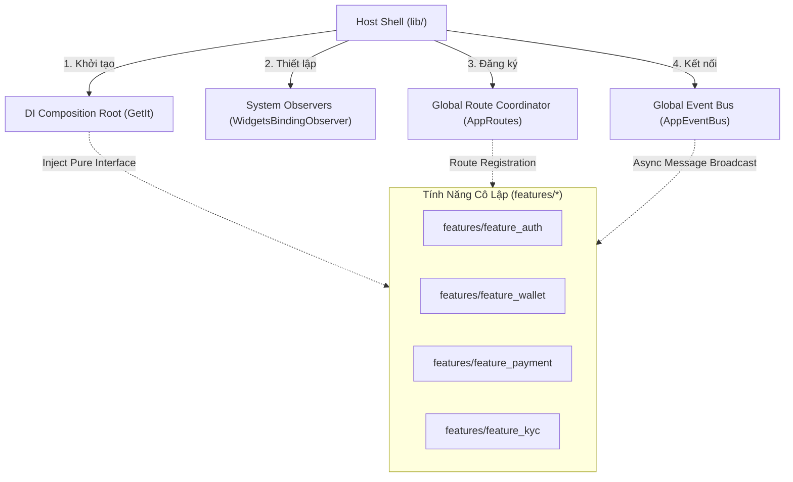
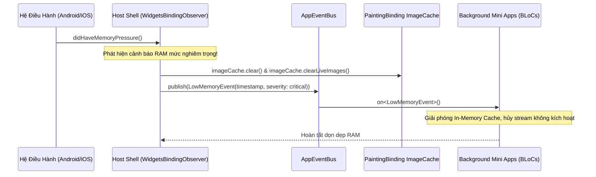
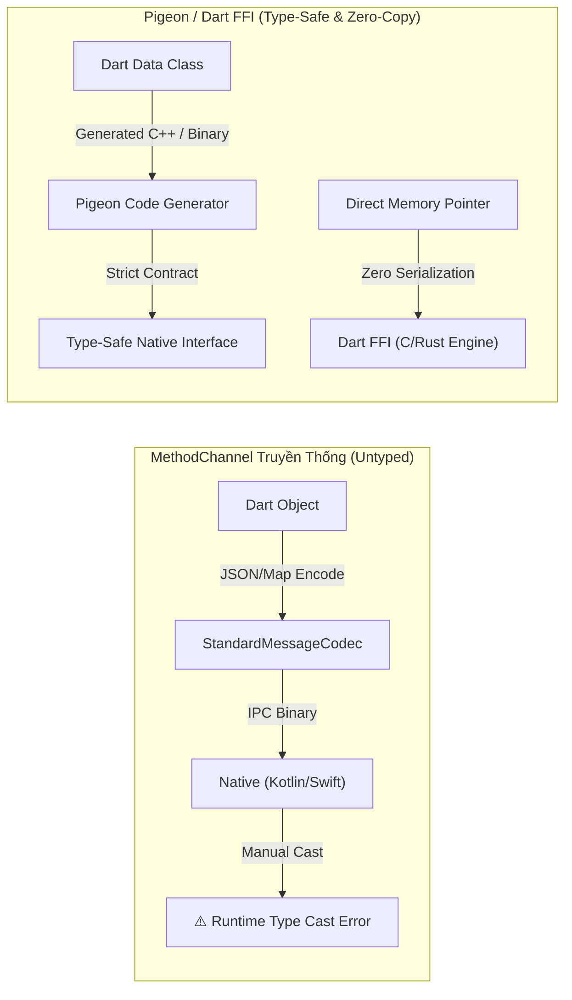
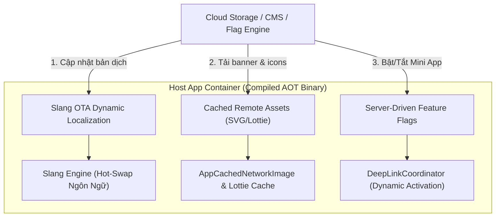
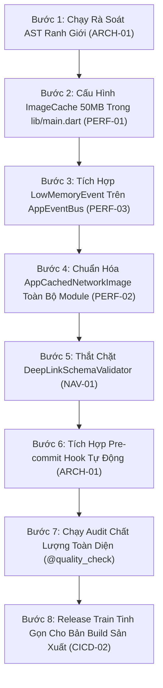

# Lộ Trình Nâng Cấp Thực Chiến Siêu Ứng Dụng Flutter
## (Flutter Super App Production Roadmap & Runtime Resilience Strategy)

> **Mục đích tài liệu:** Lưu trữ toàn bộ các phân tích kiến trúc chuyên sâu, chiến lược quản trị bộ nhớ, điều phối quyền tập trung, giải pháp cho 3 bài toán sống còn (Platform Bridge, OTA Compliance, Release Trains), danh mục backlog 7 lĩnh vực sản xuất và ma trận phân kỳ ưu tiên nhằm phát triển ứng dụng di động cấp độ Enterprise / Fintech trong hệ sinh thái Flutter.
>
> **Tài liệu liên quan:** [English Version](flutter_production_roadmap.en.md) | [Overview (VI)](OVERVIEW.vi.md) | [EN](OVERVIEW.en.md) | [Requirements Catalog](super_app_requirements.md)

---

## Mục Lục (Table of Contents)

- [I. Kiến Trúc Lõi Tinh Gọn & Ranh Giới Mô-đun (Lean Core & Module Boundaries)](#i-kiến-trúc-lõi-tinh-gọn--ranh-giới-mô-đun-lean-core--module-boundaries)
  - [1. Host Shell - Container Khởi Chạy Tinh Gọn](#1-host-shell---container-khởi-chạy-tinh-gọn)
  - [2. Kiểm Soát Ranh Giới Mô-đun Bằng AST Script](#2-kiểm-soát-ranh-giới-mô-đun-bằng-ast-script)
  - [3. Cơ Chế Chuyển Đổi Chế Độ Dual-Mode](#3-cơ-chế-chuyển-đổi-chế-độ-dual-mode)
  - [4. Chuẩn Hóa Mini App với Mason Scaffolding](#4-chuẩn-hóa-mini-app-với-mason-scaffolding)
- [II. Quản Trị Bộ Nhớ RAM & Áp Lực Bộ Nhớ (RAM & Memory Pressure Governance)](#ii-quản-trị-bộ-nhớ-ram--áp-lực-bộ-nhớ-ram--memory-pressure-governance)
  - [1. Phân cấp Scope & Vòng Đời Đối Tượng trong Flutter BLoC](#1-phân-cấp-scope--vòng-đời-đối-tượng-trong-flutter-bloc)
  - [2. Thiết Lập Trần ImageCache Cấp Ứng Dụng (25% Heap Cap)](#2-thiết-lập-trần-imagecache-cấp-ứng-dụng-25-heap-cap)
  - [3. Chiến Lược Downsampling Bắt Buộc Khi Decode Hình Ảnh](#3-chiến-lược-downsampling-bắt-buộc-khi-decode-hình-ảnh)
  - [4. Vòng Đời Phản Ứng Áp Lực Bộ Nhớ (Memory Pressure Lifecycle)](#4-vòng-đời-phản-ứng-áp-lực-bộ-nhớ-memory-pressure-lifecycle)
- [III. Điều Phối Quyền & Phần Cứng Nền Tảng (Platform Permissions & Hardware Access)](#iii-điều-phối-quyền--phần-cứng-nền-tảng-platform-permissions--hardware-access)
  - [1. Broker Quyền Tập Trung (Centralized Permission Broker)](#1-broker-quyền-tập-trung-centralized-permission-broker)
  - [2. Ranh Giới Clean Architecture & MVI Đối Với Quyền](#2-ranh-giới-clean-architecture--mvi-đối-với-quyền)
  - [3. Luồng UX: Suy Thoái Mềm Dẻo & Vĩnh Viễn Từ Chối (Graceful Degradation)](#3-luồng-ux-suy-thoái-mềm-dẻo--vĩnh-viễn-từ-chối-graceful-degradation)
  - [4. Điều Hướng Sâu Cài Đặt Hệ Thống (Direct OS Settings Deep Link)](#4-điều-hướng-sâu-cài-đặt-hệ-thống-direct-os-settings-deep-link)
- [IV. Ba Bài Toán Sống Còn Cho Siêu Ứng Dụng Flutter (The 3 Vital Super App Problems)](#iv-ba-bài-toán-sống-còn-cho-siêu-ứng-dụng-flutter-the-3-vital-super-app-problems)
  - [1. Điểm Nghẽn Tuần Tự Hóa Platform Channel vs Pigeon & Dart FFI](#1-điểm-nghẽn-tuần-tự-hóa-platform-channel-vs-pigeon--dart-ffi)
  - [2. Dynamic Code Push vs Quy Định Apple App Store Guideline 2.5.2 & Google Play](#2-dynamic-code-push-vs-quy-định-apple-app-store-guideline-252--google-play)
  - [3. Release Trains Độc Lập Cho Nhiều Đội Ngũ: Melos Monorepo & Git Worktree](#3-release-trains-độc-lập-cho-nhiều-đội-ngũ-melos-monorepo--git-worktree)
- [V. Danh Mục Nâng Cấp Sản Xuất Toàn Diện (Future Enhancements Backlog)](#v-danh-mục-nâng-cấp-sản-xuất-toàn-diện-future-enhancements-backlog)
  - [1. Kiến Trúc & Quản Trị Hệ Thống (Architecture & Governance)](#1-kiến-trúc--quản-trị-hệ-thống-architecture--governance)
  - [2. Quản Trị Trạng Thái & Lưu Trữ (State & Storage Governance)](#2-quản-trị-trạng-thái--lưu-trữ-state--storage-governance)
  - [3. Điều Hướng & Deep Link (Navigation & Central Routing)](#3-điều-hướng--deep-link-navigation--central-routing)
  - [4. Kết Nối Mạng & Hoạt Động Ngoại Tuyến (Network & Offline Resilience)](#4-kết-nối-mạng--hoạt-động-ngoại-tuyến-network--offline-resilience)
  - [5. Quản Trị Hiệu Năng & Bộ Nhớ (Performance & Memory)](#5-quản-trị-hiệu-năng--bộ-nhớ-performance--memory)
  - [6. Bảo Mật & Tuân Thủ Fintech (Security & Compliance)](#6-bảo-mật--tuân-thủ-fintech-security--compliance)
  - [7. CI/CD & Kiểm Thử Tự Động (CI/CD & Testing Pipeline)](#7-cicd--kiểm-thử-tự-động-cicd--testing-pipeline)
- [VI. Ma Trận Phân Kỳ Triển Khai (Prioritized Execution Matrix)](#vi-ma-trận-phân-kỳ-triển-khai-prioritized-execution-matrix)
- [VII. Tổng Kết & Lộ Trình Hành Động 8 Bước (Summary & Next Steps Roadmap)](#vii-tổng-kết--lộ-trình-hành-động-8-bước-summary--next-steps-roadmap)
  - [1. Bảng Đề Xuất Lộ Trình Hành Động Bổ Sung](#1-bảng-đề-xuất-lộ-trình-hành-động-bổ-sung)
  - [2. Kế Hoạch Thực Thi Chi Tiết 8 Bước Dành Cho Kỹ Sư](#2-kế-hoạch-thực-thi-chi-tiết-8-bước-dành-cho-kỹ-sư)

---

## I. Kiến Trúc Lõi Tinh Gọn & Ranh Giới Mô-đun (Lean Core & Module Boundaries)

### 1. Host Shell - Container Khởi Chạy Tinh Gọn

Trong mô hình Super App Flutter của `bloc_digital_wallet`, tầng gốc `lib/` không nắm giữ business logic của bất kỳ tính năng cụ thể nào. Nó chỉ đóng vai trò là **Host Shell (Vỏ Điều Phối)**:



1. **Composition Root Tinh Khiết:** Khởi tạo các dịch vụ nền tảng (Secure Storage, Network Client, Session Manager).
2. **Khai Báo Module Gọn Nhẹ:** Các Mini App được nạp vào ứng dụng thông qua dynamic dependency injection mà không lộ implementation internals.

### 2. Kiểm Soát Ranh Giới Mô-đun Bằng AST Script

Rủi ro lớn nhất của một Super App phát triển song song nhiều đội ngũ là việc lạm dụng import trực tiếp (`import 'package:feature_kyc/...'` bên trong `features/feature_wallet/`). Điều này phá vỡ tính cô lập, biến monorepo thành một mớ bòng bong nguyên khối.

Template `bloc_digital_wallet` giải quyết triệt để bằng script phân tích AST tự động:

```bash
# Kiểm tra tự động vi phạm ranh giới
./scripts/check_module_boundaries.sh
```

**Quy tắc cấm kỵ được thực thi bởi script:**
- `features/A` **TUYỆT ĐỐI KHÔNG** được import bất kỳ file nào từ `features/B`.
- Giao tiếp liên module bắt buộc phải qua 2 kênh:
  1. **Điều hướng:** `DeepLinkCoordinator` (truyền tham số qua query string / payload an toàn).
  2. **Truyền tin bất đồng bộ:** `AppEventBus` (phát và lắng nghe sự kiện nghiệp vụ).

### 3. Cơ Chế Chuyển Đổi Chế Độ Dual-Mode

Dự án cung cấp cơ chế chuyển đổi chế độ làm việc ngay trên dòng lệnh:

```bash
# Chế độ Lean: Chỉ giữ lại Auth, Home, Wallet
./scripts/configure_mode.sh lean

# Chế độ Enterprise: Kích hoạt toàn bộ 10 Mini App
./scripts/configure_mode.sh enterprise
```

#### Bảng so sánh cấu hình Dual-Mode:

| Thành Phần Cấu Hình | Chế Độ Lean (`lean`) | Chế Độ Doanh Nghiệp (`enterprise`) |
| :--- | :--- | :--- |
| **Modules Kích Hoạt** | `auth`, `home`, `wallet` | `auth`, `home`, `wallet`, `kyc`, `payment`, `transfer`, `chat`, `analytics`, `cards`, `settings` |
| **Mục Đích Sử Dụng** | - Phát triển tính năng lõi ví.<br>- Chạy CI Unit Test siêu tốc.<br>- Debug trên thiết bị cấu hình thấp. | - Kiểm thử tích hợp E2E.<br>- Bản build phát hành cho UAT & Production.<br>- Đánh giá tổng tải toàn hệ thống. |
| **Số Lượng Dependencies** | Tối thiểu (~25 packages) | Toàn diện (~45 packages) |
| **Thời Gian Khởi Động (Cold Boot)** | < 1.2 giây | ~ 1.8 giây |

### 4. Chuẩn Hóa Mini App với Mason Scaffolding

Để đảm bảo tính đồng nhất 100% về kiến trúc Clean Architecture + MVI giữa các squad, template tích hợp Mason brick chuyên dụng:

```bash
# Tạo một Mini App mới chuẩn hóa kiến trúc
mason make pac_mvi_feature --name loyalty --feature_type mini_app
```

Cấu trúc tạo ra luôn tuân thủ phân lớp nghiêm ngặt:
- `loyalty/data/`: Models, DataSources (Remote/Local), Repositories Implementation.
- `loyalty/domain/`: Pure Dart Entities, UseCases, Repository Interfaces.
- `loyalty/presentation/`: BLoC (State, Event, Bloc), Screens, Widgets.

---

## II. Quản Trị Bộ Nhớ RAM & Áp Lực Bộ Nhớ (RAM & Memory Pressure Governance)

### 1. Phân cấp Scope & Vòng Đời Đối Tượng trong Flutter BLoC

| Scope | Vòng Đời (Lifecycle) | Quy Tắc Áp Dụng | Rủi Ro Nếu Dùng Sai |
| :--- | :--- | :--- | :--- |
| **`@singleton` / `@LazySingleton`** | Toàn bộ tiến trình app | **CHỈ** dành cho hạ tầng cấp thấp vô trạng thái: `DioClient`, `SecureStorage`, `AppEventBus`, `SessionManager`. | Rò rỉ bộ nhớ vĩnh viễn (Leak cả vòng đời app) nếu gán state của Mini App vào Singleton. |
| **Scoped DI / `BlocProvider`** | Gắn liền với vòng đời widget / route | **Mọi business state và BLoC của Feature phải nằm ở đây.** Khi rời màn hình Mini App, BLoC tự động `close()`. | Nếu giữ reference tới `BuildContext` hoặc StreamSubscription không hủy sẽ gây memory leak. |
| **Factory `@injectable`** | Tạo mới mỗi lần inject | Dành cho UseCases, Parsers, Formatters không lưu trạng thái. | Cấp phát quá nhiều instance gây áp lực lên GC nếu lạm dụng trong build method. |

### 2. Thiết Lập Trần ImageCache Cấp Ứng Dụng (25% Heap Cap)

Khác với Native Android có thể dựa vào Garbage Collector và cơ chế Bitmap Pool của ART, Flutter render thông qua engine Skia hoặc Impeller. Nếu 5-10 Mini App cùng hiển thị các banner quảng cáo, avatar và danh sách giao dịch chứa ảnh phân giải cao (2K/4K), dung lượng RAM sẽ tăng đột biến dẫn đến OOM Crash (Jetsam Event trên iOS hoặc LMK killer trên Android).

Trong `lib/main.dart`, template áp dụng công thức giới hạn bộ nhớ đệm:

```dart
void configureGlobalImageCache() {
  final binding = PaintingBinding.instance;
  // Cố định số lượng ảnh tối đa trong bộ nhớ đệm
  binding.imageCache.maximumSize = 100;
  
  // Giới hạn dung lượng byte tối đa: 50MB (tương đương 25% heap an toàn)
  binding.imageCache.maximumSizeBytes = 50 * 1024 * 1024;
}
```

### 3. Chiến Lược Downsampling Bắt Buộc Khi Decode Hình Ảnh

Không bao giờ decode một bức ảnh 2048x2048px nếu widget UI chỉ có kích thước 64x64px. Template cung cấp widget dùng chung `AppCachedNetworkImage` bắt buộc các tham số tối ưu kích thước decode trong bộ nhớ (`memCacheWidth` & `memCacheHeight`):

```dart
AppCachedNetworkImage(
  imageUrl: userAvatarUrl,
  width: 48,
  height: 48,
  // Bắt buộc downsample khi decode vào GPU RAM
  memCacheWidth: 48 * (ui.window.devicePixelRatio.toInt()),
  memCacheHeight: 48 * (ui.window.devicePixelRatio.toInt()),
  fit: BoxFit.cover,
);
```

### 4. Vòng Đời Phản Ứng Áp Lực Bộ Nhớ (Memory Pressure Lifecycle)

Khi hệ điều hành gửi tín hiệu thiếu hụt RAM, Host App sẽ đón nhận qua `WidgetsBindingObserver` và kích hoạt chuỗi giải phóng tài nguyên trên toàn bộ hệ thống:



---

## III. Điều Phối Quyền & Phần Cứng Nền Tảng (Platform Permissions & Hardware Access)

### 1. Broker Quyền Tập Trung (Centralized Permission Broker)

Trong một Super App, việc nhiều Mini App (như KYC, Quét mã QR thanh toán, Chat hình ảnh) cùng lúc yêu cầu quyền Camera hoặc Micro sẽ gây ra xung đột hộp thoại của hệ điều hành, làm hỏng trải nghiệm người dùng hoặc khiến app bị crash.

Template cung cấp `PlatformPermissionBroker` tập trung tại `packages/platform/`:

```dart
abstract class PlatformPermissionBroker {
  Future<PermissionStatus> requestCameraPermission({
    required String requestingModule,
    required String rationale,
  });

  Future<PermissionStatus> requestBiometricsPermission({
    required String requestingModule,
  });

  Future<PermissionStatus> requestLocationPermission({
    required String requestingModule,
  });

  Future<bool> openAppSettingsPage();
}
```

### 2. Ranh Giới Clean Architecture & MVI Đối Với Quyền
1. **Domain Layer:** Không bao giờ phụ thuộc vào package `permission_handler`. UseCase chỉ nhận kết quả dạng entity thuần Dart (`PermissionResult.granted`, `PermissionResult.denied`).
2. **Presentation Layer (BLoC):** Nhận sự kiện yêu cầu quyền từ UI, gọi UseCase, và phát ra State phản ánh trạng thái quyền (ví dụ: `CameraPermissionRequiredState`).

### 3. Luồng UX: Suy Thoái Mềm Dẻo & Vĩnh Viễn Từ Chối (Graceful Degradation)

Khi người dùng từ chối cấp quyền, Mini App **tuyệt đối không được văng ứng dụng** hay hiển thị màn hình trống:

| Quyền Bị Từ Chối | Tính Năng Bị Ảnh Hưởng | Cơ Chế Suy Thoái Mềm Dẻo (Degradation Fallback) |
| :--- | :--- | :--- |
| **Camera** | Quét QR chuyển tiền | Cho phép người dùng nhập thủ công số tài khoản/số điện thoại hoặc chọn ảnh QR từ thư viện ảnh. |
| **Camera** | Chụp ảnh KYC eKYC | Hiển thị màn hình hướng dẫn và nút mở cài đặt hệ thống để cấp quyền lại. |
| **Biometrics** (FaceID/Vân tay) | Xác thực thanh toán | Tự động chuyển sang yêu cầu nhập mã PIN 6 số hoặc mật khẩu ví. |
| **Location** | Tìm cây ATM / Điểm nạp tiền | Cho phép chọn Tỉnh/Thành phố và Quận/Huyện từ danh sách dropdown tĩnh. |

### 4. Điều Hướng Sâu Cài Đặt Hệ Thống (Direct OS Settings Deep Link)

Đối với trường hợp quyền đã bị người dùng từ chối vĩnh viễn (`PermissionStatus.permanentlyDenied`), hộp thoại hệ thống sẽ không thể hiển thị lại. `PlatformPermissionBroker` sẽ hiển thị một BottomSheet giải thích lý do cụ thể và cung cấp nút bấm gọi trực tiếp `openAppSettings()`, đưa người dùng vào ngay trang cài đặt quyền của ứng dụng trên iOS/Android.

---

## IV. Ba Bài Toán Sống Còn Cho Siêu Ứng Dụng Flutter (The 3 Vital Super App Problems)

### 1. Điểm Nghẽn Tuần Tự Hóa Platform Channel vs Pigeon & Dart FFI

#### Vấn Đề (The Problem)
Trong ứng dụng Flutter thông thường, giao tiếp giữa Dart và Native Code (Kotlin/Swift) sử dụng `MethodChannel`. `MethodChannel` mặc định dựa vào `StandardMessageCodec` để tuần tự hóa (serialize) dữ liệu sang binary và giải tuần tự hóa (deserialize) qua thread UI hệ thống.
Khi Super App gọi liên tục qua bridge để xử lý camera frame eKYC, mã hóa Keystore, hoặc GPS realtime, việc tuần tự hóa JSON không type-safe sẽ gây drop frame (Jank) và runtime type cast exceptions.



#### Giải Pháp Sản Xuất (Production Solution)
1. **Áp dụng Pigeon (`package:pigeon`):**
   Mọi giao tiếp platform bridge phức tạp (Biometrics, NFC Scanner, Camera Hardware) bắt buộc phải định nghĩa schema tĩnh bằng file `.dart` giao ước. Pigeon tự động sinh mã nguồn Dart, Kotlin và Swift tương ứng.
2. **Sử dụng Dart FFI cho các tác vụ tính toán chuyên sâu:**
   Đối với các thuật toán mã hóa chữ ký giao dịch số hoặc xử lý ảnh bitmap, gọi trực tiếp thư viện C/C++ hoặc Rust qua `dart:ffi`. Bỏ qua hoàn toàn chi phí tuần tự hóa của Platform Channel, đạt tốc độ zero-copy thực tế.

---

### 2. Dynamic Code Push vs Quy Định Apple App Store Guideline 2.5.2 & Google Play

#### Vấn Đề (The Problem)
- **Apple App Store Review Guideline 2.5.2:** Nghiêm cấm tuyệt đối việc tải, cài đặt hoặc thực thi mã nhị phân thực thi (executable binary code) làm thay đổi hành vi cốt lõi của ứng dụng ngoài App Store. Vi phạm sẽ dẫn đến việc ứng dụng bị gỡ bỏ ngay lập tức (Ban Account).
- **Flutter AOT Single Binary Reality:** Flutter biên dịch Dart thành mã máy AOT (`Runner.app` trên iOS và `libapp.so` trên Android). Cơ chế VM JIT bị vô hiệu hóa hoàn toàn trong chế độ Release, do đó việc nạp động Dart bytecode là bất khả thi về mặt kỹ thuật trên iOS.

#### Giải Pháp Hợp Chuẩn Sản Xuất (Compliant Production Strategy)
Thay vì cố gắng tải động mã nguồn nhị phân bất hợp pháp, Super App Flutter giải quyết bài toán cập nhật động (Dynamic Delivery) qua 3 lớp phòng vệ tuân thủ chính sách:



1. **Cập Nhật Ngôn Ngữ Nóng Qua Slang OTA (`package:slang`):**
   Tải động các file JSON bản dịch đa ngôn ngữ từ CDN mà không cần phát hành bản build mới. Slang hỗ trợ hot-swap bản dịch ngay khi có kết nối mạng.
2. **Tài Nguyên Từ Xa Được Quản Lý Bộ Nhớ Đệm (Remote Asset Caching):**
   Tất cả hình ảnh minh họa, icon Mini App, animation Lottie được lưu trữ trên CDN và nạp qua `AppCachedNetworkImage` với chính sách giới hạn dung lượng bộ nhớ đệm nghiêm ngặt.
3. **Server-Driven Dynamic Feature Toggling:**
   Tất cả 10 Mini App đều được biên dịch sẵn trong AOT binary, nhưng quyền hiển thị và kích hoạt trên Dashboard được điều khiển 100% bằng Server-Driven Feature Flags.

---

### 3. Release Trains Độc Lập Cho Nhiều Đội Ngũ: Melos Monorepo & Git Worktree

#### Vấn Đề (The Problem)
Khi quy mô kỹ thuật mở rộng lên 5-10 squads tính năng, nếu tất cả cùng commit vào một nhánh chính và cùng phát hành theo một chu kỳ đơn lẻ, hiện tượng "kẹt tàu" (Release Train Blockage) chắc chắn xảy ra.

#### Giải Pháp Monorepo Melos & Worktree Sản Xuất
1. **Kiểm Soát Phiên Bản Độc Lập Qua Melos (`melos.yaml`):**
   Mỗi package trong `features/*` sở hữu số phiên bản Semantic Versioning riêng biệt:
   ```bash
   # Tự động tính toán phiên bản và cập nhật CHANGELOG cho từng feature độc lập
   melos version --prerelease
   ```
2. **Cô Lập Môi Trường Phát Triển Với Git Worktree:**
   Mỗi squad làm việc trên một worktree độc lập (`.worktrees/feature_kyc`), hoàn toàn không làm bẩn workspace chính của các squad khác.
3. **Quy Chuẩn Commit Có Phạm Vi (`CRITICAL_RULES`):**
   Mọi commit đều gắn scope rõ ràng: `[FEATURE_KYC] Fix liveness detection timeout`, cho phép CI tự động lọc và chạy kiểm thử đúng các package bị ảnh hưởng (Targeted CI Testing).

---

## V. Danh Mục Nâng Cấp Sản Xuất Toàn Diện (Future Enhancements Backlog)

### 1. Kiến Trúc & Quản Trị Hệ Thống (Architecture & Governance)
*   **ARCH-01 AST Boundary Gatekeeper:**
    *   *Mục đích:* Quét AST ngăn chặn 100% import chéo giữa các module trong `features/`.
    *   *Vị trí:* `scripts/check_module_boundaries.sh` tích hợp vào Git Pre-commit hook.
*   **ARCH-02 Stream Subscription Linter:**
    *   *Mục đích:* Kiểm tra tự động các `StreamSubscription` chưa được `cancel()` trong BLoC `close()`.
*   **ARCH-03 Scoped DI Disposal:**
    *   *Mục đích:* Tự động unregister instance trong GetIt khi người dùng đóng Mini App.

### 2. Quản Trị Trạng Thái & Lưu Trữ (State & Storage Governance)
*   **STOR-01 Encrypted Storage Partitioning:**
    *   *Mục đích:* Phân vùng mã hóa cơ sở dữ liệu Isar / Hive riêng biệt cho từng Mini App (`features/wallet/data/`).
*   **STOR-02 Instant Secure Token Zeroization:**
    *   *Mục đích:* Làm sạch token bảo mật tức thời trong Keychain/Keystore khi nhận `UserSessionExpiredEvent`.
*   **STOR-03 Local Disk Cache Quota:**
    *   *Mục đích:* Giới hạn dung lượng cache tối đa 200MB cho toàn bộ app với cơ chế tự động dọn dẹp LRU.

### 3. Điều Hướng & Deep Link (Navigation & Central Routing)
*   **NAV-01 DeepLink Schema Parameter Validator:**
    *   *Mục đích:* Kiểm tra kiểu dữ liệu của query parameters trước khi chuyển tiếp vào Mini App.
*   **NAV-02 Fallback Route & 404 Handler:**
    *   *Mục đích:* Xử lý điều hướng dự phòng khi deep link trỏ vào Mini App bị tắt bởi Feature Flag.
*   **NAV-03 Navigation Stack Preservation:**
    *   *Mục đích:* Lưu trữ ngăn xếp điều hướng khi người dùng chuyển đổi qua lại giữa các Mini App.

### 4. Kết Nối Mạng & Hoạt Động Ngoại Tuyến (Network & Offline Resilience)
*   **NET-01 Offline Sync Queue:**
    *   *Mục đích:* Hàng đợi đồng bộ giao dịch ngoại tuyến với cơ chế lũy thoái số mũ (Exponential Backoff).
*   **NET-02 Isolated Dio Interceptors:**
    *   *Mục đích:* Tách biệt interceptors giữa các Mini App: mỗi module có header và timeout riêng biệt.
*   **NET-03 Strict SSL Certificate Pinning:**
    *   *Mục đích:* Khóa chặt certificate và chặn cleartext traffic HTTP tại `packages/shared/network/`.

### 5. Quản Trị Hiệu Năng & Bộ Nhớ (Performance & Memory)
*   **PERF-01 Global ImageCache 50MB Cap:**
    *   *Mục đích:* Thiết lập trần cứng 50MB (25% heap cap) trong `lib/main.dart`.
*   **PERF-02 Mandatory Image Downsampling:**
    *   *Mục đích:* Bắt buộc truyền `memCacheWidth` & `memCacheHeight` trong `AppCachedNetworkImage`.
*   **PERF-03 LowMemoryEvent Bus Integration:**
    *   *Mục đích:* Lắng nghe `WidgetsBindingObserver.didHaveMemoryPressure` phát sự kiện dọn RAM toàn cục.
*   **PERF-04 Impeller Shader Warmup:**
    *   *Mục đích:* Khởi chạy shader warmup cho các animation thanh toán phức tạp.

### 6. Bảo Mật & Tuân Thủ Fintech (Security & Compliance)
*   **SEC-01 Device Integrity & Root/Jailbreak Detection:**
    *   *Mục đích:* Phát hiện thiết bị đã bị can thiệp (Root, Magisk, Jailbreak, Frida hook).
*   **SEC-02 Screen Obfuscation & Privacy Shield:**
    *   *Mục đích:* Chặn chụp màn hình / quay video màn hình (`FLAG_SECURE`) trên các màn hình nhạy cảm.
*   **SEC-03 Zero Plaintext PII Logging:**
    *   *Mục đích:* Che giấu toàn bộ số thẻ, số dư và thông tin cá nhân trong console logs.

### 7. CI/CD & Kiểm Thử Tự Động (CI/CD & Testing Pipeline)
*   **CICD-01 Matrix 3-Tier GitHub Actions Workflow:**
    *   *Mục đích:* Chạy song song Tier A (Unit), Tier B (Lint/AST), Tier C (Integration) trên mỗi PR.
*   **CICD-02 Melos Automated Semantic Versioning:**
    *   *Mục đích:* Tự động đánh tag phiên bản và cập nhật CHANGELOG cho từng package độc lập.
*   **CICD-03 App Binary Budgeting Alert:**
    *   *Mục đích:* Cảnh báo tự động nếu dung lượng IPA / APK tăng vượt quá 5MB.

---

## VI. Ma Trận Phân Kỳ Triển Khai (Prioritized Execution Matrix)

```
       ▲  Cao
       │
       │  [P0] ARCH-01 (AST Boundary Check)       [P1] NET-01 (Offline Sync Queue)
       │  [P0] PERF-01 (ImageCache 50MB Cap)      [P1] NAV-01 (DeepLink Schema Guard)
       │  [P0] STOR-02 (Secure Token Purge)       [P1] SEC-01 (Jailbreak/Root Check)
 ẢNH   │
 HƯỞNG │
 (IMPACT)
       │  [P0] PERF-03 (LowMemoryEvent Bus)       [P2] PERF-04 (Impeller Shader Warmup)
       │  [P1] CICD-01 (Matrix CI Testing)        [P2] CICD-02 (Melos Auto-Versioning)
       │  [P1] STOR-03 (Disk Quota 200MB)         [P2] ARCH-03 (Scoped DI Disposal)
       │
       └────────────────────────────────────────────────────────────────────────►
         Thấp                                                          Cao
                                NỖ LỰC TRIỂN KHAI (EFFORT)
```

| Giai Đoạn | Hạng Mục Kỹ Thuật | Phân Loại | Tác Động Kiến Trúc | Khi Nào Cần Áp Dụng? |
| :---: | :--- | :--- | :---: | :--- |
| **Phase A (P0)** | **Kiểm Soát Ranh Giới AST (`check_module_boundaries.sh`)** | Architecture | Cao | Ngay trong sprint hiện tại, tích hợp Pre-commit hook |
| **Phase A (P0)** | **Cấu Hình ImageCache 50MB (25% Heap Cap)** | Performance | Cao | Trước khi nạp danh sách giao dịch lớn |
| **Phase A (P0)** | **Lắng Nghe Áp Lực Bộ Nhớ (`LowMemoryEvent`)** | Resilience | Cao | Trước khi mở rộng lên 5+ Mini App chạy đồng thời |
| **Phase A (P0)** | **Làm Sạch Token Bảo Mật Khi Hết Phiên** | Security | Cao | Bắt buộc đối với ứng dụng tài chính số |
| **Phase B (P1)** | **Bộ Xác Thực Schema Tham Số Deep Link** | Routing | Trung bình | Khi có các luồng thanh toán từ đối tác thứ ba |
| **Phase B (P1)** | **Hàng Đợi Đồng Bộ Ngoại Tuyến (Offline Sync Queue)** | Network | Trung bình | Khi người dùng thực hiện giao dịch ở vùng sóng yếu |
| **Phase B (P1)** | **Phát Hiện Thiết Bị Can Thiệp (Jailbreak / Root)** | Security | Trung bình | Chuẩn bị cho giai đoạn thử nghiệm bảo mật (Pen-test) |
| **Phase B (P1)** | **Pipeline GitHub Actions Chạy Ma Trận 3 Tầng** | DevOps | Độc lập | Khi đội ngũ mở rộng lên trên 5 kỹ sư |
| **Phase C (P2)** | **Tối Ưu Shader Khởi Động Impeller (Warmup)** | Rendering | Thấp | Khi có các animation chuyển đổi màn hình phức tạp |
| **Phase C (P2)** | **Tự Động Đánh Tag Phiên Bản Qua Melos** | Release | Thấp | Khi vận hành Release Train tự động |

---

## VII. Tổng Kết & Lộ Trình Hành Động 8 Bước (Summary & Next Steps Roadmap)

### 1. Bảng Đề Xuất Lộ Trình Hành Động Bổ Sung

| STT | Hạng Mục Bổ Sung | Phân Loại | Độ Cần Thiết | File Dự Kiến Tác Động |
| :---: | :--- | :--- | :---: | :--- |
| **1** | **Chạy Rà Soát AST Ranh Giới Module** | Architecture | ⭐⭐⭐⭐⭐ | `scripts/check_module_boundaries.sh` |
| **2** | **Cấu Hình Giới Hạn ImageCache 50MB** | Performance | ⭐⭐⭐⭐⭐ | `lib/main.dart` |
| **3** | **Lắng Nghe Sự Kiện Áp Lực Bộ Nhớ Hệ Thống** | Resilience | ⭐⭐⭐⭐⭐ | `lib/app.dart`, `packages/platform/` |
| **4** | **Bắt Buộc Downsampling Ảnh Trong UI Kit** | UI / Memory | ⭐⭐⭐⭐⭐ | `packages/shared/`, `packages/ui_kit/` |
| **5** | **Thiết Lập DeepLink Schema Parameter Validator** | Navigation | ⭐⭐⭐⭐☆ | `packages/platform/` |
| **6** | **Cài Đặt Git Pre-commit Hook Tự Động** | DevOps | ⭐⭐⭐⭐⭐ | `.git/hooks/pre-commit` |
| **7** | **Thực Thi Kiểm Định Đa Tầng Với `@quality_check`** | QA / Audit | ⭐⭐⭐⭐⭐ | Toàn bộ monorepo |
| **8** | **Vận Hành Bản Build Sản Xuất Theo Release Train** | Release | ⭐⭐⭐⭐☆ | `scripts/configure_mode.sh`, `melos.yaml` |

### 2. Kế Hoạch Thực Thi Chi Tiết 8 Bước Dành Cho Kỹ Sư



1. **Bước 1: Chạy rà soát vi phạm ranh giới module hiện tại**
   ```bash
   ./scripts/check_module_boundaries.sh
   ```
   *Mục tiêu:* Đảm bảo không có bất kỳ dòng lệnh import chéo nào giữa các thư mục trong `features/`.

2. **Bước 2: Kích hoạt giới hạn ImageCache 50MB**
   - Mở file `lib/main.dart`.
   - Bổ sung hàm thiết lập `PaintingBinding.instance.imageCache.maximumSizeBytes = 50 * 1024 * 1024;`.
   *Mục tiêu:* Ngăn chặn 100% rủi ro tràn RAM hình ảnh khi cuộn danh sách lớn.

3. **Bước 3: Lắng nghe sự kiện áp lực bộ nhớ hệ điều hành**
   - Triển khai `WidgetsBindingObserver` tại `lib/app.dart`.
   - Khi hàm `didHaveMemoryPressure()` được kích hoạt, phát sự kiện `LowMemoryEvent()` qua `AppEventBus`.
   *Mục tiêu:* Báo động cho toàn bộ BLoC và In-Memory Cache dọn dẹp bộ nhớ đệm.

4. **Bước 4: Bắt buộc downsample ảnh trong widget dùng chung**
   - Rà soát các widget hiển thị hình ảnh trong `packages/shared/`.
   - Đảm bảo widget `AppCachedNetworkImage` luôn truyền `memCacheWidth` và `memCacheHeight`.

5. **Bước 5: Thiết lập bộ kiểm tra schema tham số Deep Link**
   - Cập nhật `DeepLinkCoordinator` trong `packages/platform/`.
   - Xác thực schema kiểu dữ liệu (kiểm tra kiểu số, định dạng email, mã giao dịch) trước khi chuyển tiếp vào màn hình của Mini App.

6. **Bước 6: Cài đặt Git Pre-commit Hook tự động**
   - Đưa lệnh `./scripts/check_module_boundaries.sh` và `melos analyze` vào hook `.git/hooks/pre-commit`.
   *Mục tiêu:* Chặn đứng lỗi kiến trúc ngay từ máy trạm của lập trình viên trước khi tạo commit.

7. **Bước 7: Thực thi kiểm tra chất lượng đa tầng với `@quality_check`**
   - Chạy bộ kiểm thử 3 tầng (Unit Test, Linter/AST, Integration Flow) kết hợp 4 chuyên gia audit (Security, Architecture, UI, Code Health) để xác nhận hệ thống hoàn toàn sạch lỗi.

8. **Bước 8: Phát hành bản build sản xuất theo Release Train**
   - Chuyển sang chế độ mong muốn: `./scripts/configure_mode.sh enterprise` (hoặc `lean`).
   - Sử dụng Melos để cập nhật phiên bản và tag bản phát hành sạch.
