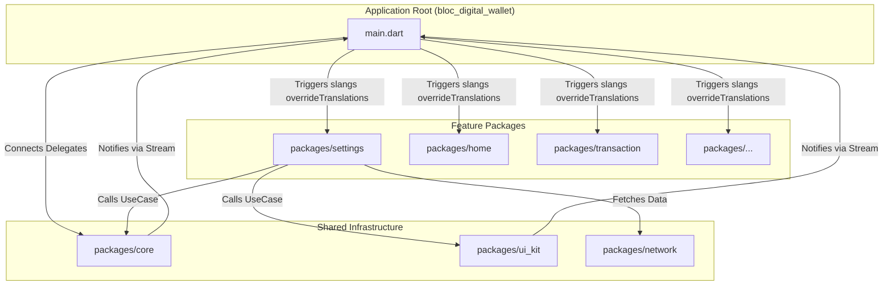
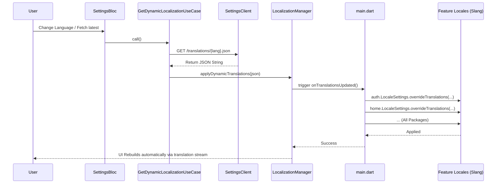
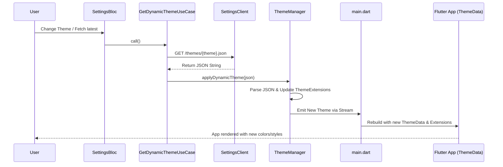

# Dynamic Configuration High Level Design (HLD)

This document describes the high-level design for dynamic configuration updates, specifically for Localization (Slang) and Themes (Theme Tailor). 
The architecture aims to allow fetching configuration values from the backend dynamically and broadcasting them to all independent feature modules, without tightly coupling modules to the network layer.

## Table of Contents
- [1. Architectural Overview](#1-architectural-overview)
  - [1.1 Diagram: Component Interactions](#11-diagram-component-interactions)
- [2. Component Responsibilities](#2-component-responsibilities)
  - [2.1 Settings Package (`packages/settings`)](#21-settings-package-packagessettings)
  - [2.2 Core Package (`packages/core`)](#22-core-package-packagescore)
  - [2.3 UI Kit Package (`packages/ui_kit`)](#23-ui-kit-package-packagesui_kit)
  - [2.4 Application Layer (`lib/main.dart`)](#24-application-layer-libmaindart)
- [3. Dynamic Translation (Slang)](#3-dynamic-translation-slang)
  - [3.1 Sequence Diagram](#31-sequence-diagram)
  - [3.2 Slang Requirements](#32-slang-requirements)
- [4. Dynamic Theme (Theme Tailor)](#4-dynamic-theme-theme-tailor)
  - [4.1 Sequence Diagram](#41-sequence-diagram)
  - [4.2 Theme Tailor Requirements](#42-theme-tailor-requirements)

## 1. Architectural Overview

The dynamic configuration flow follows Clean Architecture principles by isolating the network operations into a dedicated `settings` feature module, while the orchestrators that broadcast these changes live in the `core` and `ui_kit` shared packages. The `app` (Main Layer) binds these components together.

### 1.1 Diagram: Component Interactions



## 2. Component Responsibilities

### 2.1 Settings Package (`packages/settings`)
Responsible for all remote data fetching and triggering the update process.

- **`SettingsClient` (Retrofit)**: Defines the API endpoints to fetch translation JSONs and theme JSONs.
- **`SettingsRepository`**: Handles data mapping and error handling from the data source.
- **`GetDynamicLocalizationUseCase`**: Fetches the translation from the repository and triggers `LocalizationManager.applyDynamicTranslations()`.
- **`GetDynamicThemeUseCase`**: Fetches the theme from the repository and triggers `ThemeManager.applyDynamicTheme()`.
- **`SettingsBloc`**: The presentation state manager that calls the UseCases based on user interaction or app initialization events.

### 2.2 Core Package (`packages/core`)
Acts as the central broadcaster for configurations without depending on network or UI implementations.

- **`LocalizationManager`**: 
    - Maintains a `BehaviorSubject` for the current locale stream.
    - Exposes a `registerOverrideCallback` for the App layer to attach the translation override logic.
    - Exposes `applyDynamicTranslations(String json)` to be called by the `settings` UseCase.

### 2.3 UI Kit Package (`packages/ui_kit`)
- **`ThemeManager`**: Similar to `LocalizationManager`, handles the application of dynamic themes by updating the `ThemeExtension` values.
    - Maintains a stream of current Theme data.
    - Exposes `applyDynamicTheme(String json)` to parse JSON and update the active theme in the UI.

### 2.4 Application Layer (`lib/main.dart`)
The orchestrator. It knows about all feature modules and binds the core managers to the specific packages.

- Connects the `LocalizationManager`'s callback to iterate through every package's `LocaleSettings.overrideTranslations` method using Slang's built-in override capabilities.
- Listens to `ThemeManager` updates and dynamically reconstructs the App's `ThemeData` to apply new colors and styles throughout the app.

## 3. Dynamic Translation (Slang)

### 3.1 Sequence Diagram



### 3.2 Slang Requirements
To enable dynamic translations per feature module, each package using Slang must have the following configuration in its `slang.yaml`:

```yaml
translation_overrides: true
```
This instructs Slang to generate the `overrideTranslations` and `overrideTranslationsSync` APIs in `translations.dart`, which allows appending or replacing the key-value pairs at runtime.

## 4. Dynamic Theme (Theme Tailor)

### 4.1 Sequence Diagram



### 4.2 Theme Tailor Requirements
To enable dynamic themes with Theme Tailor, the theme extensions must be designed to be mutable or easily cloned with new values. Typically, the parsed JSON is converted into a `ThemeExtension` class generated by Theme Tailor:

1. Parse the JSON map dynamically and override specific properties (e.g., `primaryColor`, `backgroundColor`) in the active `ThemeExtension` instance.
2. The UI Kit must expose utility functions to convert raw string colors (like hex `#FFFFFF`) into Flutter `Color` objects that update the Tailor classes.
