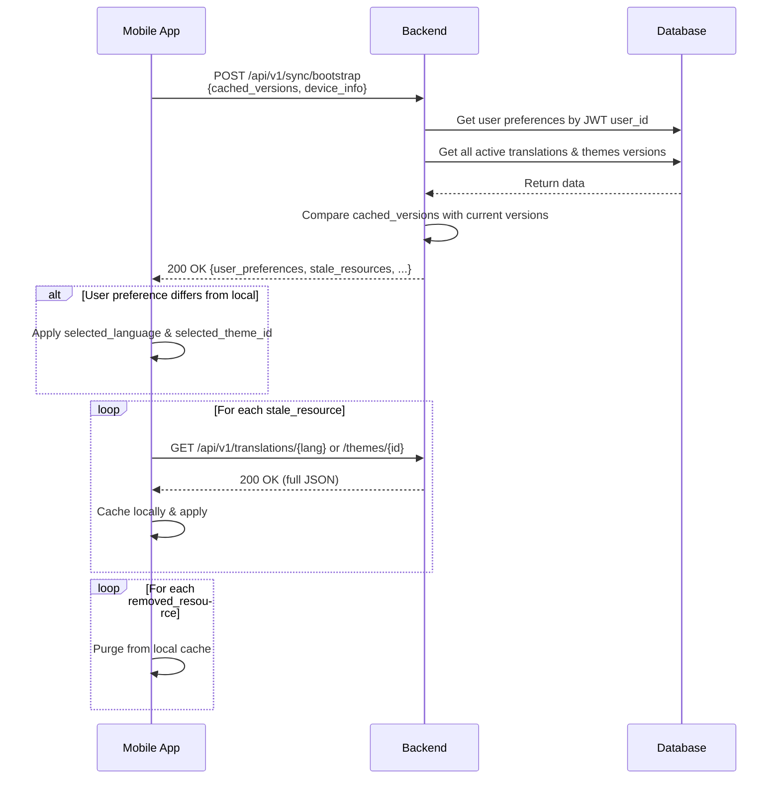
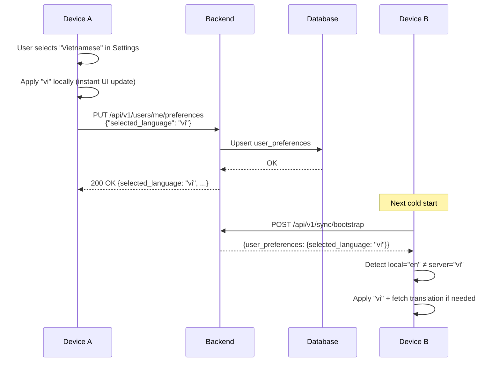
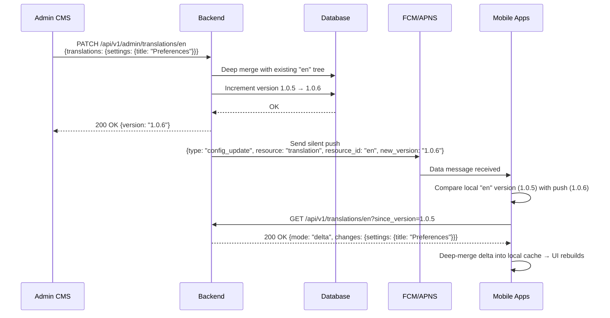
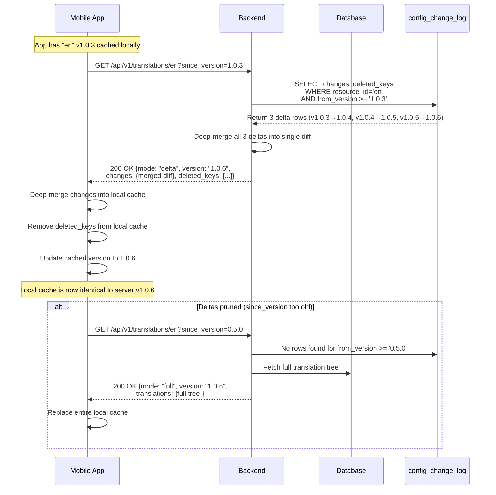

# User Preferences Sync — API Contract

> **Audience**: Backend Engineers / AI Agents implementing the server-side APIs.
> **Prerequisite Reading**: [dynamic_configuration_hld.md](./dynamic_configuration_hld.md), [dynamic_configuration_api.md](./dynamic_configuration_api.md)

This document extends the existing Dynamic Configuration API Contract with three new capabilities:

1. **Full CRUD management** of Translations & Themes from the Backend (Admin CMS), with remote push down to mobile apps.
2. **Per-user preference storage** (`selected_language`, `selected_theme`) with **cross-device synchronization**.
3. **Delta Versioning** — Track changes per version and return only modified/added keys when clients request updates, drastically reducing response payload size.

---

## Table of Contents
- [Architecture Overview](#architecture-overview)
- [Data Model](#data-model)
- [Part 1: Configuration Management APIs (Admin)](#part-1-configuration-management-apis-admin)
  - [1.1 Translations CRUD](#11-translations-crud)
  - [1.2 Themes CRUD](#12-themes-crud)
  - [1.3 Push Notification on Config Change](#13-push-notification-on-config-change)
- [Part 2: User Preferences Sync APIs (Client)](#part-2-user-preferences-sync-apis-client)
  - [2.1 Get User Preferences](#21-get-user-preferences)
  - [2.2 Update User Preferences](#22-update-user-preferences)
  - [2.3 Sync Flow on App Startup](#23-sync-flow-on-app-startup)
- [Part 3: Enhanced Client APIs (Mobile App)](#part-3-enhanced-client-apis-mobile-app)
  - [3.1 Get Available Languages](#31-get-available-languages)
  - [3.2 Get Translation by Language](#32-get-translation-by-language)
  - [3.3 Get Available Themes](#33-get-available-themes)
  - [3.4 Get Theme Details](#34-get-theme-details)
  - [3.5 Bulk Config Sync (Bootstrap)](#35-bulk-config-sync-bootstrap)
- [Part 4: Delta Versioning Strategy](#part-4-delta-versioning-strategy)
  - [4.1 Concept Overview](#41-concept-overview)
  - [4.2 How PATCH Records a Delta](#42-how-patch-records-a-delta)
  - [4.3 Client Fetches Delta via `since_version`](#43-client-fetches-delta-via-since_version)
  - [4.4 Delta-Aware Bootstrap](#44-delta-aware-bootstrap)
  - [4.5 Housekeeping: Pruning Old Deltas](#45-housekeeping-pruning-old-deltas)
- [Error Codes](#error-codes)
- [Sequence Diagrams](#sequence-diagrams)
  - [App Startup Sync Flow](#app-startup-sync-flow)
  - [User Changes Language on Device A](#user-changes-language-on-device-a)
  - [Admin Updates Translation from CMS](#admin-updates-translation-from-cms)
  - [Delta Sync Flow (Client requests incremental update)](#delta-sync-flow)
- [Database Schema (Reference)](#database-schema-reference)
- [Implementation Checklist](#implementation-checklist)

---

## Architecture Overview

```
┌─────────────────────────────────────────────────────────────────┐
│                     Admin CMS / Dashboard                       │
│  (CRUD Translations, CRUD Themes, Push notifications)           │
└───────────────────────┬─────────────────────────────────────────┘
                        │ Admin APIs (/api/v1/admin/*)
                        ▼
┌─────────────────────────────────────────────────────────────────┐
│                        Backend Server                           │
│                                                                 │
│  ┌──────────────────┐  ┌──────────────────┐  ┌───────────────┐  │
│  │  translations    │  │     themes       │  │    user_      │  │
│  │  table           │  │     table        │  │    preferences│  │
│  └──────────────────┘  └──────────────────┘  └───────────────┘  │
│                                                                 │
│  On mutation → increment version + record delta + push notify   │
└───────────────────────┬─────────────────────────────────────────┘
                        │ Client APIs (/api/v1/*)
                        ▼
┌─────────────────────────────────────────────────────────────────┐
│                    Mobile App (Device A, B, C...)               │
│                                                                 │
│  App Startup → POST /sync/bootstrap                             │
│  User changes pref → PUT /users/me/preferences                  │
│  Receives push → re-fetch changed config                        │
└─────────────────────────────────────────────────────────────────┘
```

---

## Data Model

### User Preferences

| Field              | Type     | Description                                              |
|--------------------|----------|----------------------------------------------------------|
| `user_id`          | `string` | Authenticated user's unique ID (from JWT)                |
| `selected_language`| `string` | Language code, e.g. `"en"`, `"vi"`, `"fr"`               |
| `selected_theme_id`| `string` | Theme ID, e.g. `"default_light"`, `"tet_holiday_special"`|
| `updated_at`       | `string` | ISO 8601 timestamp of last update                        |

### Translation Metadata

| Field            | Type     | Description                                      |
|------------------|----------|--------------------------------------------------|
| `language_code`  | `string` | ISO 639-1 code, e.g. `"en"`, `"vi"`              |
| `language_name`  | `string` | Human-readable name, e.g. `"English"`            |
| `version`        | `string` | Semantic version, auto-incremented on mutation   |
| `is_default`     | `bool`   | Whether this is the fallback language            |
| `is_active`      | `bool`   | Whether this language is available to clients    |
| `checksum`       | `string` | MD5 or SHA-256 hash of the complete JSON tree    |
| `updated_at`     | `string` | ISO 8601 timestamp                               |

### Theme Metadata

| Field            | Type     | Description                                       |
|------------------|----------|---------------------------------------------------|
| `id`             | `string` | Unique theme identifier, e.g. `"tet_holiday"`     |
| `name`           | `string` | Display name, e.g. `"Tết Nguyên Đán"`             |
| `mode`           | `string` | `"light"` or `"dark"`                             |
| `version`        | `string` | Semantic version, auto-incremented on mutation    |
| `is_default`     | `bool`   | Whether this is the system default theme          |
| `is_active`      | `bool`   | Whether this theme is available to clients        |
| `valid_from`     | `string?`| Optional campaign start date (ISO 8601)           |
| `valid_to`       | `string?`| Optional campaign end date (ISO 8601)             |
| `thumbnail_url`  | `string?`| Preview image URL                                 |
| `checksum`       | `string` | MD5 or SHA-256 hash of the complete JSON tree     |
| `updated_at`     | `string` | ISO 8601 timestamp                                |

---

## Part 1: Configuration Management APIs (Admin)

> **Base URL**: `/api/v1/admin`
> **Authentication**: Bearer Token with `admin` role required for all endpoints.

### 1.1 Translations CRUD

#### Create Translation
`POST /api/v1/admin/translations`

Creates a new language with its full translation tree.

**Request Body**:
```json
{
  "language_code": "fr",
  "language_name": "French",
  "is_default": false,
  "translations": {
    "common": {
      "appName": "Portefeuille Numérique"
    },
    "settings": {
      "title": "Paramètres",
      "account": {
        "title": "Compte",
        "profile": "Modifier le profil"
      }
    }
  }
}
```

**Response**: `201 Created`
```json
{
  "status": "success",
  "data": {
    "language_code": "fr",
    "language_name": "French",
    "version": "1.0.0",
    "is_default": false,
    "is_active": true,
    "updated_at": "2026-08-17T00:00:00Z"
  }
}
```

**Business Rules**:
- `language_code` must be unique. Return `409 Conflict` if it already exists.
- `version` is auto-generated as `"1.0.0"`.

---

#### List All Translations
`GET /api/v1/admin/translations`

Returns metadata for all languages (no translation tree — keep response lightweight).

**Response**: `200 OK`
```json
{
  "status": "success",
  "data": [
    {
      "language_code": "en",
      "language_name": "English",
      "version": "1.0.5",
      "is_default": true,
      "is_active": true,
      "updated_at": "2026-08-10T10:00:00Z"
    },
    {
      "language_code": "vi",
      "language_name": "Vietnamese",
      "version": "1.0.2",
      "is_default": false,
      "is_active": true,
      "updated_at": "2026-08-11T12:00:00Z"
    }
  ]
}
```

---

#### Get Translation Details
`GET /api/v1/admin/translations/{language_code}`

Returns the full translation JSON tree for a specific language plus audit metadata.

**Response**: `200 OK`
```json
{
  "status": "success",
  "data": {
    "language_code": "en",
    "language_name": "English",
    "version": "1.0.5",
    "is_default": true,
    "is_active": true,
    "updated_at": "2026-08-10T10:00:00Z",
    "translations": {
      "common": { "appName": "Digital Wallet" },
      "settings": { "title": "Settings" }
    }
  }
}
```

**Error**: `404 Not Found` if `language_code` does not exist.

---

#### Update Translation (Deep Merge)
`PATCH /api/v1/admin/translations/{language_code}`

Performs a **deep merge** of the provided keys into the existing translation tree. Only the keys present in the request body are updated; all other existing keys are preserved.

**Request Body**:
```json
{
  "language_name": "English (US)",
  "translations": {
    "settings": {
      "preferences": {
        "language": "App Language"
      }
    },
    "wallet": {
      "walletList": {
        "account": "Wallet #$index"
      }
    }
  }
}
```

**Response**: `200 OK`
```json
{
  "status": "success",
  "data": {
    "language_code": "en",
    "version": "1.0.6",
    "updated_at": "2026-08-17T01:00:00Z"
  }
}
```

**Business Rules**:
- `version` MUST be auto-incremented (e.g., `1.0.5` → `1.0.6`).
- Only provided keys are merged. Existing keys NOT in the payload remain unchanged.
- **Record a delta changelog entry** with the exact keys that were changed (see [§4.2](#42-how-patch-records-a-delta)).
- After successful mutation, trigger [Push Notification](#13-push-notification-on-config-change).

---

#### Delete Translation
`DELETE /api/v1/admin/translations/{language_code}`

Soft-deletes or deactivates a language.

**Response**: `204 No Content`

**Business Rules**:
- ❌ MUST NOT delete the language where `is_default = true`. Return `400 Bad Request`:
  ```json
  { "status": "error", "message": "Cannot delete the default fallback language." }
  ```
- If any user has `selected_language` pointing to this deleted language, their preference is NOT automatically changed. The mobile app handles fallback locally.

---

### 1.2 Themes CRUD

#### Create Theme
`POST /api/v1/admin/themes`

**Request Body**:
```json
{
  "id": "summer_vibes",
  "name": "Summer Vibes",
  "mode": "light",
  "is_default": false,
  "valid_from": "2026-06-01T00:00:00Z",
  "valid_to": "2026-08-31T00:00:00Z",
  "thumbnail_url": "https://cdn.example.com/themes/summer_thumb.png",
  "colors": {
    "primary": "#FF9800",
    "secondary": "#FFB74D",
    "background": "#FFF3E0",
    "surface": "#FFFFFF",
    "error": "#D32F2F",
    "text_primary": "#212121"
  },
  "assets": {
    "home_banner": {
      "1x": "https://cdn.example.com/assets/summer_1x.png",
      "2x": "https://cdn.example.com/assets/summer_2x.png",
      "3x": "https://cdn.example.com/assets/summer_3x.png"
    }
  },
  "typography": {
    "global_font_family": "Poppins",
    "tokens": {
      "headline_large": { "font_size": 34, "font_weight": 700, "line_height": 42, "letter_spacing": 0.0 },
      "body_regular": { "font_size": 14, "font_weight": 400, "line_height": 20, "letter_spacing": 0.25 }
    }
  }
}
```

**Response**: `201 Created`
```json
{
  "status": "success",
  "data": {
    "id": "summer_vibes",
    "name": "Summer Vibes",
    "version": "1.0.0",
    "is_default": false,
    "is_active": true,
    "updated_at": "2026-08-17T00:00:00Z"
  }
}
```

**Business Rules**:
- `id` must be unique. Return `409 Conflict` if already exists.
- `version` is auto-generated as `"1.0.0"`.
- Admin CMS uploads multi-resolution assets (1x, 2x, 3x). Client API (`GET /themes/{id}?dpr=3`) resolves to a single URL.

---

#### Update Theme (Deep Merge)
`PATCH /api/v1/admin/themes/{theme_id}`

**Request Body** (partial — only changed fields):
```json
{
  "colors": {
    "primary": "#F57C00"
  },
  "assets": {
    "home_banner": {
      "3x": "https://cdn.example.com/assets/summer_v2_3x.png"
    }
  }
}
```

**Response**: `200 OK`
```json
{
  "status": "success",
  "data": {
    "id": "summer_vibes",
    "version": "1.0.1",
    "updated_at": "2026-08-17T02:00:00Z"
  }
}
```

**Business Rules**:
- Deep merge: only provided keys are updated, rest preserved.
- `version` auto-incremented.
- **Record a delta changelog entry** with the exact fields that were changed (see [§4.2](#42-how-patch-records-a-delta)).
- Trigger push notification after success.

---

#### Delete Theme
`DELETE /api/v1/admin/themes/{theme_id}`

**Response**: `204 No Content`

**Business Rules**:
- ❌ MUST NOT delete theme where `is_default = true`. Return `400 Bad Request`.
- If deleted theme is the `active_campaign_theme_id`, clear that field so apps fall back to defaults.

---

#### Set Active Campaign Theme
`PUT /api/v1/admin/themes/active-campaign`

Sets or clears the globally active campaign theme.

**Request Body**:
```json
{
  "theme_id": "tet_holiday_special"
}
```
To clear: `{ "theme_id": null }`

**Response**: `200 OK`
```json
{
  "status": "success",
  "data": {
    "active_campaign_theme_id": "tet_holiday_special"
  }
}
```

---

### 1.3 Push Notification on Config Change

When an Admin mutates a Translation or Theme, the Backend SHOULD send a **silent push notification** (FCM/APNS data message) to inform all connected mobile apps.

**FCM Data Payload**:
```json
{
  "type": "config_update",
  "resource": "translation",
  "resource_id": "en",
  "new_version": "1.0.6",
  "timestamp": "2026-08-17T01:00:00Z"
}
```

| Field          | Values                            | Description                                       |
|----------------|-----------------------------------|---------------------------------------------------|
| `type`         | `"config_update"`                 | Always this value for config changes               |
| `resource`     | `"translation"` or `"theme"`      | Which resource was changed                         |
| `resource_id`  | Language code or Theme ID         | Identifier of the changed resource                 |
| `new_version`  | Version string                    | The new version after mutation                     |

**Mobile App behavior**:
1. Receive silent push.
2. Compare `new_version` with locally cached version.
3. If different, re-fetch the resource (`GET /translations/{lang}` or `GET /themes/{id}`).
4. Apply changes via `LocalizationManager` or `ThemeManager`.

> **Fallback**: If push is not available (user denied notifications), the app checks versions on every cold start via the [Bootstrap API](#35-bulk-config-sync-bootstrap).

---

## Part 2: User Preferences Sync APIs (Client)

> **Base URL**: `/api/v1/users/me`
> **Authentication**: Bearer Token (user JWT). The `user_id` is extracted from the token; no need to pass it explicitly.

### 2.1 Get User Preferences

`GET /api/v1/users/me/preferences`

Returns the authenticated user's saved preferences (language, theme, etc.).

**Response**: `200 OK`
```json
{
  "status": "success",
  "data": {
    "selected_language": "vi",
    "selected_theme_id": "default_light",
    "updated_at": "2026-08-16T15:30:00Z"
  }
}
```

**Response (No preferences saved yet)**: `200 OK`
```json
{
  "status": "success",
  "data": {
    "selected_language": null,
    "selected_theme_id": null,
    "updated_at": null
  }
}
```

> When `null`, the mobile app uses its local defaults (system locale for language, `default_light` for theme).

---

### 2.2 Update User Preferences

`PUT /api/v1/users/me/preferences`

Upserts the user's preferences. Only the fields present in the request body are updated (partial update behavior).

**Request Body** (change language only):
```json
{
  "selected_language": "en"
}
```

**Request Body** (change theme only):
```json
{
  "selected_theme_id": "tet_holiday_special"
}
```

**Request Body** (change both):
```json
{
  "selected_language": "vi",
  "selected_theme_id": "summer_vibes"
}
```

**Response**: `200 OK`
```json
{
  "status": "success",
  "data": {
    "selected_language": "vi",
    "selected_theme_id": "summer_vibes",
    "updated_at": "2026-08-17T00:15:00Z"
  }
}
```

**Validation Rules**:
- `selected_language`: Must be an active `language_code` in the translations table. Return `422 Unprocessable Entity` if the language is inactive or doesn't exist.
- `selected_theme_id`: Must be an active theme `id` in the themes table. Return `422 Unprocessable Entity` if the theme is inactive or doesn't exist.

**Business Rules**:
- This is an **idempotent upsert**: if no row exists for this `user_id`, create one; if it exists, update it.
- The `updated_at` field is always set to the server timestamp.
- The Backend does NOT push a notification back to the user's other devices. Instead, other devices sync on the next app start via the [Bootstrap API](#35-bulk-config-sync-bootstrap).

---

### 2.3 Sync Flow on App Startup

The mobile app calls the [Bootstrap API](#35-bulk-config-sync-bootstrap) on every cold start to synchronize:

1. **User preferences** — apply `selected_language` and `selected_theme_id` from server if newer than local cache.
2. **Translation version** — compare cached version with server version; re-fetch if stale.
3. **Theme version** — compare cached version with server version; re-fetch if stale.

This single API call replaces multiple round trips and ensures cross-device consistency.

---

## Part 3: Enhanced Client APIs (Mobile App)

> **Base URL**: `/api/v1`
> **Authentication**: Bearer Token (user JWT) for preference-aware responses; some endpoints work without auth (using defaults).

### 3.1 Get Available Languages

`GET /api/v1/translations`

Returns metadata for all **active** languages. Does not include the full translation tree (keep response < 1KB).

**Response**: `200 OK`
```json
{
  "status": "success",
  "data": {
    "default_language": "en",
    "languages": [
      {
        "language_code": "en",
        "language_name": "English",
        "version": "1.0.5",
        "is_default": true
      },
      {
        "language_code": "vi",
        "language_name": "Vietnamese",
        "version": "1.0.2",
        "is_default": false
      },
      {
        "language_code": "fr",
        "language_name": "French",
        "version": "1.0.0",
        "is_default": false
      }
    ]
  }
}
```

> **Note**: Only return languages where `is_active = true`.

---

### 3.2 Get Translation by Language

`GET /api/v1/translations/{language_code}`

Returns translation data for a specific language. Supports both **full fetch** and **delta fetch** modes.

**Query Parameters**:

| Parameter       | Type     | Required | Description                                                  |
|-----------------|----------|----------|--------------------------------------------------------------|
| `since_version` | `string` | No       | Client's cached version. If provided, returns only keys changed since that version (delta mode). If omitted, returns the full translation tree. |

**Request Headers** (optional):
```
If-None-Match: "1.0.5"
```

#### Mode A: Full Fetch (no `since_version`)

`GET /api/v1/translations/en`

**Response**: `200 OK`
```json
{
  "status": "success",
  "data": {
    "version": "1.0.6",
    "mode": "full",
    "checksum": "d41d8cd98f00b204e9800998ecf8427e",
    "translations": {
      "common": { "appName": "Digital Wallet" },
      "settings": { "title": "Settings", "..." : "..." },
      "home": { "..." : "..." },
      "wallet": { "..." : "..." }
    }
  }
}
```

#### Mode B: Delta Fetch (`since_version` provided)

`GET /api/v1/translations/en?since_version=1.0.4`

Returns **only the keys that were added or changed** between version `1.0.4` and the current version `1.0.6`.

**Response**: `200 OK`
```json
{
  "success": true,
  "message": "Delta changes retrieved successfully.",
  "data": {
    "mode": "delta",
    "version": "1.0.5",
    "since_version": "1.0.4",
    "checksum": "a8f5f167f44f4964e6c998dee827110c",
    "changes": {
      "settings": {
        "security": "Security (Updated)"
      }
    },
    "deleted_keys": [
      "settings.developer.debugMode"
    ]
  }
}
```

| Field           | Description                                                                                   |
|-----------------|-----------------------------------------------------------------------------------------------|
| `mode`          | `"full"` or `"delta"` — tells client how to apply the data                                    |
| `changes`       | Nested JSON tree containing only the keys that changed. Client performs a **deep merge** into its local cache. |
| `deleted_keys`  | Flat list of dot-notation keys that were explicitly removed. Client deletes these from cache.  |
| `since_version` | Echo of the requested version, for client-side validation.                                    |

> **Fallback**: If `since_version` is too old and deltas have been pruned (see [§4.5](#45-housekeeping-pruning-old-deltas)), the server returns a **full fetch** instead with `mode: "full"` and an informational header `X-Delta-Unavailable: true`.

**Response (cached — version matches)**: `304 Not Modified` (empty body)

**Response Headers**:
```
ETag: "1.0.6"
Cache-Control: no-cache
```

**Mobile App behavior**:
1. If `mode == "full"`: replace entire local cache with `translations`.
2. If `mode == "delta"`: deep-merge `changes` into local cache, then remove `deleted_keys`.
3. Update local cached version to `version`.

---

### 3.3 Get Available Themes

`GET /api/v1/themes`

Same as defined in [dynamic_configuration_api.md §1.1](./dynamic_configuration_api.md#11-list-available-themes). No changes needed.

---

### 3.4 Get Theme Details

`GET /api/v1/themes/{theme_id}`

Returns theme data. Supports both **full fetch** and **delta fetch** modes, similar to translations.

**Query Parameters**:

| Parameter       | Type     | Required | Description                                                  |
|-----------------|----------|----------|--------------------------------------------------------------|
| `since_version` | `string` | No       | Client's cached version. If provided, returns only fields changed since that version. |
| `dpr`           | `number` | No       | Device Pixel Ratio (1, 2, 3). Used to resolve asset URLs.    |

#### Mode A: Full Fetch

`GET /api/v1/themes/tet_holiday_special?dpr=3`

Same as defined in [dynamic_configuration_api.md §1.2](./dynamic_configuration_api.md#12-get-theme-details), with additional `mode: "full"` field.

#### Mode B: Delta Fetch

`GET /api/v1/themes/tet_holiday_special?dpr=3&since_version=2.0.0`

**Response**: `200 OK`
```json
{
  "status": "success",
  "data": {
    "version": "2.1.0",
    "since_version": "2.0.0",
    "mode": "delta",
    "changes": {
      "colors": {
        "primary": "#E53935"
      },
      "assets": {
        "home_banner": "https://cdn.example.com/assets/tet_banner_v2_3x.png"
      }
    },
    "deleted_keys": []
  }
}
```

> Same fallback behavior as translations: if deltas are pruned, returns `mode: "full"`.

---

### 3.5 Bulk Config Sync (Bootstrap)

`POST /api/v1/sync/bootstrap`

**NEW API** — The single entry point for the mobile app on every cold start. Returns the user's preferences and version info for all active configs, so the app knows what to re-fetch.

> **Auth Note**: This API **MUST support unauthenticated requests (Guest users)**. If no JWT token is provided, the API still returns the latest `stale_resources`, `available_languages`, and `available_themes`, but sets `user_preferences` to `null`.

**Request Body**:
```json
{
  "cached_versions": {
    "translation_en": "1.0.5",
    "translation_vi": "1.0.1",
    "theme_default_light": "1.0.0",
    "theme_tet_holiday_special": "2.0.0"
  },
  "device_info": {
    "platform": "ios",
    "dpr": 3,
    "app_version": "2.4.12"
  }
}
```

| Field                       | Type   | Description                                          |
|-----------------------------|--------|------------------------------------------------------|
| `cached_versions`           | `map`  | Key: `"translation_{code}"` or `"theme_{id}"`, Value: cached version string |
| `device_info.platform`      | `string` | `"ios"` or `"android"`                             |
| `device_info.dpr`           | `number` | Device pixel ratio for asset resolution             |
| `device_info.app_version`   | `string` | Current app version                                 |

**Response**: `200 OK`
```json
{
  "status": "success",
  "data": {
    "user_preferences": {
      "selected_language": "vi",
      "selected_theme_id": "default_light",
      "updated_at": "2026-08-16T15:30:00Z"
    },
    "stale_resources": [
      {
        "type": "translation",
        "id": "vi",
        "current_version": "1.0.2",
        "cached_version": "1.0.1",
        "delta_available": true,
        "fetch_url": "/api/v1/translations/vi?since_version=1.0.1",
        "full_fetch_url": "/api/v1/translations/vi"
      },
      {
        "type": "theme",
        "id": "tet_holiday_special",
        "current_version": "2.1.0",
        "cached_version": "2.0.0",
        "delta_available": true,
        "fetch_url": "/api/v1/themes/tet_holiday_special?dpr=3&since_version=2.0.0",
        "full_fetch_url": "/api/v1/themes/tet_holiday_special?dpr=3"
      }
    ],
    "removed_resources": [
      {
        "type": "theme",
        "id": "old_campaign",
        "reason": "deleted"
      }
    ],
    "active_campaign_theme_id": "tet_holiday_special",
    "available_languages": [
      { "language_code": "en", "language_name": "English", "version": "1.0.5", "is_default": true },
      { "language_code": "vi", "language_name": "Vietnamese", "version": "1.0.2", "is_default": false }
    ],
    "available_themes": [
      { "id": "default_light", "name": "Standard Light", "mode": "light", "version": "1.0.0", "is_default": true },
      { "id": "tet_holiday_special", "name": "Tết Nguyên Đán", "mode": "light", "version": "2.1.0", "is_default": false }
    ]
  }
}
```

**Response Fields**:

| Field                    | Description                                                                       |
|--------------------------|-----------------------------------------------------------------------------------|
| `user_preferences`       | The user's saved preferences from the server. `null` fields mean "use local default". |
| `stale_resources`        | Resources where `cached_version < current_version`. App should re-fetch these.     |
| `stale_resources[].delta_available` | `true` if the server has delta data for this version gap. `false` means client must do a full fetch. |
| `stale_resources[].fetch_url` | Pre-built URL with `since_version` for delta fetch (preferred).               |
| `stale_resources[].full_fetch_url` | Fallback URL for full fetch if delta fails.                             |
| `removed_resources`      | Resources the client has cached but no longer exist on the server. App should purge. |
| `active_campaign_theme_id` | Currently active campaign theme (if any). App may auto-apply this.              |
| `available_languages`    | Full list of active languages with versions.                                       |
| `available_themes`       | Full list of active themes with versions.                                          |

**Mobile App behavior after receiving response**:
1. Apply Theme and Language based on the following precedence rules:
   - **Theme Precedence**: `active_campaign_theme_id` (Marketing override) > `user_preferences.selected_theme_id` (User choice) > System Default.
   - **Language Precedence**: `user_preferences.selected_language` (User choice) > System Locale.
2. For each item in `stale_resources`:
   - If `delta_available == true`: fetch via `fetch_url` (delta mode). Deep-merge `changes` into local cache, delete `deleted_keys`.
   - If `delta_available == false` or delta fetch fails: fetch via `full_fetch_url` and replace entire local cache.
3. For each item in `removed_resources`, purge from local cache.
4. Update `available_languages` and `available_themes` lists in local storage for picker UIs.

---

## Part 4: Delta Versioning Strategy

> This section describes the core mechanism that enables **requirement #3**: when a translation or theme is updated, the BE records exactly what changed, so future client requests can receive only the diff.

### 4.1 Concept Overview

```
Version 1.0.0 (full snapshot)
    ↓
PATCH: {"settings.title": "Preferences"} → Version 1.0.1 (delta #1 recorded)
    ↓
PATCH: {"wallet.tokenList.addToken": "Add New Token"} → Version 1.0.2 (delta #2 recorded)
    ↓
Client requests: GET /translations/en?since_version=1.0.0
    → Server aggregates delta #1 + delta #2 → returns merged diff only
```

**Key principles**:
- Every mutation generates a **changelog entry** with the exact keys changed and their new values.
- Client requests with `?since_version=X` trigger the server to aggregate all deltas from version X+1 to current, deep-merge them, and return a single diff.
- If `since_version` is too old (deltas pruned), server falls back to returning full data with `mode: "full"`.

### 4.2 How PATCH Records a Delta

When `PATCH /api/v1/admin/translations/{lang}` or `PATCH /api/v1/admin/themes/{id}` is called:

1. **Accept the request payload** (the partial update).
2. **Deep merge** the payload into the existing full JSON tree.
3. **Increment the version** (e.g., `1.0.5` → `1.0.6`).
4. **Insert a changelog row** into `config_change_log`:

```json
{
  "resource_type": "translation",
  "resource_id": "en",
  "from_version": "1.0.5",
  "to_version": "1.0.6",
  "changes": {
    "settings": {
      "preferences": {
        "language": "App Language"
      }
    }
  },
  "deleted_keys": [],
  "created_at": "2026-08-17T01:00:00Z"
}
```

**For key deletions**: If the Admin explicitly removes a key (via a separate `DELETE` endpoint or a special `null` marker in PATCH), record it in `deleted_keys`:

```json
{
  "changes": {},
  "deleted_keys": ["settings.developer.debugMode"]
}
```

> [!WARNING]
> **Backward Compatibility**: Backend/Admin MUST avoid deleting keys that are still referenced by older versions of the mobile app. Deleting actively used keys can cause the UI to crash or display broken fallback strings. Only delete keys when all app versions referencing them have been fully deprecated.

### 4.3 Client Fetches Delta via `since_version`

When the server receives `GET /translations/en?since_version=1.0.4`:

1. **Query changelog**: `SELECT * FROM config_change_log WHERE resource_type='translation' AND resource_id='en' AND from_version >= '1.0.4' ORDER BY created_at ASC`
2. **Aggregate deltas**: Deep-merge all `changes` objects from oldest to newest. Collect all `deleted_keys` into a flat set.
3. **Return the aggregated diff**:

```json
{
  "version": "1.0.6",
  "since_version": "1.0.4",
  "mode": "delta",
  "changes": { /* merged diff of all deltas from 1.0.4 → 1.0.6 */ },
  "deleted_keys": [ /* all keys removed across those versions */ ]
}
```

4. **Fallback**: If no changelog rows exist for `since_version >= 1.0.4` (pruned), return `mode: "full"` with the complete data.

> [!TIP]
> **Performance Optimization (Smart Fallback)**: If the requested `since_version` is too old (e.g., version gap > 50) or if the computed merged delta size is larger than the full JSON payload, the Backend should skip deep-merging and automatically return `mode: "full"` to save CPU and bandwidth.

### 4.6 Data Integrity (Checksums)

Deep-merging JSON structures on mobile devices is error-prone. To ensure the local cache has not become corrupted (e.g., app crash during write, or flawed merge logic):

1. **Backend**: Every time a full JSON tree is updated, compute its MD5 or SHA-256 hash and store it in the `checksum` column.
2. **Backend**: Always include the latest `checksum` in the response payload for both `mode: "full"` and `mode: "delta"`.
3. **Mobile App**:
   - After recursively merging the `changes` and removing `deleted_keys`, serialize the resulting JSON object back to a string and compute its hash.
   - If `computed_hash != payload.checksum`, the merge failed or the local state is corrupted.
   - **Recovery**: Discard the local JSON file and immediately trigger a `GET /...` request without `since_version` to force a `mode: "full"` payload.

**Pseudocode for aggregation**:
```python
def aggregate_deltas(resource_type, resource_id, since_version):
    deltas = db.query(
        "SELECT changes, deleted_keys FROM config_change_log "
        "WHERE resource_type = ? AND resource_id = ? AND from_version >= ? "
        "ORDER BY created_at ASC",
        resource_type, resource_id, since_version
    )
    
    if not deltas:
        # Deltas pruned or since_version is too old → return full
        return {"mode": "full", "data": get_full_resource(resource_type, resource_id)}
    
    merged_changes = {}
    all_deleted_keys = set()
    
    for delta in deltas:
        deep_merge(merged_changes, delta.changes)
        all_deleted_keys.update(delta.deleted_keys)
    
    # Remove keys from changes that were later deleted
    for key in all_deleted_keys:
        remove_nested_key(merged_changes, key)
    
    return {
        "mode": "delta",
        "changes": merged_changes,
        "deleted_keys": list(all_deleted_keys)
    }
```

### 4.4 Delta-Aware Bootstrap

The [Bootstrap API](#35-bulk-config-sync-bootstrap) now includes `delta_available` per stale resource:

```python
def check_delta_available(resource_type, resource_id, cached_version):
    count = db.query(
        "SELECT COUNT(*) FROM config_change_log "
        "WHERE resource_type = ? AND resource_id = ? AND from_version >= ?",
        resource_type, resource_id, cached_version
    )
    return count > 0
```

If `delta_available == true`, the `fetch_url` includes `?since_version=X` so the client can directly fetch the delta.

### 4.5 Housekeeping: Pruning Old Deltas

To prevent the `config_change_log` table from growing indefinitely:

- **Retention policy**: Keep deltas for the last **N versions** (recommended: 20) or the last **30 days**, whichever is greater.
- **Scheduled job**: Run a daily cron to delete old changelog rows:

```sql
-- Delete deltas older than 30 days
DELETE FROM config_change_log
WHERE created_at < NOW() - INTERVAL '30 days';

-- Or keep only last 20 versions per resource
DELETE FROM config_change_log
WHERE id NOT IN (
    SELECT id FROM config_change_log
    WHERE resource_type = 'translation' AND resource_id = 'en'
    ORDER BY created_at DESC
    LIMIT 20
);
```

- **Impact on clients**: When a client's `since_version` is older than all retained deltas, the server returns `mode: "full"` as a graceful fallback. No client-side error handling needed.

> [!TIP]
> **Size comparison example**: A full translation JSON is ~20KB. A typical delta (2-3 changed keys) is ~200 bytes — a **99% reduction** in payload size.

---

## Error Codes

| HTTP Code | Meaning                  | When to Use                                                    |
|-----------|--------------------------|----------------------------------------------------------------|
| `200`     | OK                       | Successful read or update                                      |
| `201`     | Created                  | Successful creation of a new resource                          |
| `204`     | No Content               | Successful deletion                                            |
| `304`     | Not Modified             | Client's cached version is up-to-date (ETag match)             |
| `400`     | Bad Request              | Invalid input or attempting to delete a default resource        |
| `401`     | Unauthorized             | Missing or invalid Bearer token                                |
| `403`     | Forbidden                | User does not have `admin` role for Admin APIs                 |
| `404`     | Not Found                | Resource (language, theme) does not exist                      |
| `409`     | Conflict                 | Duplicate `id` or `language_code`                              |
| `422`     | Unprocessable Entity     | Validation error (e.g., selected_language points to inactive lang) |
| `429`     | Too Many Requests        | Rate limit exceeded                                            |
| `500`     | Internal Server Error    | Unexpected server error                                        |

**Standard Error Response Format**:
```json
{
  "status": "error",
  "code": "LANGUAGE_NOT_FOUND",
  "message": "The language code 'xx' does not exist.",
  "details": {}
}
```

---

## Sequence Diagrams

### App Startup Sync Flow



### User Changes Language on Device A



### Admin Updates Translation from CMS



### Delta Sync Flow



---

## Database Schema (Reference)

> This is a suggested schema for the Backend team. Adapt to your ORM/database as needed.

```sql
-- ==========================================
-- Translations
-- ==========================================
CREATE TABLE translations (
    language_code   VARCHAR(10) PRIMARY KEY,
    language_name   VARCHAR(100) NOT NULL,
    version         VARCHAR(20)  NOT NULL DEFAULT '1.0.0',
    is_default      BOOLEAN      NOT NULL DEFAULT FALSE,
    is_active       BOOLEAN      NOT NULL DEFAULT TRUE,
    translations    JSONB        NOT NULL,  -- Full translation tree
    created_at      TIMESTAMPTZ  NOT NULL DEFAULT NOW(),
    updated_at      TIMESTAMPTZ  NOT NULL DEFAULT NOW()
);

-- Ensure exactly one default language
CREATE UNIQUE INDEX idx_translations_default
    ON translations (is_default) WHERE is_default = TRUE;

-- ==========================================
-- Themes
-- ==========================================
CREATE TABLE themes (
    id              VARCHAR(100) PRIMARY KEY,
    name            VARCHAR(200) NOT NULL,
    mode            VARCHAR(10)  NOT NULL CHECK (mode IN ('light', 'dark')),
    version         VARCHAR(20)  NOT NULL DEFAULT '1.0.0',
    is_default      BOOLEAN      NOT NULL DEFAULT FALSE,
    is_active       BOOLEAN      NOT NULL DEFAULT TRUE,
    valid_from      TIMESTAMPTZ,
    valid_to        TIMESTAMPTZ,
    thumbnail_url   TEXT,
    colors          JSONB        NOT NULL,
    assets          JSONB,       -- Multi-resolution: {"home_banner": {"1x": "...", "2x": "...", "3x": "..."}}
    typography      JSONB,
    created_at      TIMESTAMPTZ  NOT NULL DEFAULT NOW(),
    updated_at      TIMESTAMPTZ  NOT NULL DEFAULT NOW()
);

CREATE UNIQUE INDEX idx_themes_default
    ON themes (is_default) WHERE is_default = TRUE;

-- ==========================================
-- Active Campaign Theme (singleton config)
-- ==========================================
CREATE TABLE app_config (
    key             VARCHAR(100) PRIMARY KEY,
    value           TEXT
);
-- INSERT INTO app_config (key, value) VALUES ('active_campaign_theme_id', NULL);

-- ==========================================
-- User Preferences
-- ==========================================
CREATE TABLE user_preferences (
    user_id             VARCHAR(100) PRIMARY KEY,  -- From JWT
    selected_language   VARCHAR(10)  REFERENCES translations(language_code) ON DELETE SET NULL,
    selected_theme_id   VARCHAR(100) REFERENCES themes(id) ON DELETE SET NULL,
    created_at          TIMESTAMPTZ  NOT NULL DEFAULT NOW(),
    updated_at          TIMESTAMPTZ  NOT NULL DEFAULT NOW()
);

-- ==========================================
-- Config Change Log (Delta Versioning)
-- ==========================================
CREATE TABLE config_change_log (
    id              BIGSERIAL    PRIMARY KEY,
    resource_type   VARCHAR(20)  NOT NULL CHECK (resource_type IN ('translation', 'theme')),
    resource_id     VARCHAR(100) NOT NULL,  -- language_code or theme_id
    from_version    VARCHAR(20)  NOT NULL,  -- version BEFORE this change
    to_version      VARCHAR(20)  NOT NULL,  -- version AFTER this change
    changes         JSONB        NOT NULL,  -- the exact keys that were added/modified
    deleted_keys    JSONB        NOT NULL DEFAULT '[]'::jsonb,  -- dot-notation keys removed
    created_at      TIMESTAMPTZ  NOT NULL DEFAULT NOW()
);

-- Index for efficient delta queries
CREATE INDEX idx_change_log_lookup
    ON config_change_log (resource_type, resource_id, from_version);

-- Index for pruning old entries
CREATE INDEX idx_change_log_created_at
    ON config_change_log (created_at);
```

---

## Implementation Checklist

Use this checklist to track Backend implementation progress.

### Phase 1: Core CRUD
- [ ] `POST /api/v1/admin/translations` — Create translation
- [ ] `GET /api/v1/admin/translations` — List all translations
- [ ] `GET /api/v1/admin/translations/{language_code}` — Get translation details
- [ ] `PATCH /api/v1/admin/translations/{language_code}` — Update (deep merge)
- [ ] `DELETE /api/v1/admin/translations/{language_code}` — Delete translation
- [ ] `POST /api/v1/admin/themes` — Create theme
- [ ] `GET /api/v1/admin/themes` — List all themes (reuse existing)
- [ ] `GET /api/v1/admin/themes/{theme_id}` — Get theme details (reuse existing)
- [ ] `PATCH /api/v1/admin/themes/{theme_id}` — Update (deep merge)
- [ ] `DELETE /api/v1/admin/themes/{theme_id}` — Delete theme
- [ ] `PUT /api/v1/admin/themes/active-campaign` — Set/clear campaign theme

### Phase 2: User Preferences
- [ ] `GET /api/v1/users/me/preferences` — Get user preferences
- [ ] `PUT /api/v1/users/me/preferences` — Upsert user preferences
- [ ] User preferences DB table with foreign key constraints

### Phase 3: Client Sync
- [ ] `GET /api/v1/translations` — List available languages (client)
- [ ] `GET /api/v1/translations/{language_code}` — Get translation with ETag support
- [ ] `POST /api/v1/sync/bootstrap` — Bulk config sync endpoint
- [ ] ETag / `304 Not Modified` caching for translations and themes

### Phase 4: Push Notifications
- [ ] FCM/APNS silent push on translation mutation
- [ ] FCM/APNS silent push on theme mutation
- [ ] Push payload format validation

### Phase 5: Validation & Edge Cases
- [ ] Prevent deletion of default language
- [ ] Prevent deletion of default theme
- [ ] Clear `active_campaign_theme_id` when campaign theme is deleted
- [ ] `ON DELETE SET NULL` for user preferences FK
- [ ] Rate limiting on Admin APIs
- [ ] Auto-increment version on every PATCH mutation

### Phase 6: Delta Versioning
- [ ] `config_change_log` DB table with indexes
- [ ] Record changelog entry on every PATCH mutation (translations)
- [ ] Record changelog entry on every PATCH mutation (themes)
- [ ] `GET /translations/{lang}?since_version=X` — delta fetch mode
- [ ] `GET /themes/{id}?since_version=X` — delta fetch mode
- [ ] Delta aggregation logic (merge multiple changelog rows)
- [ ] Graceful fallback to `mode: "full"` when deltas are pruned
- [ ] `delta_available` + `fetch_url` with `since_version` in Bootstrap response
- [ ] Daily cron job to prune old changelog entries (>30 days or >20 versions)
- [ ] Support `deleted_keys` tracking for key removal operations
