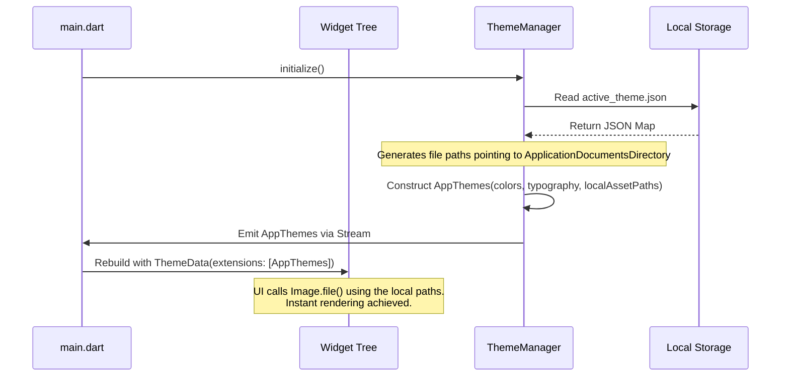
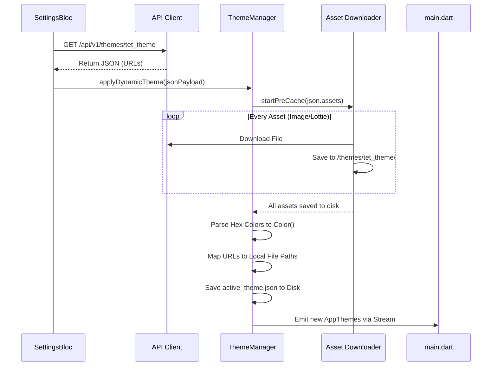
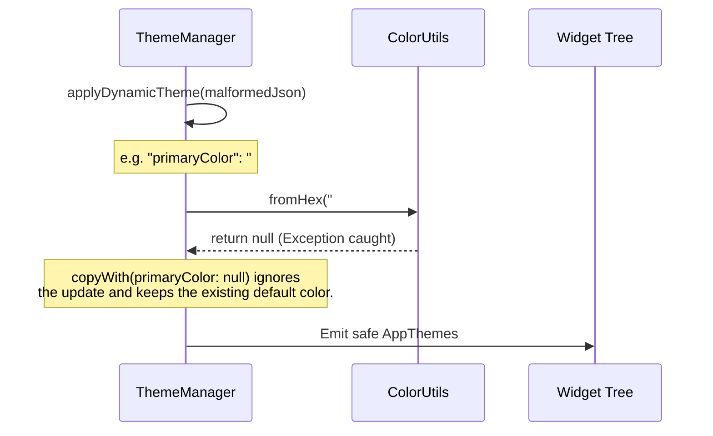

# Dynamic Theme Configuration - Architecture & Use Cases

This document outlines the detailed architecture, asset caching strategy, JSON structures, API contracts, and sequence diagrams for the Dynamic Theme feature. This feature allows the application to dynamically change its appearance (colors, typography, and assets) based on backend configurations without requiring an App Store/Google Play update.

## Table of Contents
1. [Theme JSON Data Structure](#1-theme-json-data-structure)
2. [Asset Management & Caching Strategy (Deep Dive)](#2-asset-management--caching-strategy-deep-dive)
3. [RESTful API Definitions](#3-restful-api-definitions)
4. [Use Cases & Sequence Diagrams](#4-use-cases--sequence-diagrams)

---

## 1. Theme JSON Data Structure

Based on the actual state of the project, colors, images, and lotties are defined in centralized files (`app_themes.dart`) or local package XMLs (e.g., `packages/home/assets/colors.xml`). To make themes dynamic, this data is exported into a structured JSON format grouped by modules (e.g., core, home, wallet, authentication).

### A. Light Mode Example (`default_light`)

```json
{
  "theme_id": "default_light",
  "name": "Zeno Light Mode",
  "mode": "light",
  "version": "1.0.0",
  "colors": {
    "core": {
      "primaryColor": "#0091FF",
      "backgroundColor": "#F5F5F5",
      "surfaceColor": "#FFFFFF",
      "errorColor": "#D32F2F",
      "textPrimaryColor": "#000000",
      "textSecondaryColor": "#757575",
      "dividerColor": "#E0E0E0"
    },
    "authentication": {
      "authTextSecondary": "#6C7278",
      "authBorderColor": "#EDF1F3",
      "authShadowColor": "#E4E5E7",
      "authTextPrimary": "#1A1C1E"
    },
    "scanner": {
      "scannerButtonColor": "#2196F3",
      "scannerIconColor": "#FFFFFF"
    },
    "wallet": {
      "walletPrimary": "#000000",
      "walletGradientBlueStart": "#0091FF",
      "walletGradientBlueEnd": "#E89BA4"
    },
    "home": {
      "homePrimary": "#000000"
    },
    "trends": {
      "trendUpColor": "#4CAF50"
    },
    "design_system": {
      "trueBlue": { "0": "#E6F4FF", "100": "#0091FF", "base": "#0091FF" },
      "greenVogue": { "base": "#1B2A47" }
    }
  },
  "typography": {
    "global_font_family": "Roboto",
    "tokens": {
      "displayLarge": { "fontSize": 57, "color": "#000000" },
      "bodyMedium": { "fontSize": 14, "color": "#000000" }
    }
  },
  "assets": {
    "images": {
      "ic_zeno": "https://cdn.zeno.com/themes/light/ic_zeno.png",
      "ic_globe": "https://cdn.zeno.com/themes/light/ic_globe.svg",
      "profile": "https://cdn.zeno.com/themes/light/profile.svg"
    },
    "lotties": {
      "splash_animation": "https://cdn.zeno.com/themes/light/splash_animation.json",
      "crypto_center": "https://cdn.zeno.com/themes/light/crypto_center.json"
    }
  }
}
```

*Note: The Dark Mode JSON has an identical structure but features inverted hex values for backgrounds and texts.*

---

## 2. Asset Management & Caching Strategy (Deep Dive)

A critical challenge with dynamic themes is rendering remote assets (images, SVGs, Lotties) instantly so the UI doesn't "flicker" or load slowly. Furthermore, theme assets are critical UI components that **must not be purged** by standard caching rules (which typically evict older network images like post thumbnails to save space).

### A. Dedicated Cache Manager vs. Standard Cache
Standard `flutter_cache_manager` (used by `cached_network_image`) operates on a First-In-First-Out (FIFO) basis with expiration dates. If a user browses hundreds of news articles, the cache manager might evict the theme's `ic_zeno.png` to make room for article images. This would cause a critical UI flash when the theme is rendered later.

**The Solution: Persistent Dedicated Directory**
To overcome cache limitations, we implement a **Persistent Theme Downloader Strategy**:

1. **Dedicated Application Directory**: When downloading theme assets, we bypass the standard temporary cache. Instead, we save them directly into the `ApplicationDocumentsDirectory` within a specific path: `/themes/{theme_id}/`.
2. **Pre-fetching Workflow**:
   - The app receives a new JSON theme payload in the background.
   - The `ThemeManager` parses the `assets` block.
   - A background isolate iterates over all URLs and downloads them using standard HTTP calls to `/themes/{theme_id}/{filename}`.
   - Once all assets are physically written to disk, the `ThemeManager` updates the `AppThemes` state.
3. **Smart Local Rendering**:
   - Instead of using `Image.network()`, we create a custom wrapper (e.g., `ThemeAssetImage(key: 'ic_zeno')`).
   - The wrapper looks up the absolute file path `/themes/{theme_id}/ic_zeno.png`.
   - It renders using `Image.file(File(path))`, ensuring zero network latency and no risk of cache eviction.
4. **Cleanup Mechanism**: The app handles pruning explicitly. If a campaign theme (e.g., Christmas) expires, the `ThemeManager` explicitly deletes the `/themes/christmas_2026/` folder to free up device storage.

---

## 3. RESTful API Definitions

The API structure mimics the Localization API to maintain consistency across the project architecture (Clean Architecture & Django Ninja).

### A. Admin APIs (CMS/Dashboard)

- **`POST /api/v1/admin/themes`**
  - **Summary**: Create a new theme.
  - **Body**: The complete JSON structure defined above.
  
- **`GET /api/v1/admin/themes`**
  - **Summary**: List all themes and their metadata (id, name, status).

- **`GET /api/v1/admin/themes/{theme_id}`**
  - **Summary**: Retrieve the full JSON definition of a specific theme for editing.

- **`PATCH /api/v1/admin/themes/{theme_id}`**
  - **Summary**: Delta update (Deep Merge). Allows the CMS to update only specific nodes (e.g., changing just `colors.core.primaryColor`) without sending the entire payload. The BE automatically increments the theme `version`.

- **`DELETE /api/v1/admin/themes/{theme_id}`**
  - **Summary**: Delete a theme. Validation rules must prevent deleting the `default_light` and `default_dark` base themes.

- **`PUT /api/v1/admin/themes/active-campaign`**
  - **Summary**: Assign a specific theme to be the globally active campaign theme for all users for a set duration.

### B. Client APIs (Mobile App)

- **`GET /api/v1/themes`**
  - **Summary**: List available themes that the client can download, including the currently active campaign theme.

- **`GET /api/v1/themes/{theme_id}`**
  - **Query**: `?since_version={current_version}`
  - **Summary**: Fetch the theme JSON. Supports HTTP caching (ETag/If-None-Match) or Delta Versioning. Returns `304 Not Modified` if the client is already up-to-date.

---

## 4. Use Cases & Sequence Diagrams

Based on Test-Driven Development (TDD) principles, here are the exact use cases the Mobile app must handle.

### Use Case 1: App Initialization with Persistent Assets

When the app boots, it must immediately render the UI using the persisted JSON and local file paths without any network delay.



### Use Case 2: Fetch, Pre-cache, and Apply Dynamic Theme

When a new theme update is available, the app must pre-cache the assets *before* switching the UI state to prevent flickering.



### Use Case 3: Fallback and Error Handling (TDD Red/Green)

The system must handle malformed JSON gracefully to avoid crashing. If a hex color string is invalid, the parser must revert to the base fallback color.


