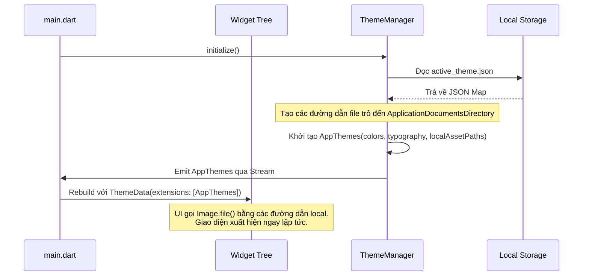
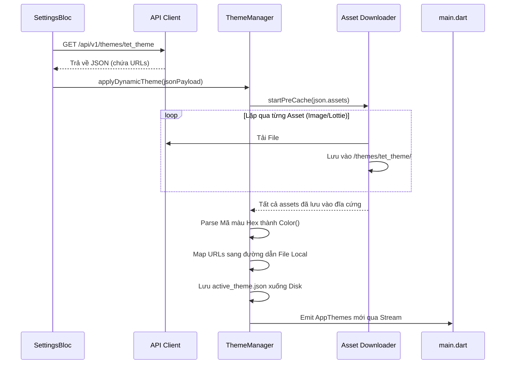
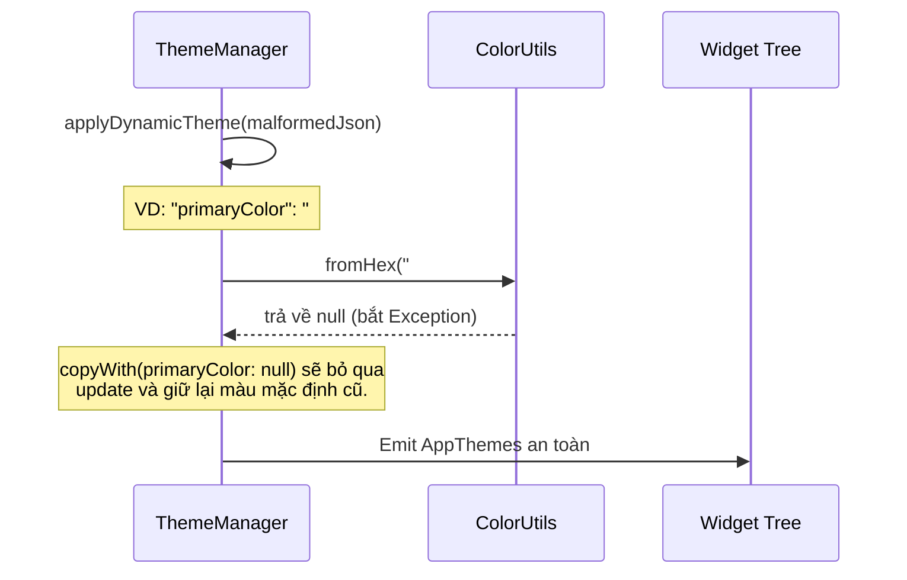

# Cấu hình Dynamic Theme - Kiến trúc & Use Cases

Tài liệu này trình bày chi tiết về kiến trúc, chiến lược lưu trữ (caching) assets, cấu trúc JSON, định nghĩa API và sơ đồ tuần tự (sequence diagrams) cho tính năng Dynamic Theme. Tính năng này cho phép ứng dụng thay đổi linh hoạt giao diện (màu sắc, typography, và assets) dựa trên cấu hình từ backend mà không cần cập nhật qua App Store/Google Play.

## Mục Lục
1. [Cấu trúc dữ liệu JSON của Theme](#1-cấu-trúc-dữ-liệu-json-của-theme)
2. [Chiến lược Quản lý & Caching Assets (Chuyên sâu)](#2-chiến-lược-quản-lý--caching-assets-chuyên-sâu)
3. [Định nghĩa RESTful API](#3-định-nghĩa-restful-api)
4. [Use Cases & Sequence Diagrams](#4-use-cases--sequence-diagrams)

---

## 1. Cấu trúc dữ liệu JSON của Theme

Dựa trên cấu trúc thực tế của dự án, các màu sắc, hình ảnh và lottie được định nghĩa tập trung ở (`app_themes.dart`) hoặc rải rác trong các file XML cục bộ của package (ví dụ: `packages/home/assets/colors.xml`). Để làm cho theme trở nên "động", các dữ liệu này được xuất ra định dạng JSON và gom nhóm theo module (ví dụ: core, home, wallet, authentication).

### A. Ví dụ Light Mode (`default_light`)

```json
{
  "theme_id": "default_light",
  "name": "Zeno Light Mode",
  "mode": "light",
  "version": "1.0.0",
  "colors": {
    "core": {
      "primaryColor": "#0091FF",
      "backgroundColor": "#F5F5F5",
      "surfaceColor": "#FFFFFF",
      "errorColor": "#D32F2F",
      "textPrimaryColor": "#000000",
      "textSecondaryColor": "#757575",
      "dividerColor": "#E0E0E0"
    },
    "authentication": {
      "authTextSecondary": "#6C7278",
      "authBorderColor": "#EDF1F3",
      "authShadowColor": "#E4E5E7",
      "authTextPrimary": "#1A1C1E"
    },
    "scanner": {
      "scannerButtonColor": "#2196F3",
      "scannerIconColor": "#FFFFFF"
    },
    "wallet": {
      "walletPrimary": "#000000",
      "walletGradientBlueStart": "#0091FF",
      "walletGradientBlueEnd": "#E89BA4"
    },
    "home": {
      "homePrimary": "#000000"
    },
    "trends": {
      "trendUpColor": "#4CAF50"
    },
    "design_system": {
      "trueBlue": { "0": "#E6F4FF", "100": "#0091FF", "base": "#0091FF" },
      "greenVogue": { "base": "#1B2A47" }
    }
  },
  "typography": {
    "global_font_family": "Roboto",
    "tokens": {
      "displayLarge": { "fontSize": 57, "color": "#000000" },
      "bodyMedium": { "fontSize": 14, "color": "#000000" }
    }
  },
  "assets": {
    "images": {
      "ic_zeno": "https://cdn.zeno.com/themes/light/ic_zeno.png",
      "ic_globe": "https://cdn.zeno.com/themes/light/ic_globe.svg",
      "profile": "https://cdn.zeno.com/themes/light/profile.svg"
    },
    "lotties": {
      "splash_animation": "https://cdn.zeno.com/themes/light/splash_animation.json",
      "crypto_center": "https://cdn.zeno.com/themes/light/crypto_center.json"
    }
  }
}
```

*Lưu ý: JSON cho Dark Mode có cấu trúc y hệt nhưng sử dụng mã hex màu đảo ngược cho nền và chữ.*

---

## 2. Chiến lược Quản lý & Caching Assets (Chuyên sâu)

Thách thức lớn nhất đối với Dynamic Theme là phải hiển thị các assets từ xa (ảnh, SVGs, Lotties) ngay lập tức để UI không bị "nháy" (flicker) hoặc load chậm. Hơn nữa, assets của theme là các thành phần UI thiết yếu **không được phép bị xóa** bởi các quy luật dọn dẹp cache thông thường (thường tự động xóa các ảnh cũ để tiết kiệm dung lượng).

### A. Cache Manager Độc lập vs. Cache Thông thường
`flutter_cache_manager` mặc định (được dùng bởi `cached_network_image`) hoạt động dựa trên cơ chế Vào Trước - Ra Trước (FIFO) với thời gian hết hạn. Nếu người dùng lướt đọc hàng trăm tin tức, Cache Manager có thể sẽ xóa file `ic_zeno.png` của theme để nhường chỗ cho ảnh bài viết. Điều này sẽ khiến giao diện bị chớp trắng khi render lại theme.

**Giải pháp: Thư mục lưu trữ cố định (Persistent Dedicated Directory)**
Để vượt qua giới hạn của cache thông thường, chúng ta triển khai **Chiến lược Tải và Lưu trữ Theme Cố định**:

1. **Thư mục ứng dụng riêng biệt**: Khi tải assets của theme, chúng ta bỏ qua bộ nhớ đệm tạm thời. Thay vào đó, ghi file trực tiếp vào `ApplicationDocumentsDirectory` bên trong một đường dẫn cụ thể: `/themes/{theme_id}/`.
2. **Quy trình Pre-fetching (Tải trước)**:
   - Ứng dụng nhận được payload JSON của theme mới ở chế độ nền (background).
   - `ThemeManager` phân tích khối `"assets"`.
   - Một background isolate sẽ lặp qua tất cả URLs và tải chúng xuống, lưu vào đĩa cứng tại `/themes/{theme_id}/{filename}`.
   - **Chỉ khi tất cả assets đã được ghi vật lý xuống đĩa cứng**, `ThemeManager` mới cập nhật state của `AppThemes`.
3. **Hiển thị (Rendering) Thông minh**:
   - Thay vì dùng `Image.network()`, chúng ta tạo một wrapper custom (ví dụ: `ThemeAssetImage(key: 'ic_zeno')`).
   - Wrapper này sẽ tìm đường dẫn file tuyệt đối `/themes/{theme_id}/ic_zeno.png`.
   - Nó render ảnh bằng `Image.file(File(path))`, đảm bảo tốc độ phản hồi ngay lập tức (zero network latency) và loại bỏ hoàn toàn rủi ro bị xóa cache oan.
4. **Cơ chế Dọn dẹp (Cleanup)**: Ứng dụng sẽ quản lý việc xóa cache một cách chủ động. Nếu một theme chiến dịch (ví dụ: Giáng Sinh) hết hạn, `ThemeManager` sẽ chủ động xóa toàn bộ thư mục `/themes/christmas_2026/` để giải phóng bộ nhớ thiết bị.

---

## 3. Định nghĩa RESTful API

Cấu trúc API mô phỏng lại hoàn toàn Localization API để giữ tính đồng nhất trong kiến trúc dự án (Clean Architecture & Django Ninja).

### A. Admin APIs (Dành cho CMS/Dashboard)

- **`POST /api/v1/admin/themes`**
  - **Mô tả**: Tạo mới một theme.
  - **Body**: Toàn bộ cấu trúc JSON như trên.
  
- **`GET /api/v1/admin/themes`**
  - **Mô tả**: Lấy danh sách toàn bộ các themes và metadata của chúng (id, name, status).

- **`GET /api/v1/admin/themes/{theme_id}`**
  - **Mô tả**: Lấy toàn bộ định nghĩa JSON của một theme để CMS chỉnh sửa.

- **`PATCH /api/v1/admin/themes/{theme_id}`**
  - **Mô tả**: Delta update (Deep Merge). Cho phép CMS chỉ cập nhật một số node nhất định (ví dụ: chỉ sửa `colors.core.primaryColor`) mà không cần gửi toàn bộ payload. BE sẽ tự động tăng `version` của theme.

- **`DELETE /api/v1/admin/themes/{theme_id}`**
  - **Mô tả**: Xóa một theme. BE cần ngăn chặn việc xóa các base themes mặc định như `default_light` và `default_dark`.

- **`PUT /api/v1/admin/themes/active-campaign`**
  - **Mô tả**: Chỉ định một theme cụ thể làm theme chiến dịch (campaign) mặc định cho toàn bộ người dùng trong một khoảng thời gian.

### B. Client APIs (Dành cho Mobile App)

- **`GET /api/v1/themes`**
  - **Mô tả**: Lấy danh sách các themes khả dụng để client tải xuống, bao gồm cả thông tin theme chiến dịch đang active.

- **`GET /api/v1/themes/{theme_id}`**
  - **Query**: `?since_version={current_version}`
  - **Mô tả**: Tải JSON của theme. Hỗ trợ HTTP caching (ETag/If-None-Match) hoặc Delta Versioning. Trả về `304 Not Modified` nếu client đã update lên bản mới nhất.

---

## 4. Use Cases & Sequence Diagrams

Dựa trên nguyên lý Test-Driven Development (TDD), dưới đây là các use cases mà Mobile app phải xử lý chính xác.

### Use Case 1: Khởi tạo App với Assets đã lưu (Persistent Assets)

Khi khởi động, app phải lập tức render giao diện sử dụng JSON và các đường dẫn file local mà không phải chờ đợi network.



### Use Case 2: Tải, Pre-cache, và Cập nhật Dynamic Theme

Khi có bản cập nhật theme mới, app bắt buộc phải pre-cache các assets *trước khi* chuyển đổi state giao diện để tránh bị nháy màn hình.



### Use Case 3: Fallback và Xử lý Lỗi (TDD Red/Green)

Hệ thống phải xử lý an toàn với các JSON bị lỗi định dạng để tránh crash app. Nếu một chuỗi màu hex không hợp lệ, parser phải fallback về màu gốc (base color).


