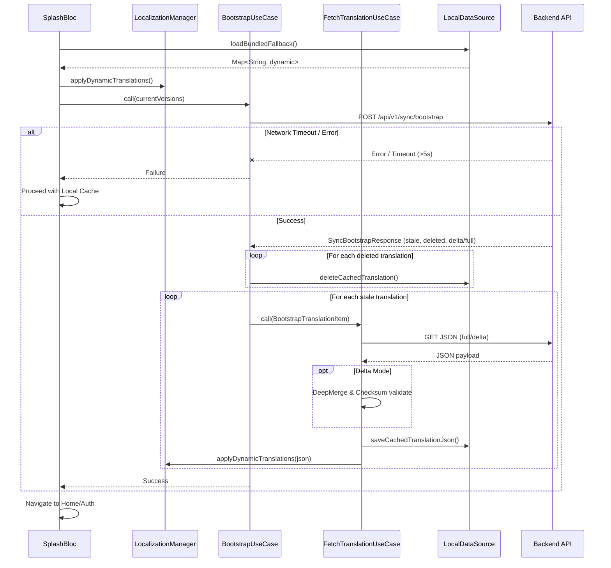
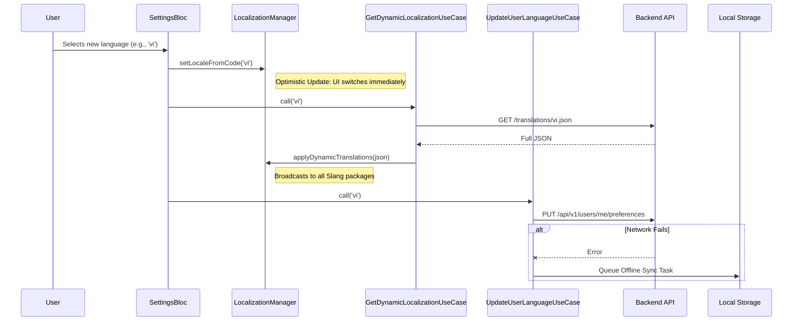

# Localization Management in Mobile App

This document outlines the use cases, edge cases, architecture, and sequence diagrams for managing multi-language (localization) updates dynamically within the mobile application.

## Table of Contents
- [1. Overview](#1-overview)
- [2. Use Cases Analysis](#2-use-cases-analysis)
  - [2.1. App Cold Start (Bootstrap Sync)](#21-app-cold-start-bootstrap-sync)
  - [2.2. User Changes Language in Settings](#22-user-changes-language-in-settings)
  - [2.3. Offline Mode & Connectivity Loss](#23-offline-mode--connectivity-loss)
  - [2.4. Edge Cases](#24-edge-cases)
- [3. Architecture & Implementation Overview](#3-architecture--implementation-overview)
- [4. Sequence Diagrams](#4-sequence-diagrams)
  - [4.1. Bootstrap Sync Sequence (Cold Start)](#41-bootstrap-sync-sequence-cold-start)
  - [4.2. On-Demand Language Change Sequence](#42-on-demand-language-change-sequence)

---

## 1. Overview
The mobile app handles dynamic translations over-the-air (OTA) by fetching JSON translation files from the backend and applying them via the `Slang` package at runtime. This enables seamless updates to localized texts without needing app store releases.

---

## 2. Use Cases Analysis

### 2.1. App Cold Start (Bootstrap Sync)
- **Actor:** System / App Startup
- **Description:** When the app launches, it immediately attempts to synchronize its local translation dictionary with the latest versions from the server.
- **Flow:**
  1. Load the selected language from local cache, or fall back to bundled translations if the cache is empty, to ensure the UI immediately displays the correct language.
  2. Call the `/api/v1/sync/bootstrap` API with currently cached versions.
  3. Backend returns a list of translation files to update (`full` or `delta` modes) or delete.
  4. App fetches the necessary JSON files, merges deltas, verifies checksums, and saves them to local storage.
  5. Apply new translations to `Slang` in memory.

### 2.2. User Changes Language in Settings
- **Actor:** User
- **Description:** The user explicitly selects a new language from the Settings menu.
- **Flow:**
  1. User selects language.
  2. App immediately updates UI (optimistic UI update) using locally cached/bundled translations for the selected language.
  3. App calls the backend to fetch the latest complete JSON for that language.
  4. Once downloaded, `Slang` applies the updated translations dynamically.
  5. The preference is synced to the backend user profile via a background API call.

### 2.3. Offline Mode & Connectivity Loss
- **Actor:** User / Network
- **Description:** The app handles translation loads when there is no internet connection.
- **Flow:**
  1. On cold start without network, the app falls back to cached JSON in local storage.
  2. If the cache is missing/corrupted, the app falls back to bundled `assets/locales/<lang>.i18n.json`.
  3. If a user changes the language while offline, the app switches to the cached version and queues the backend synchronization task.

### 2.4. Edge Cases
- **Checksum Mismatch (Delta Update):** If the app receives a `delta` update but the SHA-256 checksum of the merged JSON fails validation, the app discards the cache and falls back to a `full` fetch.
- **Bootstrap Timeout:** If the bootstrap API takes longer than 5 seconds, the app aborts the network wait and proceeds with local cached data to avoid blocking the Splash Screen.
- **Missing Keys:** If a dynamic JSON payload is missing a key, `Slang` automatically falls back to the base language (English) compiled inside the app.
- **Corrupt Local Cache:** Handled similarly to Checksum Mismatch—corrupted files are purged, and the app fetches a fresh copy or uses bundled assets.

---

## 3. Architecture & Implementation Overview
- **Data Layer:** `SettingsLocalDataSource` utilizes `path_provider` for large JSON files and `SharedPreferences` for version metadata.
- **Domain Layer:** Uses `BootstrapUseCase` and `FetchTranslationUseCase` to encapsulate deep-merge and checksum logic.
- **Core Layer:** 
  - `LocalizationManager` uses `BehaviorSubject` (RxDart) to orchestrate and broadcast locale changes to all Feature Packages via Slang's `overrideTranslationsFromMap`.
  - `DynamicTranslator` provides a lookup mechanism for arbitrary dynamic keys (e.g., API enums) that were not defined in Slang at compile-time.

### 3.1. DynamicTranslator Usage Guide
`DynamicTranslator` is used when you need to render translated strings based on dynamic variables from the server (e.g., status Enums, API error codes) that are **not hardcoded** in the JSON files during the app's build time (Slang generation).

**Usage Example:**
```dart
// Example: server returns status = 'PENDING'
final serverStatus = response.status; 
// You want to map this to the key: "transaction.status.PENDING"
final translationKey = 'transaction.status.$serverStatus';

// Instead of using t.transaction.status... (which won't compile due to dynamic keys),
// call DynamicTranslator directly:
final translatedText = DynamicTranslator.translate(translationKey);
```
> **Note:** If the key does not exist in the dynamic dictionary, the function falls back to returning the exact key string.

---

## 4. Sequence Diagrams

### 4.1. Bootstrap Sync Sequence (Cold Start)


### 4.2. On-Demand Language Change Sequence

