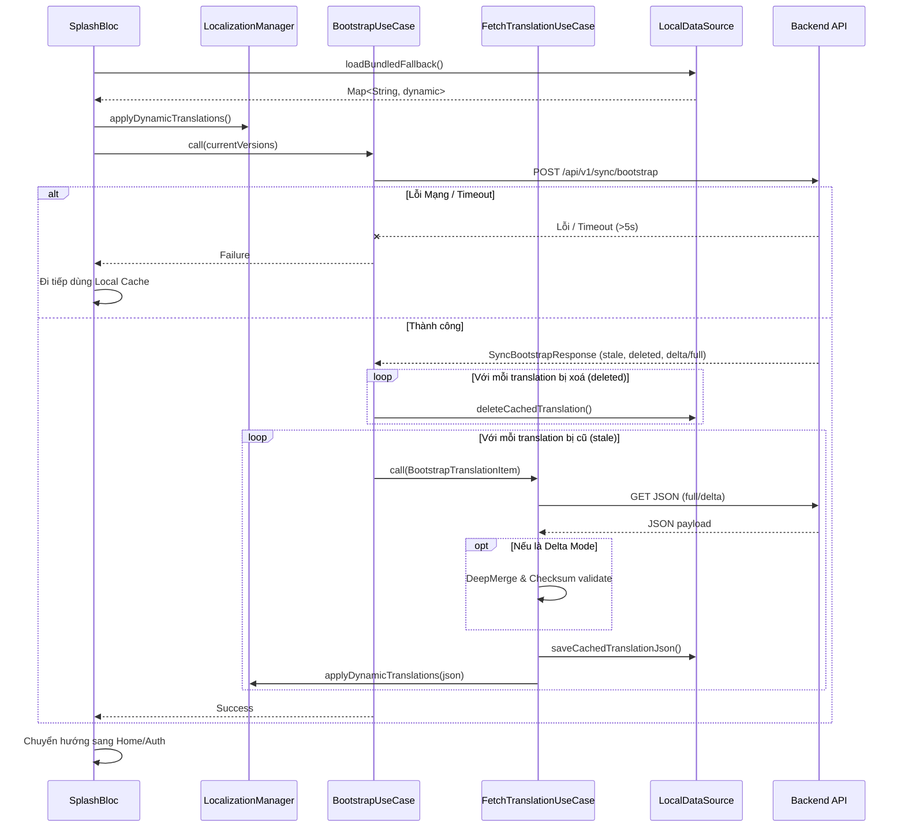
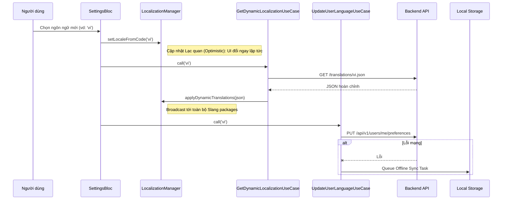

# Quản lý Đa ngôn ngữ (Localization) trên Mobile App

Tài liệu này trình bày phân tích các use cases, edge cases, kiến trúc và các biểu đồ tuần tự (sequence diagrams) cho việc quản lý và cập nhật đa ngôn ngữ động (OTA) trong ứng dụng di động.

## Mục lục
- [1. Tổng quan](#1-tổng-quan)
- [2. Phân tích Use Cases](#2-phân-tích-use-cases)
  - [2.1. Khởi động ứng dụng (Bootstrap Sync)](#21-khởi-động-ứng-dụng-bootstrap-sync)
  - [2.2. Người dùng thay đổi ngôn ngữ trong Cài đặt](#22-người-dùng-thay-đổi-ngôn-ngữ-trong-cài-đặt)
  - [2.3. Chế độ Ngoại tuyến (Offline Mode) & Mất kết nối](#23-chế-độ-ngoại-tuyến-offline-mode--mất-kết-nối)
  - [2.4. Các trường hợp ngoại lệ (Edge Cases)](#24-các-trường-hợp-ngoại-lệ-edge-cases)
- [3. Tổng quan Kiến trúc & Triển khai](#3-tổng-quan-kiến-trúc--triển-khai)
- [4. Biểu đồ Tuần tự (Sequence Diagrams)](#4-biểu-đồ-tuần-tự-sequence-diagrams)
  - [4.1. Luồng đồng bộ Bootstrap (Khởi động ứng dụng)](#41-luồng-đồng-bộ-bootstrap-khởi-động-ứng-dụng)
  - [4.2. Luồng thay đổi ngôn ngữ chủ động (On-Demand)](#42-luồng-thay-đổi-ngôn-ngữ-chủ-động-on-demand)

---

## 1. Tổng quan
Ứng dụng di động xử lý việc dịch thuật động qua mạng (Over-the-Air - OTA) bằng cách tải các file JSON chứa bản dịch từ backend và áp dụng chúng thông qua package `Slang` tại runtime. Điều này cho phép cập nhật mượt mà các đoạn text trên UI mà không cần phải phát hành bản cập nhật ứng dụng lên Store.

---

## 2. Phân tích Use Cases

### 2.1. Khởi động ứng dụng (Bootstrap Sync)
- **Tác nhân:** Hệ thống / Quá trình khởi động App (Splash)
- **Mô tả:** Khi app mở lên, nó sẽ ngay lập tức thực hiện việc đồng bộ từ điển dịch thuật cục bộ với các phiên bản mới nhất từ server.
- **Luồng xử lý:**
  1. Tải bản dịch của ngôn ngữ đã chọn (từ local cache) hoặc bản dịch mặc định đi kèm (bundled fallback) nếu chưa có cache, để đảm bảo UI hiển thị đúng ngôn ngữ ngay lập tức.
  2. Gọi API `/api/v1/sync/bootstrap` với các phiên bản ngôn ngữ đang được cache ở local.
  3. Backend trả về danh sách các file cần cập nhật (chế độ `full` hoặc `delta`) hoặc các file cần xoá.
  4. App tải về các file JSON cần thiết, gộp (merge) dữ liệu nếu là `delta`, xác minh mã băm (checksum), và lưu xuống local storage.
  5. Áp dụng bản dịch mới vào bộ nhớ của `Slang`.

### 2.2. Người dùng thay đổi ngôn ngữ trong Cài đặt
- **Tác nhân:** Người dùng
- **Mô tả:** Người dùng chủ động chọn một ngôn ngữ mới trong màn hình Cài đặt (Settings).
- **Luồng xử lý:**
  1. Người dùng chọn ngôn ngữ.
  2. App lập tức cập nhật UI (Cập nhật lạc quan - Optimistic update) bằng các bản dịch cache/mặc định có sẵn ở local cho ngôn ngữ vừa chọn.
  3. App gọi API backend để tải về JSON hoàn chỉnh mới nhất cho ngôn ngữ đó.
  4. Khi tải xong, `Slang` áp dụng bản dịch đã cập nhật.
  5. Tuỳ chọn ngôn ngữ của người dùng được đồng bộ ngầm lên server thông qua API background.

### 2.3. Chế độ Ngoại tuyến (Offline Mode) & Mất kết nối
- **Tác nhân:** Người dùng / Mạng
- **Mô tả:** Ứng dụng xử lý việc tải bản dịch khi không có kết nối internet.
- **Luồng xử lý:**
  1. Nếu khởi động app không có mạng, app sẽ sử dụng JSON được cache ở local storage.
  2. Nếu không có cache hoặc cache bị hỏng, app sử dụng bản dịch đi kèm `assets/locales/<lang>.i18n.json`.
  3. Nếu người dùng thay đổi ngôn ngữ khi đang offline, app chuyển đổi locale ở local và đưa tiến trình đồng bộ API vào hàng đợi (queue) để đồng bộ sau khi có mạng.

### 2.4. Các trường hợp ngoại lệ (Edge Cases)
- **Sai lệch Checksum (Cập nhật Delta):** Nếu app nhận được một bản cập nhật `delta` nhưng mã băm SHA-256 sau khi gộp không khớp, app sẽ xoá cache và quay về chế độ fetch `full` (tải lại toàn bộ file JSON).
- **Timeout quá trình Bootstrap:** Nếu gọi API bootstrap mất quá 5 giây, app sẽ tự động huỷ chờ mạng và đi tiếp bằng dữ liệu cache cục bộ để không chặn Splash Screen của người dùng.
- **Thiếu Key (Missing Keys):** Nếu file JSON động bị thiếu key, `Slang` sẽ tự động hiển thị key đó bằng ngôn ngữ gốc (Tiếng Anh) đã được biên dịch cứng trong app.
- **Hỏng Local Cache:** Xử lý tương tự như Sai lệch Checksum — file hỏng sẽ bị xoá và app sẽ tải một bản copy mới từ server hoặc dùng file mặc định.

---

## 3. Tổng quan Kiến trúc & Triển khai
- **Data Layer:** `SettingsLocalDataSource` sử dụng `path_provider` để lưu file JSON lớn và `SharedPreferences` để lưu metadata (version).
- **Domain Layer:** Dùng `BootstrapUseCase` và `FetchTranslationUseCase` để đóng gói logic Deep-Merge và tính toán Checksum.
- **Core Layer:** 
  - `LocalizationManager` sử dụng `BehaviorSubject` (của RxDart) để điều phối và phát (broadcast) sự kiện thay đổi locale tới tất cả các Feature Packages thông qua hàm `overrideTranslationsFromMap` của Slang.
  - `DynamicTranslator` cung cấp cơ chế tra cứu (lookup) trực tiếp các key động (như enum trạng thái từ server) chưa từng được định nghĩa trong Slang lúc compile.

### 3.1. Hướng dẫn sử dụng DynamicTranslator
`DynamicTranslator` được sử dụng khi bạn cần render các chuỗi dịch thuật dựa trên các biến động từ server (ví dụ: Enum trạng thái, mã lỗi API) mà **không được khai báo cứng** trong file JSON lúc build app bằng Slang.

**Cách sử dụng:**
```dart
// Ví dụ server trả về status = 'PENDING'
final serverStatus = response.status; 
// Bạn muốn map với key: "transaction.status.PENDING"
final translationKey = 'transaction.status.$serverStatus';

// Thay vì dùng t.transaction.status... (không compile được vì key động), 
// bạn gọi trực tiếp qua DynamicTranslator:
final translatedText = DynamicTranslator.translate(translationKey);
```
> **Lưu ý:** Nếu key không tồn tại trong từ điển, hàm sẽ fallback trả về chính chuỗi key đó.

---

## 4. Biểu đồ Tuần tự (Sequence Diagrams)

### 4.1. Luồng đồng bộ Bootstrap (Khởi động ứng dụng)


### 4.2. Luồng thay đổi ngôn ngữ chủ động (On-Demand)

