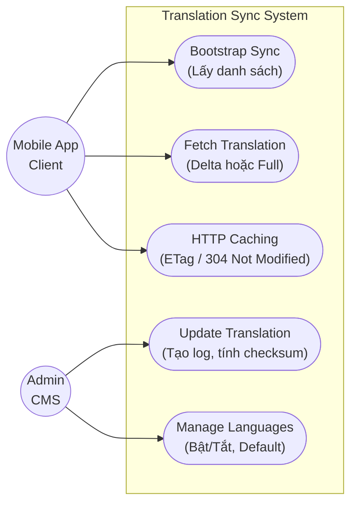
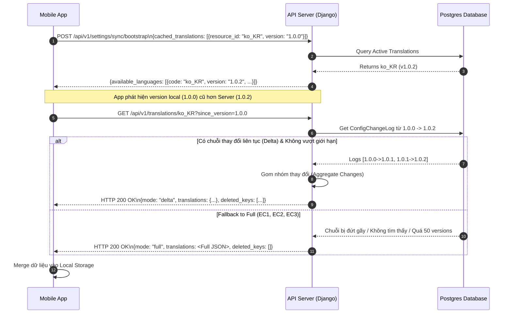
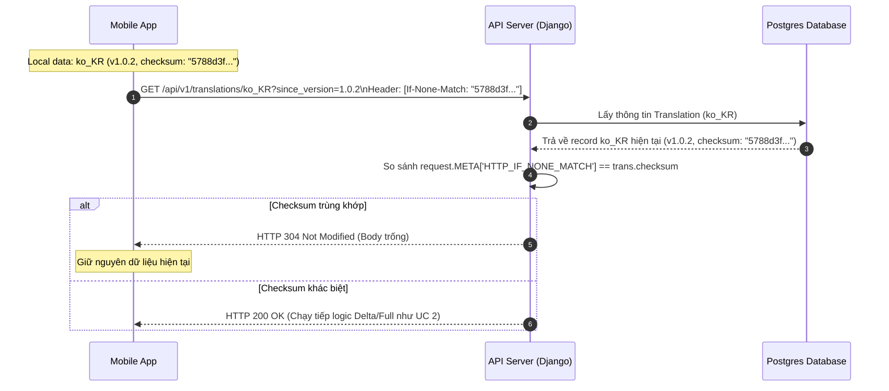
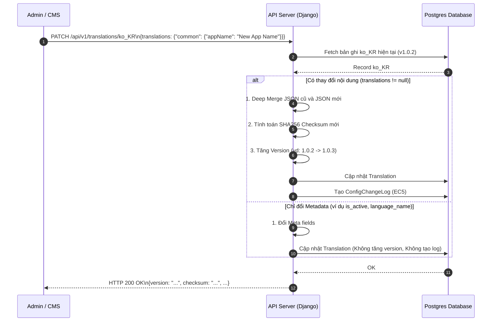
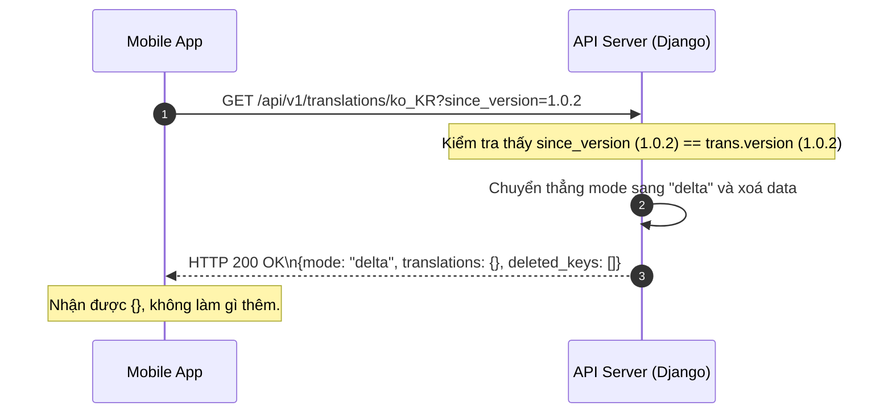

# Phân Tích Hệ Thống Đồng Bộ Cấu Hình & Ngôn Ngữ (Dynamic Configuration Sync)

Tài liệu này mô tả chi tiết các Use Cases, Edge Cases và các Sequence Diagrams minh hoạ cách các thành phần trong hệ thống quản lý Translation tương tác với nhau.

## 1. Tổng Quan Các Use Cases (Use Case Diagram)

Hệ thống bao gồm 2 Actor chính:
- **Client (Mobile App):** Tải dữ liệu khởi tạo, đồng bộ ngôn ngữ (hỗ trợ delta update để tối ưu băng thông) và sử dụng HTTP Caching (ETag).
- **Admin (CMS):** Cập nhật, tạo mới ngôn ngữ.



---

## 2. Phân Tích Edge Cases (Các trường hợp đặc biệt)

Hệ thống được thiết kế để xử lý mượt mà các tình huống "góc" (edge cases) nhằm bảo đảm an toàn, tối ưu hiệu năng và ngăn chặn lỗi logic ở Client:

### EC1: Delta Chain Broken (Lịch sử thay đổi bị đứt gãy)
- **Tình huống:** Client yêu cầu bản cập nhật từ `1.0.0` lên `1.0.3`. Tuy nhiên trong Database bị mất log trung gian `1.0.1 -> 1.0.2` (do xoá tay hoặc lỗi).
- **Xử lý:** Khi quét chuỗi thay đổi, thuật toán `get_aggregated_delta` phát hiện sự thiếu hụt. Thay vì ghép ra một bản Delta lỗi, hệ thống tự động fallback về `mode="full"` và trả về toàn bộ file JSON nguyên vẹn cho Client.

### EC2: Exceeding Delta Depth (Phiên bản Client quá cũ)
- **Tình huống:** Client yêu cầu bản cập nhật từ version `1.0.0`, trong khi Server đã ở version `1.0.60`.
- **Xử lý:** Việc loop qua 60 bản JSON để deep merge tạo ra Delta có thể tốn CPU và RAM của Server. Thuật toán giới hạn chỉ quét tối đa 50 logs gần nhất. Nếu khoảng cách phiên bản vượt quá 50, Server chủ động fallback về `mode="full"`. 

### EC3: Invalid/Unknown `since_version` (Version rác)
- **Tình huống:** Client gửi lên `since_version="0"` hoặc một string ngẫu nhiên không có trong lịch sử (vd `"2.9.9"`).
- **Xử lý:** Server không tìm thấy version này trong `ConfigChangeLog`. Ngay lập tức ngừng tính toán và trả về `mode="full"`.

### EC4: Inactive Translation Requested (Ngôn ngữ bị vô hiệu hoá)
- **Tình huống:** Ngôn ngữ `ko_KR` bị Admin tắt (`is_active = False`). Client (vốn đang dùng tiếng Hàn) gửi API `GET /api/v1/translations/ko_KR`.
- **Xử lý:** Server kiểm tra quyền. Nếu là user bình thường (không phải admin), Server trả về `success=False, message="Translation not found"`. 

### EC5: PATCH request without translations (Cập nhật metadata, không đổi nội dung)
- **Tình huống:** Admin gửi `PATCH /api/v1/translations/ko_KR` chỉ để cập nhật `language_name` (vd: đổi từ "Korean" sang "한국어"), không đính kèm trường `translations`.
- **Xử lý:** Server cập nhật metadata nhưng **KHÔNG** tăng `version` và **KHÔNG** tạo log mới. Điều này giúp ngăn Client tải lại dữ liệu ngôn ngữ một cách vô nghĩa khi nội dung text bên trong hoàn toàn không thay đổi.

---

## 3. Sequence Diagrams Cho Các Use Cases Thực Tế

### Use Case 1 & 2: App Startup (Bootstrap) & Tải Ngôn Ngữ (Delta/Full Update)
Khi App khởi động, thay vì gọi từng API riêng lẻ, App gọi API `/bootstrap` truyền lên phiên bản ngôn ngữ hiện tại nó đang có (vd: `1.0.0`). Server phản hồi danh sách các ngôn ngữ đang kích hoạt. Nếu version trên Server mới hơn, App tiến hành gọi API `/translations/{lang}?since_version=1.0.0` để lấy bản cập nhật.



---

### Use Case 3: Cơ chế HTTP Caching (Tối ưu băng thông cực đại)
Nếu App đã tải ngôn ngữ mới nhất về, nhưng một lúc sau mở lại App hoặc user chủ động bấm "Check for updates". App vẫn gửi API `/translations/{lang}` nhưng kèm theo Header `If-None-Match` chứa `checksum` của version hiện tại. Nếu dữ liệu trên Server không đổi, Server không trả về JSON mà chỉ trả `304 Not Modified`.



---

### Use Case 4 & 5: CMS Admin Cập Nhật Ngôn Ngữ
CMS/Admin upload file JSON mới hoặc chỉnh sửa một vài từ vựng. Dữ liệu được push lên qua method `PATCH`. Server xử lý merge dữ liệu, tạo version mới, tính checksum mới và lưu lại log thay đổi để phục vụ cho luồng Delta phía Client.



---

### Use Case 6: Kịch bản đồng bộ bị gián đoạn (Client nhận empty delta)
Trong trường hợp client không dùng ETag, mà gọi API `/translations/{lang}?since_version=1.0.2` khi server vẫn đang ở `1.0.2`. Hệ thống xử lý thông minh để tránh gửi payload lớn.



---

## 4. Tại sao cần ETag (If-None-Match) khi đã có `since_version`?

Nhiều người thắc mắc: *"Nếu đã dùng `since_version` để check và trả về Delta rồi, tại sao phải làm thêm ETag làm gì cho phức tạp?"*

Hệ thống kết hợp cả 2 là một kiến trúc **phòng thủ kép (Double-layer defense)** với 2 lợi ích vô giá:

### 1. Tận dụng sức mạnh của HTTP Standard & CDN (Zero-Cost)
- `since_version` là một logic tuỳ chỉnh (Custom Logic) mà chỉ có Code Django của chúng ta hiểu.
- `If-None-Match` (ETag) là tiêu chuẩn của Web (HTTP Standard). Các hệ thống Proxy, Load Balancer, hay CDN (như Cloudflare, AWS CloudFront) mặc định đều hiểu ETag. CDN có thể tự động chặn Request và trả về `304` cho Client từ Edge Server mà không cần Request đó chạm tới Server Django (giảm 100% tải cho Backend).
- Các thư viện HTTP trên Mobile (Dio, Alamofire, OkHttp) đều có bộ Cache tự động xử lý ETag ngầm mà Coder không cần viết thêm dòng logic nào.

### 2. Tự động phục hồi khi dữ liệu Client bị hỏng (Data Integrity Repair)
- Giả sử Mobile App tải Delta về thành công, nâng `version` lên `1.0.2`, nhưng trong lúc lưu JSON vào bộ nhớ thiết bị thì App bị crash, dẫn đến file JSON bị mất một nửa dữ liệu.
- Trong lần mở App tiếp theo, App gọi API với `since_version=1.0.2`. Nếu Server chỉ kiểm tra Version, nó sẽ thấy `1.0.2 == 1.0.2` và trả về một gói cập nhật rỗng (Empty Delta). Kết quả: **App vĩnh viễn bị kẹt với file JSON lỗi.**
- Nhờ có ETag, khi App băm cái JSON bị lỗi đó ra, mã Hash chắc chắn sẽ sai lệch. Server kiểm tra thấy Hash sai liền biết ngay dữ liệu Client đang bị "Corrupted" (dù version có đúng đi chăng nữa). Server sẽ ngay lập tức **từ chối 304**, và fallback về việc gửi lại toàn bộ file JSON gốc (`mode="full"`) để sửa lỗi cho Client!

---

## 5. Tiêu Chuẩn Băm Checksum (Checksum / ETag Hashing Standard)

Để cơ chế **HTTP Caching (If-None-Match)** hoạt động chính xác, cả Mobile Client và Backend bắt buộc phải tuân theo một tiêu chuẩn mã hoá JSON nghiêm ngặt trước khi băm SHA-256. Nếu 2 bên mã hoá JSON lệch nhau (VD: có/không có dấu cách thừa, sai encoding), Checksum sẽ sinh ra khác nhau và cơ chế Caching sẽ bị vô hiệu hoá.

Quy trình băm chuẩn được quy định như sau:

1. **Xoá toàn bộ dấu cách (spaces) thừa:** Phân tách JSON chỉ bằng dấu `,` và `:` không có khoảng trắng.
2. **Sắp xếp Key theo bảng chữ cái (Alphabetical Order):** Đảm bảo thứ tự các key trong JSON luôn đồng nhất trên mọi nền tảng.
3. **Giữ nguyên ký tự Unicode (Raw UTF-8):** Không được escape các ký tự đặc biệt (như tiếng Hàn, tiếng Việt) thành dạng mã ASCII (ví dụ: `\ud64d`). Giữ nguyên raw UTF-8.

**Mã nguồn tham chiếu (Python Backend):**
```python
import json
import hashlib

def compute_checksum(data: dict) -> str:
    if not data:
        return ""
        
    # 1. sort_keys=True: Sắp xếp key theo Alphabet (giống hệt Mobile)
    # 2. separators=(',', ':'): Xoá toàn bộ dấu cách thừa
    # 3. ensure_ascii=False: Giữ nguyên ký tự Unicode (tiếng Hàn, Việt) không biến thành \uXXXX
    json_string = json.dumps(
        data, 
        sort_keys=True, 
        separators=(',', ':'), 
        ensure_ascii=False
    )
    
    # 4. Băm SHA-256 chuỗi UTF-8
    return hashlib.sha256(json_string.encode('utf-8')).hexdigest()
```

> [!IMPORTANT]
> - Mobile Developer khi băm dữ liệu cũng phải cấu hình thư viện JSON parser theo đúng 3 tiêu chuẩn trên (No spaces, Sorted keys, Raw UTF-8).
> - Khi gọi API có mang theo ETag, Mobile Client nên cẩn thận kiểm tra xem HTTP thư viện có tự bọc chuỗi ETag trong dấu ngoặc kép `" "` hay thêm `W/` vào trước hay không. Backend đã thiết kế logic để dọn dẹp các ký hiệu này, nhưng tốt nhất vẫn là truyền chuỗi thuần.
